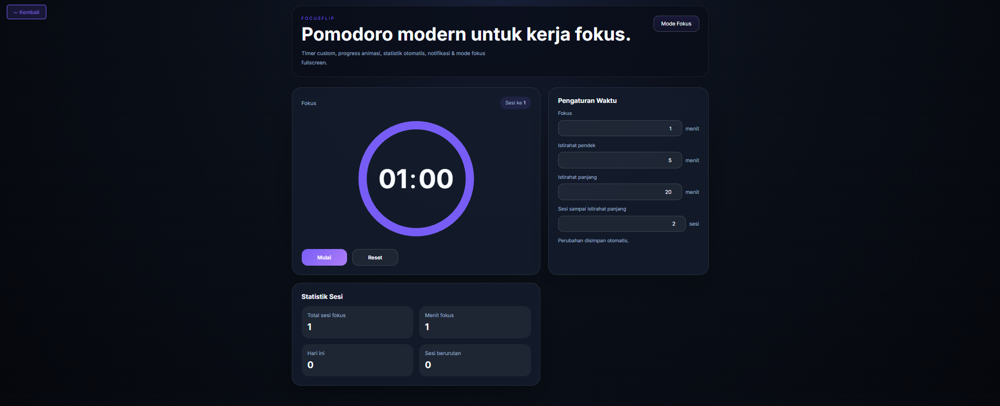
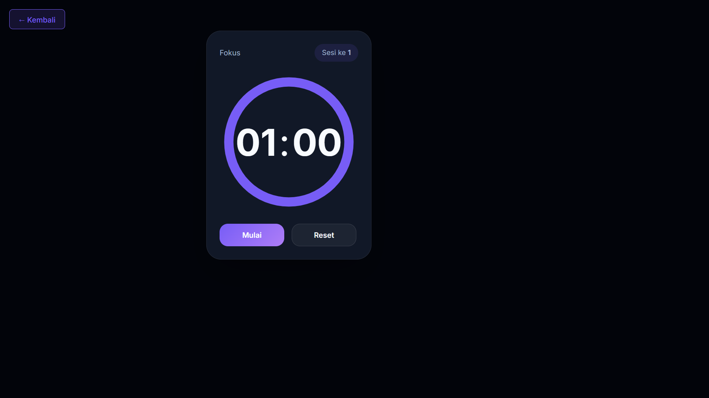

# 🍅 FocusFlip

<div align="center">

**Timer Pomodoro dengan tampilan modern yang dilengkapi timer custom, progress animasi, statistik otomatis, notifikasi, dan mode fokus fullscreen**

</div>

## 📋 Deskripsi Proyek

**FocusFlip** adalah aplikasi web Pomodoro Timer yang dirancang untuk meningkatkan produktivitas dengan metode manajemen waktu yang terbukti efektif. Aplikasi ini memungkinkan pengguna untuk mengatur sesi fokus dan istirahat secara fleksibel, dengan pelacakan statistik otomatis dan antarmuka yang imersif. Fitur mode fokus fullscreen membantu pengguna meminimalisir distraksi saat bekerja.

Aplikasi ini sangat cocuk digunakan oleh pelajar, pekerja remote, developer, atau siapa saja yang ingin menerapkan teknik Pomodoro untuk meningkatkan fokus dan produktivitas. Dengan kemampuan menyimpan pengaturan dan statistik secara lokal, pengguna dapat melacak perkembangan produktivitas mereka dari waktu ke waktu.

Fitur utama aplikasi ini:
- **Timer Fleksibel**: Atur durasi fokus, istirahat pendek, dan istirahat panjang sesuai kebutuhan
- **Progress Animasi**: Visualisasi lingkaran progres yang dinamis untuk setiap sesi
- **Statistik Lengkap**: Pantau total sesi fokus, menit fokus, aktivitas hari ini, dan streak berurutan
- **Notifikasi & Suara**: Pemberitahuan desktop dan bunyi tanda saat sesi berganti
- **Mode Fokus Fullscreen**: Mode imersif yang menyembunyikan elemen lain untuk fokus maksimal
- **Auto-start Timer**: Timer otomatis berjalan saat sesi baru dimulai

## 📑 Daftar Isi

- [Deskripsi Proyek](#-deskripsi-proyek)
- [Tampilan Aplikasi](#-tampilan-aplikasi)
- [Latar Belakang](#-latar-belakang)
- [Fitur Utama](#-fitur-utama)
- [Teknologi yang Digunakan](#-teknologi-yang-digunakan)
- [Cara Penggunaan](#-cara-penggunaan)
- [Peran Developer](#-peran-developer)
- [Pembelajaran dari Proyek](#-pembelajaran-dari-proyek-lessons-learned)
- [Ucapan Terima Kasih](#-ucapan-terima-kasih)

## 📸 Tampilan Aplikasi

### Tampilan Utama (Dashboard)

 

### Mode Fokus Fullscreen



## 🎯 Latar Belakang

Proyek ini dibuat untuk mengembangkan keterampilan dalam:

- **Manajemen Timer Kompleks**: Mengimplementasikan timer dengan multiple states (fokus, istirahat pendek, istirahat panjang) dan transisi otomatis antar sesi.
- **LocalStorage untuk Persistensi Data**: Menyimpan pengaturan pengguna dan riwayat statistik secara lokal di browser.
- **Animasi SVG Dinamis**: Membuat progress ring yang berubah secara real-time sesuai sisa waktu.
- **Notifikasi Browser & Web Audio**: Mengintegrasikan Notification API dan Web Audio API untuk feedback pengguna.
- **Fullscreen API**: Mengimplementasikan mode layar penuh untuk pengalaman fokus yang imersif.

Kebutuhan yang melatarbelakangi proyek ini:
- **Kebutuhan alat produktivitas** yang tidak hanya fungsional tetapi juga memiliki desain modern.
- **Keinginan memahami** siklus timer kompleks dengan multiple states.
- **Eksplorasi visualisasi progres** menggunakan SVG dan stroke-dashoffset.
- **Penerapan konsep "statistik kebiasaan"** (streak, total waktu, daily tracking).

## 🌟 Fitur Utama

### ⏲️ **Siklus Timer Pomodoro**

| Siklus | Deskripsi | Durasi Default |
|--------|-----------|----------------|
| **Fokus** | Waktu kerja produktif | 25 menit |
| **Istirahat Pendek** | Istirahat singkat setelah fokus | 5 menit |
| **Istirahat Panjang** | Istirahat lebih panjang setelah beberapa siklus | 20 menit |

### 🔄 **Sistem Transisi Otomatis**

| Kondisi | Aksi |
|---------|------|
| Timer mencapai 0 | Otomatis beralih ke siklus berikutnya |
| Setelah Fokus | Bertambah ke Istirahat (pendek/panjang) |
| Setelah Istirahat | Kembali ke mode Fokus |
| Setiap 4 sesi fokus | Memicu Istirahat Panjang |

### 📊 **Statistik yang Dilacak**

| Statistik | Deskripsi | Cara Perhitungan |
|-----------|-----------|-------------------|
| **Total Sesi Fokus** | Akumulasi seluruh sesi fokus yang selesai | Setiap kali mode fokus selesai (+1) |
| **Menit Fokus** | Total menit produktif sepanjang masa | Akumulasi durasi fokus yang terselesaikan |
| **Hari Ini** | Total menit fokus hari ini | Reset otomatis setiap tengah malam |
| **Sesi Berurutan** | Streak fokus tanpa me-reset timer | Bertambah setiap fokus selesai, reset dengan Reset |

### 🎨 **Desain Antarmuka & Feedback**

| Komponen | Efek / Fungsi |
|----------|---------------|
| **Progress Ring** | Lingkaran SVG yang berkurang seiring waktu, warna berubah sesuai mode |
| **Notifikasi Desktop** | Memberi tahu saat sesi selesai (dengan izin pengguna) |
| **Suara Penanda** | Nada pendek (~0.12 detik) saat sesi berganti |
| **Toast Message** | Notifikasi sementara di bagian bawah layar |
| **Mode Fokus Fullscreen** | Layar penuh dengan hanya timer yang terlihat |

### ⚙️ **Pengaturan Kustom**

| Pengaturan | Rentang | Default | Fungsi |
|------------|---------|---------|--------|
| Fokus | 1-90 menit | 25 menit | Durasi waktu kerja |
| Istirahat pendek | 1-30 menit | 5 menit | Durasi istirahat singkat |
| Istirahat panjang | 5-60 menit | 20 menit | Durasi istirahat panjang |
| Sesi sampai istirahat panjang | 2-8 sesi | 4 sesi | Jumlah fokus sebelum istirahat panjang |

## 🛠️ Teknologi yang Digunakan

### Core Technologies

| Teknologi | Fungsi | Alasan Penggunaan |
|-----------|--------|-------------------|
| **HTML5** | Struktur halaman | Semantik, aksesibilitas |
| **CSS3** | Styling dan layout | CSS Grid, Flexbox, CSS variables, gradient |
| **JavaScript (ES6+)** | Logika dan interaktivitas | Timer management, LocalStorage, DOM manipulation, Web APIs |

### Web APIs yang Digunakan

| API | Penggunaan |
|-----|------------|
| **LocalStorage API** | Menyimpan pengaturan pengguna dan statistik secara persisten |
| **Notification API** | Mengirim notifikasi desktop saat sesi timer selesai |
| **Web Audio API** | Menghasilkan bunyi penanda menggunakan OscillatorNode |
| **Fullscreen API** | Mengaktifkan mode layar penuh untuk fokus maksimal |
| **Date API** | Menentukan reset harian untuk statistik "Hari Ini" |
| **setInterval / clearInterval** | Mekanisme utama countdown timer |

### CSS Modern yang Diterapkan

| Fitur | Penggunaan |
|-------|------------|
| **CSS Grid** | Layout dashboard dua kolom yang responsif |
| **CSS Variables** | Sistem tema dark yang konsisten (`--bg`, `--accent`, dll) |
| **Radial Gradient** | Background dengan efek kedalaman |
| **Backdrop-filter** | Efek glassmorphism pada kartu |
| **Transition & Transform** | Animasi hover dan transisi state |

### Penjelasan File

| File | Fungsi |
|------|--------|
| **index.html** | Struktur aplikasi Pomodoro. Berisi hero section, panel timer dengan progress ring SVG, panel pengaturan waktu, panel statistik, dan elemen toast untuk notifikasi. |
| **styles.css** | Styling lengkap dengan tema dark, CSS Grid layout, efek glassmorphism, progress ring styling, dan mode fullscreen responsive. |
| **script.js** | Logika inti aplikasi. Mengelola state timer, transisi antar siklus (fokus/istirahat), validasi input, persistensi data ke localStorage, notifikasi, suara, dan mode fokus fullscreen. |

## 🎮 Cara Penggunaan

### Panduan Penggunaan Lengkap

#### 1. **Memulai Timer**

1. Buka file `index.html` di browser modern.
2. Timer akan dimulai dengan mode **Fokus** selama 25 menit (default).
3. Klik tombol **"Mulai"** untuk memulai hitungan mundur.

#### 2. **Kontrol Timer**

| Tombol | Fungsi |
|--------|--------|
| **Mulai / Jeda / Lanjutkan** | Memulai, menjeda, atau melanjutkan timer |
| **Reset** | Menghentikan timer dan mengembalikan ke mode Fokus dengan durasi awal |

#### 3. **Siklus Otomatis**

FocusFlip secara otomatis mengelola siklus Pomodoro:

```
Fokus (25 menit) → Istirahat Pendek (5 menit) → Fokus → Istirahat Pendek → Fokus → Istirahat Pendek → Fokus → Istirahat Panjang (20 menit) → (ulang)
```

- Saat timer mencapai **0:00**, aplikasi akan:
  1. Menampilkan notifikasi desktop (butuh izin)
  2. Memainkan bunyi penanda
  3. Menampilkan toast "Fokus selesai!" atau "Istirahat selesai!"
  4. Otomatis beralih ke siklus berikutnya
  5. Timer otomatis mulai berjalan (auto-start)

#### 4. **Menyesuaikan Pengaturan**

| Langkah | Instruksi |
|---------|-----------|
| Ubah durasi | Edit angka pada kartu "Pengaturan Waktu" |
| Simpan otomatis | Perubahan disimpan ke LocalStorage secara real-time |
| Efek perubahan | Timer akan menyesuaikan (hanya jika timer tidak berjalan) |

#### 5. **Mode Fokus Fullscreen**

1. Klik tombol **"Mode Fokus"** di pojok kanan atas.
2. Layar akan menjadi fullscreen dengan hanya timer yang terlihat.
3. Tekan **Esc** atau klik **"Keluar Fokus"** untuk keluar.

#### 6. **Memahami Statistik**

| Statistik | Penjelasan |
|-----------|------------|
| **Total sesi fokus** | Jumlah sesi fokus yang telah Anda selesaikan |
| **Menit fokus** | Total akumulasi menit produktif |
| **Hari ini** | Menit fokus yang dicapai hari ini (reset pukul 00:00) |
| **Sesi berurutan** | Streak fokus tanpa me-reset timer |

### Contoh Skenario Penggunaan

| Skenario | Yang Terjadi |
|----------|--------------|
| Selesai 1 sesi fokus (25 menit) | Statistik: +1 sesi, +25 menit fokus total, +25 menit hari ini, streak +1 |
| Reset timer di tengah jalan | Streak menjadi 0, timer kembali ke awal mode fokus |
| Tutup browser lalu buka lagi | Pengaturan dan statistik tetap tersimpan |
| Timer mencapai 0 saat mode istirahat | Otomatis pindah ke mode fokus, timer auto-start |

### Validasi & Error Handling

| Skenario | Penanganan |
|----------|------------|
| Input durasi kosong | Menggunakan nilai default |
| Input di bawah batas minimal | Dibatasi ke nilai minimal (1 atau 2) |
| Input di atas batas maksimal | Dibatasi ke nilai maksimal |
| Notification tidak diizinkan | Tidak menampilkan notifikasi, timer tetap berjalan |
| AudioContext gagal | Hanya console warning, timer tetap berjalan |

## 👨‍💻 Peran Developer

Sebagai developer proyek pribadi ini, saya bertanggung jawab atas:

### Peran dalam Proyek

| Area | Kontribusi |
|------|------------|
| **Perencanaan** | Merancang arsitektur state management dan siklus Pomodoro |
| **UI/UX Design** | Mendesain antarmuka dark theme, progress ring, dan layout responsif |
| **Frontend Development** | Membangun struktur HTML semi-grid dan styling CSS modern |
| **JavaScript Logic** | Implementasi timer, state machine untuk siklus, dan persistensi data |
| **Web APIs Integration** | Mengintegrasikan Notification API, Fullscreen API, dan Web Audio API |
| **Statistik & Tracking** | Membangun sistem pelacakan produktivitas dengan daily reset |

### Fokus Pengembangan

1. **Fungsionalitas Inti Pomodoro**
   - Manajemen state: `focus` → `shortBreak` → `longBreak`
   - Pelacakan jumlah siklus fokus (`focusCyclesCompleted`)
   - Transisi otomatis antar mode

2. **Pengalaman Pengguna**
   - Visualisasi progres melalui SVG circle dengan stroke-dashoffset
   - Auto-start timer pada siklus berikutnya
   - Feedback multimodal (visual, audio, notifikasi)

3. **Persistensi Data**
   - Penyimpanan pengaturan di LocalStorage
   - Pelacakan statistik lintas sesi
   - Reset harian untuk statistik "Hari Ini"
   - Pelestarian streak hingga timer di-reset manual

## 📚 Pembelajaran dari Proyek (Lessons Learned)

### Keterampilan Teknis yang Diperoleh

1. **State Machine untuk Timer**
   - Mengelola tiga mode berbeda (focus, shortBreak, longBreak)
   - Menghitung kapan harus menggunakan longBreak berdasarkan cycle count

2. **Animasi SVG Progress Ring**
   - Memahami konsep `stroke-dasharray` dan `stroke-dashoffset`
   - Menghitung offset berdasarkan persentase waktu tersisa

3. **Implementasi Timer Robust**
   - Menghindari multiple interval dengan properti `intervalId`
   - Menggunakan `clearInterval` sebelum membuat interval baru
   - Tick per detik dengan update progres dan display

4. **Integrasi Multiple Web APIs**
   - Notification API dengan request permission di awal
   - Fullscreen API dengan fallback dan event listener `fullscreenchange`
   - Web Audio API untuk feedback suara singkat

5. **LocalStorage Pattern**
   - Memisahkan keys: `focusflip-settings` dan `focusflip-stats`
   - Validasi dan parsing JSON dengan error handling
   - Reset harian dengan perbandingan tanggal

6. **CSS Modern untuk Interaksi**
   - `:fullscreen` pseudo-class dan class toggle `.fullscreen-focus`
   - CSS Grid untuk layout dua kolom yang responsif
   - Clamp untuk tipografi responsif

### Soft Skills yang Dikembangkan

#### 1. **Perencanaan Arsitektur**
- Memisahkan concerns antara UI, state, dan storage
- Mendesain struktur data yang tepat untuk state aplikasi

#### 2. **Perhatian terhadap Detail UX**
- Auto-start timer setelah siklus berganti (delay 800ms)
- Toast feedback untuk setiap aksi pengguna
- Efek hover dan transisi yang halus

#### 3. **Pemecahan Masalah**
- Menangani edge cases seperti timer yang sudah berjalan saat reset
- Memastikan progress ring tetap sinkron dengan timer
- Fallback untuk browser yang tidak mendukung API tertentu

## 🙏 Ucapan Terima Kasih

### Sumber Daya dan Referensi

#### Dokumentasi Resmi
- [MDN Web Docs](https://developer.mozilla.org/) - Dokumentasi Web APIs
- [Notification API](https://developer.mozilla.org/en-US/docs/Web/API/Notification) - Panduan notifikasi desktop
- [Fullscreen API](https://developer.mozilla.org/en-US/docs/Web/API/Fullscreen_API) - Panduan mode layar penuh
- [Web Audio API](https://developer.mozilla.org/en-US/docs/Web/API/Web_Audio_API) - Panduan menghasilkan suara

#### Inspirasi Metode
- **Francesco Cirillo** - Pencipta teknik Pomodoro

#### Tools yang Membantu
- **GitHub** - Hosting repository dan version control
- **VS Code** - Editor kode dengan Live Server
- **Google Fonts** - Font Inter untuk tipografi modern

---

<div align="center">

**⭐ Jika proyek ini membantu Anda menjadi lebih produktif, berikan bintang! ⭐**

**"Fokus pada satu tugas dalam satu waktu. Pomodoro membantu Anda sampai di sana."**

</div>