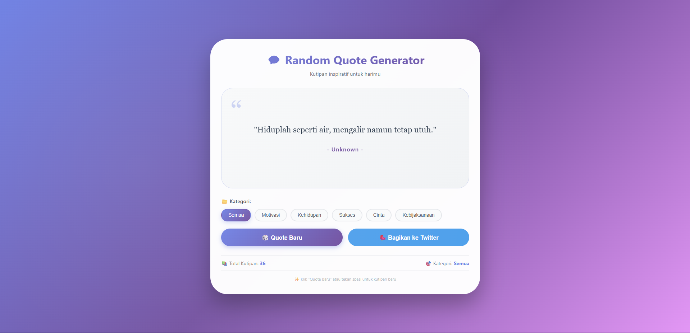

# 💬 Generator Quote

<div align="center">

**Aplikasi penghasil kutipan inspiratif dengan berbagai kategori, lengkap dengan fitur filter, animasi, dan pembagian ke Twitter**

</div>

## 📋 Deskripsi Proyek

**Generator Quote** adalah aplikasi web yang menampilkan kutipan-kutipan inspiratif secara acak dari berbagai kategori seperti motivasi, kehidupan, sukses, cinta, dan kebijaksanaan. Aplikasi ini memungkinkan pengguna untuk memfilter kutipan berdasarkan kategori, membagikan kutipan favorit ke Twitter, menikmati animasi pergantian kutipan yang mulus, serta mendukung shortcut keyboard untuk pengalaman yang lebih interaktif.

Aplikasi ini sangat berguna untuk memulai hari dengan semangat, mencari inspirasi saat sedang down, atau sekadar mendapatkan perspektif baru tentang kehidupan. Dengan desain yang modern dan 30+ kutipan berkualitas, pengguna dapat terus mendapatkan energi positif setiap saat.

Fitur utama aplikasi ini:
- **Kutipan Acak**: Menampilkan kutipan berbeda setiap kali tombol diklik
- **6 Kategori**: Motivasi, Kehidupan, Sukses, Cinta, Kebijaksanaan, dan Semua
- **Filter Kategori**: Pilih kategori tertentu untuk mendapatkan kutipan yang relevan
- **Bagikan ke Twitter**: Bagikan kutipan inspiratif ke media sosial dengan satu klik
- **Shortcut Keyboard**: Tekan Spasi untuk kutipan baru, tekan C untuk ganti kategori
- **Database 30+ Kutipan**: Koleksi kutipan dari tokoh terkenal dan kata-kata bijak

## 📑 Daftar Isi

- [Deskripsi Proyek](#-deskripsi-proyek)
- [Tampilan Aplikasi](#-tampilan-aplikasi)
- [Latar Belakang](#-latar-belakang)
- [Fitur Utama](#-fitur-utama)
- [Teknologi yang Digunakan](#-teknologi-yang-digunakan)
- [Cara Penggunaan](#-cara-penggunaan)
- [Peran Developer](#-peran-developer)
- [Pembelajaran dari Proyek](#-pembelajaran-dari-proyek-lessons-learned)
- [Ucapan Terima Kasih](#-ucapan-terima-kasih)

## 📸 Tampilan Aplikasi

### Tampilan Utama




## 🎯 Latar Belakang

Proyek ini dibuat sebagai proyek pribadi untuk mengembangkan keterampilan dalam:

- **Manipulasi Array & Filtering**: Mengelola database kutipan dan memfilter berdasarkan kategori
- **Random Selection Logic**: Mengimplementasikan logika acak dengan pengecualian (tidak sama dengan sebelumnya)
- **Animasi CSS & Transisi**: Membuat efek pergantian kutipan yang halus
- **Shortcut Keyboard**: Menangani event keyboard untuk meningkatkan pengalaman pengguna
- **Social Media Integration**: Membuka Twitter Intent URL untuk berbagi kutipan

Kebutuhan yang melatarbelakangi proyek ini:
- **Kebutuhan akan konten positif** dan inspiratif yang mudah diakses
- **Keinginan memahami** logika random dengan state management
- **Kebutuhan aplikasi ringan** yang dapat digunakan di berbagai perangkat
- **Eksplorasi sharing ke media sosial** menggunakan API berbasis URL

## 🌟 Fitur Utama

### 📚 **Database Kutipan**

| Kategori | Jumlah Kutipan | Contoh Kutipan |
|----------|----------------|----------------|
| **Motivasi** | 8+ | "Jangan menyerah. Penderitaanmu hari ini adalah kekuatanmu untuk hari esok." |
| **Kehidupan** | 7+ | "Hidup adalah 10% apa yang terjadi padamu dan 90% bagaimana kamu meresponnya." |
| **Sukses** | 7+ | "Success is not final, failure is not fatal: it is the courage to continue that counts." |
| **Cinta** | 7+ | "Cinta bukan tentang menemukan orang yang sempurna, tapi belajar melihat ketidaksempurnaan." |
| **Kebijaksanaan** | 7+ | "The only true wisdom is in knowing you know nothing." |

### 🎯 **Sistem Kategori**

| Tombol Kategori | Fungsi | Jumlah Quote |
|----------------|--------|--------------|
| **Semua** | Menampilkan kutipan dari semua kategori | 30+ |
| **Motivasi** | Hanya kutipan motivasi | ~8 |
| **Kehidupan** | Hanya kutipan tentang kehidupan | ~7 |
| **Sukses** | Hanya kutipan tentang kesuksesan | ~7 |
| **Cinta** | Hanya kutipan tentang cinta | ~7 |
| **Kebijaksanaan** | Hanya kutipan bijak | ~7 |

### ⌨️ **Shortcut Keyboard**

| Tombol | Fungsi |
|--------|--------|
| **Spasi** | Menampilkan kutipan baru (tidak sama dengan sebelumnya) |
| **C** | Mengganti kategori (cycle: All → Motivasi → Kehidupan → Sukses → Cinta → Kebijaksanaan → kembali ke All) |

### 🎨 **Animasi & Efek Visual**

| Komponen | Efek |
|----------|------|
| **Pergantian Quote** | Animasi fadeInScale (muncul dengan efek membesar) |
| **Tombol Kategori Aktif** | Gradien ungu dengan bayangan |
| **Tombol Quote Baru** | Efek hover scale dan bayangan |
| **Background** | Berubah gradien setiap kali quote baru (5 variasi) |
| **Card Hover** | Card terangkat (translateY -8px) |

### 🐦 **Bagikan ke Twitter**

| Format | Contoh |
|--------|--------|
| **Struktur Tweet** | `"Kutipan" - Penulis` |
| **Hashtag** | `#quote #inspirasi` |
| **Metode** | Twitter Intent URL (membuka popup) |

## 🛠️ Teknologi yang Digunakan

### Core Technologies

| Teknologi | Fungsi | Alasan Penggunaan |
|-----------|--------|-------------------|
| **HTML5** | Struktur halaman | Semantik, button group, flex layout |
| **CSS3** | Styling dan layout | Flexbox, gradient, animasi keyframes |
| **JavaScript (ES6+)** | Logika dan interaktivitas | Array manipulation, random selection, event handling |

### Fitur JavaScript yang Digunakan

| Fitur | Penggunaan |
|-------|------------|
| **Spread Operator (...)** | Menggabungkan array quotesDatabase dan extraQuotes |
| **Array.filter()** | Memfilter kutipan berdasarkan kategori |
| **Array.map() / forEach()** | Iterasi untuk event listener dan update UI |
| **Math.random()** | Logika pemilihan kutipan acak |
| **Event Listeners** | `click`, `keydown`, `mousedown` |
| **localStorage** | (Tidak digunakan - murni in-memory) |
| **window.open()** | Membuka Twitter Intent URL di popup |

### CSS Modern yang Diterapkan

| Fitur | Penggunaan |
|-------|------------|
| **CSS Gradient** | Background 3 warna, teks gradien, tombol gradien |
| **Keyframes Animation** | Animasi fadeInScale untuk pergantian quote |
| **Flexbox** | Tombol kategori, action buttons, layout |
| **Transform & Transition** | Hover scale, card translate, tombol scale |
| **::before Pseudo-element** | Efek radial gradient overlay |
| **Media Queries** | Responsif untuk layar di bawah 550px |
| **Backdrop-filter** | Efek glassmorphism pada back button |

### Penjelasan File

| File | Fungsi |
|------|--------|
| **index.html** | Struktur aplikasi quote generator. Berisi header, quote display dengan ikon kutip, area kategori dengan 6 tombol filter, action buttons (Quote Baru & Twitter), stats (total kutipan & kategori aktif), dan footer note untuk petunjuk keyboard. |
| **style.css** | Styling lengkap dengan tema gradien ungu-pink, desain card membulat, animasi fadeInScale untuk pergantian quote, styling tombol kategori aktif dengan gradien, efek hover pada card dan tombol, serta layout responsif. |
| **script.js** | Logika inti aplikasi. Berisi database 30+ kutipan dalam objek array, fungsi filtering berdasarkan kategori, logika random dengan pengecualian (tidak mengulang quote yang sama), event handler untuk tombol kategori, shortcut keyboard (Spasi untuk quote baru, C untuk ganti kategori), integrasi Twitter Intent URL, dan efek background bergantian. |

## 🎮 Cara Penggunaan

### Panduan Penggunaan Lengkap

#### 1. **Mendapatkan Kutipan Baru**

| Metode | Cara |
|--------|------|
| **Tombol** | Klik tombol **"🎲 Quote Baru"** |
| **Keyboard** | Tekan **Spasi** pada keyboard |
| **Auto (perubahan kategori)** | Otomatis saat mengganti kategori |

#### 2. **Memilih Kategori**

1. Klik salah satu tombol kategori:
   - **Semua** - Tampilkan semua kutipan
   - **Motivasi** - Kutipan penyemangat
   - **Kehidupan** - Kutipan tentang hidup
   - **Sukses** - Kutipan tentang kesuksesan
   - **Cinta** - Kutipan tentang cinta
   - **Kebijaksanaan** - Kata-kata bijak

2. **Shortcut**: Tekan tombol **C** pada keyboard untuk berpindah kategori (cycle)

#### 3. **Membagikan ke Twitter**

1. Klik tombol **"🐦 Bagikan ke Twitter"**
2. Jendela popup Twitter akan terbuka dengan kutipan yang sudah diformat
3. (Opsional) Edit tweet sebelum memposting
4. Klik "Tweet" untuk membagikan

#### 4. **Membaca Kutipan**

| Elemen | Informasi |
|--------|-----------|
| **Tanda petik besar (“)** | Dekorasi visual di pojok kiri |
| **Teks kutipan** | Isi kutipan dalam tanda petik |
| **Nama penulis** | Sumber kutipan (atau "Unknown") |

#### 5. **Memantau Statistik**

| Statistik | Informasi |
|-----------|-----------|
| **Total Kutipan** | Jumlah total kutipan dalam database |
| **Kategori** | Kategori yang sedang aktif |

### Contoh Kutipan yang Tersedia

#### Kategori Motivasi

> *"Jangan menyerah. Penderitaanmu hari ini adalah kekuatanmu untuk hari esok."* - Unknown

> *"The only limit to our realization of tomorrow is our doubts of today."* - Franklin D. Roosevelt

#### Kategori Kehidupan

> *"Hidup adalah 10% apa yang terjadi padamu dan 90% bagaimana kamu meresponnya."* - Charles R. Swindoll

> *"Life is what happens when you're busy making other plans."* - John Lennon

#### Kategori Sukses

> *"Success is not final, failure is not fatal: it is the courage to continue that counts."* - Winston Churchill

> *"The future depends on what you do today."* - Mahatma Gandhi

#### Kategori Cinta

> *"Where there is love, there is life."* - Mahatma Gandhi

> *"Being deeply loved by someone gives you strength, while loving someone deeply gives you courage."* - Lao Tzu

#### Kategori Kebijaksanaan

> *"The only true wisdom is in knowing you know nothing."* - Socrates

> *"The journey of a thousand miles begins with one step."* - Lao Tzu

### Tips Penggunaan

1. **Gunakan shortcut Spasi** untuk pengalaman yang lebih cepat tanpa menggeser kursor
2. **Tekan C** untuk menjelajahi semua kategori dengan cepat
3. **Bagikan kutipan favorit** ke Twitter untuk menginspirasi teman-teman
4. **Background berubah warna** setiap kali Anda mendapatkan kutipan baru - pengalaman visual yang segar
5. **Kutipan tidak akan terulang** berturut-turut dalam kategori yang sama

### Validasi & Kasus Khusus

| Skenario | Penanganan |
|----------|------------|
| Kategori hanya memiliki 1 kutipan | Quote yang sama akan muncul (tidak ada pilihan lain) |
| Kategori memiliki 2+ kutipan | Quote tidak akan sama dengan sebelumnya |
| Semua kategori | Memilih dari 30+ kutipan dengan logika tidak berulang |

## 👨‍💻 Peran Developer

Sebagai developer proyek pribadi ini, saya bertanggung jawab atas:

### Peran dalam Proyek

| Area | Kontribusi |
|------|------------|
| **Perencanaan** | Merancang struktur database kutipan dan sistem kategori |
| **UI/UX Design** | Mendesain antarmuka dengan quote display yang elegan |
| **Frontend Development** | Membangun struktur HTML dan styling CSS dengan animasi |
| **Database Kutipan** | Mengkurasi 30+ kutipan inspiratif dari berbagai sumber |
| **JavaScript Logic** | Implementasi filtering, random selection, dan keyboard shortcut |
| **Social Media Integration** | Mengintegrasikan Twitter sharing via Intent URL |

### Fokus Pengembangan

1. **Fungsionalitas Inti**
   - Database kutipan dengan kategori dan author
   - Logika filter berdasarkan kategori
   - Random selection dengan pengecualian (tidak mengulang)

2. **Pengalaman Pengguna**
   - Shortcut keyboard (Space, C) untuk power user
   - Animasi pergantian kutipan yang mulus
   - Feedback visual saat tombol diklik (scale down)

3. **Desain Visual**
   - Latar belakang gradien yang sering berubah
   - Quote display dengan ikon petik besar
   - Tombol kategori aktif dengan efek gradien

## 📚 Pembelajaran dari Proyek (Lessons Learned)

### Keterampilan Teknis yang Diperoleh

1. **Array Filtering dengan Kondisi Dinamis**
   ```javascript
   function getFilteredQuotes() {
       if (currentCategory === 'all') return allQuotes;
       return allQuotes.filter(quote => quote.category === currentCategory);
   }
   ```

2. **Random dengan Pengecualian (No Repeat)**
   ```javascript
   let randomIndex;
   do {
       randomIndex = Math.floor(Math.random() * filteredQuotes.length);
   } while (filteredQuotes.length > 1 && randomIndex === lastQuoteIndex);
   lastQuoteIndex = randomIndex;
   ```

3. **Animasi dengan Reflow Trigger**
   ```javascript
   quoteDisplay.style.animation = 'none';
   quoteDisplay.offsetHeight; // trigger reflow
   quoteDisplay.style.animation = 'fadeInScale 0.4s ease forwards';
   ```

4. **Keyboard Shortcut Handling**
   ```javascript
   document.addEventListener('keydown', (e) => {
       if (e.code === 'Space' && !isInputFocused) {
           e.preventDefault();
           generateNewQuote();
       }
   });
   ```

5. **Twitter Intent URL Construction**
   ```javascript
   const tweetUrl = `https://twitter.com/intent/tweet?text=${encodeURIComponent(tweetText)}&hashtags=quote,inspirasi`;
   window.open(tweetUrl, '_blank', 'width=550,height=420');
   ```

### Soft Skills yang Dikembangkan

#### 1. **Kurasi Konten**
- Memilih kutipan yang bermakna dan inspiratif
- Memastikan atribusi penulis yang benar
- Menyeimbangkan kutipan antar kategori

#### 2. **Perhatian terhadap Detail UX**
- Menyediakan shortcut keyboard untuk pengguna lanjutan
- Animasi halus yang tidak mengganggu
- Fallback untuk kategori dengan 1 quote

#### 3. **Kreativitas Desain**
- Background berubah untuk memberikan kesegaran visual
- Ikon petik besar sebagai elemen dekoratif
- Tampilan quote dengan font Georgia yang elegan

## 🙏 Ucapan Terima Kasih

### Sumber Daya dan Referensi

#### Sumber Kutipan
- **Tokoh terkenal** - Winston Churchill, Mahatma Gandhi, Abraham Lincoln, Socrates, Lao Tzu
- **Kata-kata bijak anonim** - Penulis "Unknown" dari berbagai sumber inspiratif

#### Dokumentasi Resmi
- [MDN Web Docs - Array.filter](https://developer.mozilla.org/en-US/docs/Web/JavaScript/Reference/Global_Objects/Array/filter) - Panduan filtering array
- [Twitter Intent API](https://developer.twitter.com/en/docs/twitter-for-websites/tweet-button/guides/web-intent) - Dokumentasi Twitter sharing
- [MDN Web Docs - KeyboardEvent](https://developer.mozilla.org/en-US/docs/Web/API/KeyboardEvent) - Panduan event keyboard

#### Inspirasi Desain
- **Dribbble** - Inspirasi desain quote card modern
- **Pinterest** - Referensi layout quote generator

#### Tools yang Membantu
- **GitHub** - Hosting repository dan version control
- **VS Code** - Editor kode dengan Live Server

---

<div align="center">

**⭐ Jika proyek ini menginspirasi Anda setiap hari, berikan bintang! ⭐**

**"Kata-kata bijak adalah lentera di kegelapan. Biarkan kutipan ini menerangi harimu."**

</div>