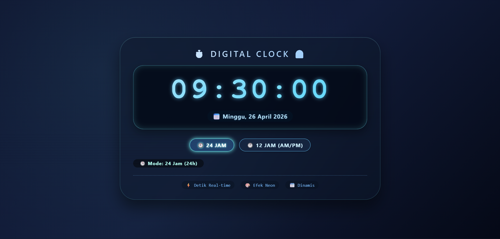
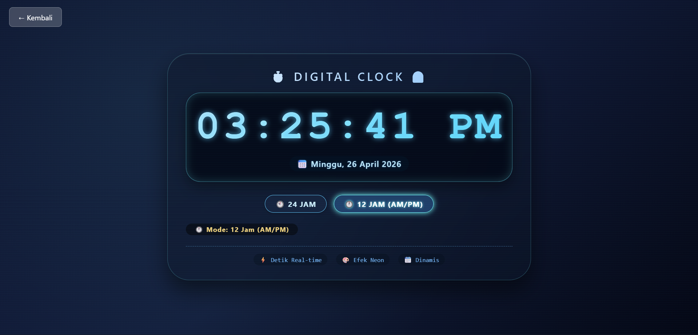

# ⏱️ Jam Digital

**Jam digital dengan tampilan neon futuristik yang menampilkan waktu real-time dalam format 12 jam (AM/PM) atau 24 jam, lengkap dengan informasi tanggal dinamis.**

## 📋 Deskripsi Proyek

**Jam Digital** adalah aplikasi web jam digital yang menampilkan waktu secara real-time dengan antarmuka yang elegan dan modern. Aplikasi ini memungkinkan pengguna untuk beralih antara format waktu 12 jam (AM/PM) dan 24 jam, serta menampilkan informasi tanggal lengkap mulai dari hari, tanggal, bulan, hingga tahun. Desainnya yang dilengkapi efek neon dan animasi detak memberikan pengalaman visual yang menarik.

Aplikasi ini sangat cocok digunakan sebagai pelengkap website pribadi, dashboard, screensaver digital, atau sekadar jam elegan yang dapat memanjakan mata. Dengan fitur mode waktu yang fleksibel, pengguna dapat memilih format sesuai kebiasaan sehari-hari.

Fitur utama aplikasi ini:
- **Dua Mode Waktu**: Beralih antara format 24 jam dan 12 jam (dengan indikator AM/PM)
- **Update Real-time**: Detik berjalan secara live dengan animasi efek neon setiap detiknya
- **Informasi Tanggal Lengkap**: Menampilkan hari, tanggal, bulan, dan tahun dalam bahasa Indonesia
- **Tampilan Neon Futuristik**: Efek glow, glassmorphism, dan gradien warna yang dinamis
- **Desain Responsif**: Tampilan optimal di berbagai ukuran layar, dari desktop hingga ponsel

## 📑 Daftar Isi

- [Deskripsi Proyek](#-deskripsi-proyek)
- [Tampilan Aplikasi](#-tampilan-aplikasi)
- [Latar Belakang](#-latar-belakang)
- [Fitur Utama](#-fitur-utama)
- [Teknologi yang Digunakan](#-teknologi-yang-digunakan)
- [Cara Penggunaan](#-cara-penggunaan)
- [Peran Developer](#-peran-developer)
- [Pembelajaran dari Proyek](#-pembelajaran-dari-proyek-lessons-learned)
- [Ucapan Terima Kasih](#-ucapan-terima-kasih)

## 📸 Tampilan Aplikasi

### Tampilan Utama (Mode 24 Jam)
 

### Tampilan Mode 12 Jam (AM/PM)

## 🎯 Latar Belakang

Proyek ini dibuat sebagai proyek pribadi untuk mengembangkan keterampilan dalam:

- **Manipulasi Waktu dengan JavaScript**: Menggunakan Date API untuk mendapatkan jam, menit, detik, dan informasi tanggal.
- **Interval dan Timer**: Mengimplementasikan `setInterval` untuk update tampilan setiap detik secara real-time.
- **Manajemen State**: Mengatur status format waktu (12/24 jam) yang dapat diubah pengguna.
- **Manipulasi DOM**: Memperbarui tampilan jam, tanggal, dan badge indikator secara dinamis.
- **CSS Modern**: Membuat efek neon, glassmorphism, gradien teks, dan animasi transisi.

## 🌟 Fitur Utama

### ⏲️ **Mode Waktu**

| Mode | Format | Indikator |
|------|--------|------------|
| **24 Jam** | HH:MM:SS (00:00:00 - 23:59:59) | 🕒 Mode: 24 Jam |
| **12 Jam** | HH:MM:SS AM/PM (12:00:00 AM - 11:59:59 PM) | 🕛 Mode: 12 Jam (AM/PM) |

### 📅 **Informasi Tanggal**

| Komponen | Format | Contoh |
|----------|--------|--------|
| Hari | Nama hari dalam Bahasa Indonesia | Senin, Selasa, Rabu, ... Minggu |
| Tanggal | Angka 1-31 | 26 |
| Bulan | Nama bulan dalam Bahasa Indonesia | Januari, Februari, ... Desember |
| Tahun | 4 digit | 2026 |

### 🎨 **Efek Visual & Animasi**

| Komponen | Efek |
|----------|------|
| **Teks Jam** | Gradien warna cyan-biru dengan efek glow |
| **Display Latar** | Efek neon pulse setiap detik (box-shadow berdenyut) |
| **Background** | Gradien gelap dengan radial glow dan scanline halus |
| **Tombol Mode** | Efek hover scale, glow, dan animasi klik (scale down) |
| **Badge Indikator** | Animasi scale saat detik berganti |
| **Glassmorphism** | Backdrop-filter blur pada container utama |

### ✅ **Interaktivitas**

| Aksi | Reaksi |
|----------|--------|
| Klik tombol "24 JAM" | Beralih ke format 24 jam, tombol aktif menyala |
| Klik tombol "12 JAM (AM/PM)" | Beralih ke format 12 jam dengan indikator AM/PM |
| Setiap detik berganti | Efek neon berdenyut pada display dan badge |

## 🛠️ Teknologi yang Digunakan

### Core Technologies

| Teknologi | Fungsi | Alasan Penggunaan |
|-----------|--------|-------------------|
| **HTML5** | Struktur halaman | Standar web, semantik, mudah dibaca |
| **CSS3** | Styling dan layout | Flexbox, gradient, glassmorphism, animasi keyframes |
| **JavaScript (ES6+)** | Logika dan interaktivitas | Date API, setInterval, DOM manipulation, event handling |

### Fitur yang Digunakan

| Fitur | Penggunaan |
|-------|------------|
| **Date API** | Mendapatkan jam, menit, detik, hari, tanggal, bulan, tahun saat ini |
| **setInterval** | Memperbarui tampilan jam setiap 1000ms (1 detik) |
| **clearInterval** | Membersihkan interval saat diperlukan (prevent memory leak) |
| **padStart** | Format angka dengan leading zero (05, 09, 12) |
| **Flexbox** | Tata letak tombol kontrol yang responsif |
| **CSS Gradient** | Background linear-gradient radial dan pada teks (background-clip: text) |
| **Glassmorphism** | Efek backdrop-filter blur pada container dan tombol |
| **Event Listener** | Menangani klik tombol mode 12/24 jam dan animasi tekan |
| **IIFE (Immediately Invoked Function Expression)** | Membungkus seluruh kode JS untuk menghindari global variable |

### Penjelasan File

| File | Fungsi |
|------|--------|
| **index.html** | Struktur dasar aplikasi jam digital. Berisi container utama, display jam, area tanggal, tombol kontrol format (24h/12h), badge indikator, dan elemen footer informasi. |
| **style.css** | Styling aplikasi. Mengatur background gradien dark theme, efek neon, glassmorphism, tata letak flexbox untuk kontrol, desain responsif, dan animasi hover/klik. |
| **script.js** | Logika aplikasi. Mengambil waktu real-time, melakukan konversi format 12/24 jam, memperbarui DOM setiap detik, mengelola state mode, menambahkan efek kedipan neon, dan menangani event tombol. |

## 🎮 Cara Penggunaan

### Panduan Penggunaan Lengkap

#### 1. **Menjalankan Aplikasi**
1. Buka file `index.html` di browser modern (Chrome, Firefox, Edge, Safari).
2. Jam akan langsung berjalan dengan mode **24 Jam** sebagai default.

#### 2. **Mengganti Format Waktu**

| Tombol | Fungsi |
|--------|--------|
| **🕙 24 JAM** | Mengubah tampilan jam ke format 24 jam (contoh: 14:30:05) |
| **🕛 12 JAM (AM/PM)** | Mengubah tampilan jam ke format 12 jam dengan keterangan AM/PM (contoh: 02:30:05 PM) |

#### 3. **Membaca Informasi**
- **Waktu**: Ditampilkan dengan huruf besar bercahaya di tengah.
- **Tanggal**: Format `📅 Hari, Tanggal Bulan Tahun` (contoh: 📅 Minggu, 26 April 2026).
- **Indikator Mode**: Menampilkan mode aktif di bawah tombol.
- **Info Tambahan**: Menampilkan keterangan "⚡ Detik Real-time", "🎨 Efek Neon", "📆 Dinamis".

#### 4. **Contoh Tampilan Jam**

| Waktu Sebenarnya | Mode 24 Jam | Mode 12 Jam |
|-----------------|-------------|-------------|
| 07:05:09 | 07:05:09 | 07:05:09 AM |
| 12:00:00 | 12:00:00 | 12:00:00 PM |
| 15:30:45 | 15:30:45 | 03:30:45 PM |
| 00:15:30 | 00:15:30 | 12:15:30 AM |

### Efek Visual Interaktif

| Elemen | Efek yang Terlihat |
|--------|---------------------|
| **Display Jam** | Setiap detik, cahaya neon di sekeliling display akan berdenyut cepat |
| **Tombol Mode** | Saat diklik, tombol mengecil sedikit lalu kembali normal (efek tekan) |
| **Badge Indikator** | Saat detik berganti, badge akan membesar sedikit lalu kembali normal |
| **Tombol Aktif** | Tombol mode yang sedang aktif memiliki efek glow dan border lebih terang |

### Tips Penggunaan

1. **Mode default** adalah 24 jam. Klik tombol 12 jam jika Anda lebih nyaman dengan format AM/PM.
2. **Jam berjalan otomatis** setiap detik, tidak perlu refresh halaman.
3. **Tampilan optimal** pada browser dengan dukungan CSS `backdrop-filter` dan `background-clip: text`.
4. **Back button** di pojok kiri atas dapat digunakan untuk kembali ke halaman utama (jika tersedia struktur folder dengan `../index.html`).

## 👨‍💻 Peran Developer

Sebagai developer proyek pribadi ini, saya bertanggung jawab atas:

### Peran dalam Proyek

| Area | Kontribusi |
|------|------------|
| **Perencanaan** | Merancang fitur jam digital dengan dua mode waktu |
| **UI/UX Design** | Mendesain antarmuka dengan tema gelap, efek neon, dan elemen glassmorphism |
| **Frontend Development** | Membangun struktur HTML semantik dan styling CSS responsif |
| **JavaScript Logic** | Implementasi real-time clock, konversi 12/24 jam, dan animasi per detik |
| **Manajemen State** | Mengatur status mode format waktu dengan visual indicator aktif |
| **Animasi & Efek** | Menambahkan efek denyut neon pada display dan efek klik pada tombol |

### Fokus Pengembangan

1. **Fungsionalitas Inti**
   - Mendapatkan waktu sistem secara real-time dengan `new Date()`
   - Konversi dari format 24 jam ke 12 jam dengan logika AM/PM
   - Update DOM setiap detik dengan `setInterval`

2. **User Experience**
   - Tombol mode yang jelas dengan ikon dan teks
   - Badge indikator yang menunjukkan format aktif
   - Efek visual yang memberikan feedback pada setiap interaksi

3. **Desain Visual**
   - Efek neon pada teks jam (`text-shadow` dan `gradient`)
   - Efek glassmorphism dengan `backdrop-filter`
   - Animasi mikro (micro-interactions) pada tombol dan badge

## 📚 Pembelajaran dari Proyek (Lessons Learned)

### Keterampilan Teknis yang Diperoleh

1. **Konversi Format Waktu 12/24 Jam**
   - Memahami logika konversi dari jam 0-23 ke jam 1-12 AM/PM
   - Menangani kondisi midnight (00:00 → 12:00 AM) dan noon (12:00 → 12:00 PM)

2. **Real-time Clock dengan JavaScript**
   - Menggunakan `setInterval` untuk update tampilan setiap detik
   - Membersihkan interval dengan `clearInterval` untuk mencegah memory leak

3. **Manipulasi Tanggal Dinamis**
   - Menggunakan array untuk nama hari dan bulan dalam Bahasa Indonesia
   - Memformat tanggal lengkap dengan `getDay()`, `getDate()`, `getMonth()`, `getFullYear()`

4. **CSS Modern untuk Efek Visual**
   - `background-clip: text` untuk gradien pada teks
   - `backdrop-filter: blur()` untuk efek kaca (glassmorphism)
   - Animasi transisi pada box-shadow dan transform

5. **State Management Sederhana**
   - Menggunakan variabel boolean `is24HourFormat` untuk menyimpan preferensi pengguna
   - Update UI (tombol aktif, badge, tampilan jam) saat state berubah

6. **Micro-interactions**
   - Animasi scale pada tombol saat diklik (efek tekan)
   - Efek denyut neon setiap detik memberikan kesan "hidup"

### Soft Skills yang Dikembangkan

#### 1. **Perhatian terhadap Detail**
- Memastikan format AM/PM ditampilkan dengan benar (tidak terbalik)
- Menjaga konsistensi leading zero pada semua format waktu

#### 2. **Kreativitas Desain**
- Memadukan tema gelap dengan aksen cyan/neon untuk kesan futuristik
- Memilih font `Orbitron` yang cocok untuk tampilan digital

#### 3. **Pemecahan Masalah**
- Menangani kasus edge seperti jam 00:00 (midnight) dan jam 12:00 (noon) pada format 12 jam
- Memastikan elemen DOM tersedia sebelum dimanipulasi (null checking)

## 🙏 Ucapan Terima Kasih

### Sumber Daya dan Referensi

#### Dokumentasi Resmi
- [MDN Web Docs](https://developer.mozilla.org/) - Dokumentasi Date API, setInterval, dan CSS
- [Date API Documentation](https://developer.mozilla.org/en-US/docs/Web/JavaScript/Reference/Global_Objects/Date) - Panduan lengkap manipulasi tanggal dan waktu
- [setInterval Documentation](https://developer.mozilla.org/en-US/docs/Web/API/setInterval) - Panduan timer dan interval
- [CSS Gradient](https://cssgradient.io/) - Inspirasi pembuatan gradient untuk background dan teks

#### Font yang Digunakan
- **Google Fonts** - Font `Orbitron` untuk tampilan jam digital

#### Tools yang Membantu
- **GitHub** - Hosting repository dan version control
- **VS Code** - Editor kode dengan ekstensi Live Server

---

**⭐ Jika proyek ini membantu Anda dalam belajar JavaScript atau sekadar membuat tampilan jam yang keren, berikan bintang! ⭐**

**"Waktu adalah aset paling berharga"**

