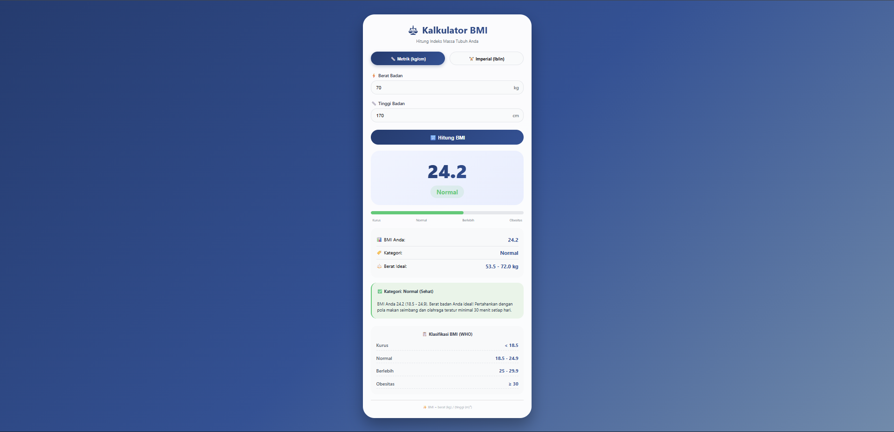

# ⚖️ Kalkulator BMI

**Aplikasi kalkulator BMI yang mendukung satuan metrik (kg/cm) dan imperial (lb/in), dilengkapi visualisasi skala, rekomendasi kesehatan, dan klasifikasi berdasarkan standar WHO**

## 📋 Deskripsi Proyek

**Kalkulator BMI** adalah aplikasi web yang menghitung Indeks Massa Tubuh (Body Mass Index) berdasarkan berat dan tinggi badan pengguna. Aplikasi ini mendukung dua sistem satuan (metrik dan imperial), menampilkan hasil dengan visualisasi skala warna, memberikan rekomendasi kesehatan yang dipersonalisasi, serta menyajikan informasi berat badan ideal dan klasifikasi BMI menurut standar Organisasi Kesehatan Dunia (WHO).

Aplikasi ini sangat berguna bagi siapa saja yang ingin memantau status berat badan mereka, baik untuk keperluan kesehatan pribadi, konsultasi gizi, maupun edukasi tentang pentingnya menjaga berat badan ideal. Dengan dukungan dua sistem satuan, pengguna dari berbagai negara dapat menggunakan kalkulator ini dengan nyaman.

Fitur utama aplikasi ini:
- **Dua Sistem Satuan**: Metrik (kg/cm) dan Imperial (lb/in) dengan konversi otomatis antar satuan
- **Perhitungan Real-time**: Hasil BMI terupdate saat pengguna mengetik atau mengklik tombol hitung
- **Visualisasi Skala BMI**: Progress bar dinamis yang menunjukkan posisi BMI pada rentang 0-40
- **Klasifikasi 4 Kategori**: Kurus, Normal, Berlebih, Obesitas (standar WHO)
- **Berat Ideal**: Menampilkan rentang berat badan ideal berdasarkan tinggi pengguna
- **Rekomendasi Kesehatan**: Saran personal berdasarkan kategori BMI pengguna

## 📑 Daftar Isi

- [Deskripsi Proyek](#-deskripsi-proyek)
- [Tampilan Aplikasi](#-tampilan-aplikasi)
- [Latar Belakang](#-latar-belakang)
- [Fitur Utama](#-fitur-utama)
- [Teknologi yang Digunakan](#-teknologi-yang-digunakan)
- [Cara Penggunaan](#-cara-penggunaan)
- [Peran Developer](#-peran-developer)
- [Pembelajaran dari Proyek](#-pembelajaran-dari-proyek-lessons-learned)
- [Ucapan Terima Kasih](#-ucapan-terima-kasih)

## 📸 Tampilan Aplikasi

### Tampilan Utama (Mode Metrik)

 

## 🎯 Latar Belakang

Proyek ini dibuat sebagai proyek pribadi untuk mengembangkan keterampilan dalam:

- **Implementasi Rumus Matematika**: Menerapkan rumus BMI dengan dua sistem satuan berbeda
- **Manajemen State UI**: Mengatur tampilan input berdasarkan satuan yang dipilih pengguna
- **Konversi Satuan**: Mengimplementasikan konversi otomatis antara metrik dan imperial
- **Visualisasi Data**: Membuat progress bar dinamis yang merepresentasikan posisi BMI
- **Personalisasi Konten**: Menampilkan rekomendasi berbeda berdasarkan kategori BMI

Kebutuhan yang melatarbelakangi proyek ini:
- **Kebutuhan alat hitung BMI** yang mudah digunakan dan mendukung dua satuan
- **Keinginan memahami** konversi satuan dan validasi input dalam JavaScript
- **Kebutuhan visualisasi status kesehatan** yang informatif dan menarik
- **Edukasi masyarakat** tentang pentingnya menjaga berat badan ideal

## 🌟 Fitur Utama

### ⚖️ **Rumus Perhitungan BMI**

| Sistem | Rumus | Konversi |
|--------|-------|----------|
| **Metrik** | `BMI = berat (kg) / (tinggi (m)²)` | Tinggi cm → m (dibagi 100) |
| **Imperial** | `BMI = (berat (lb) / (tinggi (in)²)) × 703` | Implementasi via konversi ke metrik |

### 📊 **Klasifikasi BMI (Standar WHO)**

| Kategori | Rentang BMI | Warna Indikator |
|----------|-------------|-----------------|
| **Kurus** | < 18.5 | 🔵 Biru (#3498db) |
| **Normal** | 18.5 - 24.9 | 🟢 Hijau (#2ecc71) |
| **Berlebih** | 25 - 29.9 | 🟠 Jingga (#f39c12) |
| **Obesitas** | ≥ 30 | 🔴 Merah (#e74c3c) |

### 📏 **Berat Ideal**

| Kategori | Rumus | Keterangan |
|----------|-------|-------------|
| **Batas Bawah** | `18.5 × (tinggi dalam m)²` | BMI minimal kategori normal |
| **Batas Atas** | `24.9 × (tinggi dalam m)²` | BMI maksimal kategori normal |

### 🎨 **Visualisasi & Feedback**

| Komponen | Deskripsi |
|----------|-----------|
| **Progress Bar** | Bar horizontal yang mengisi sesuai nilai BMI (skala 0-40) |
| **Warna Dinamis** | Warna bar dan status berubah sesuai kategori BMI |
| **Animasi Fade In** | Hasil perhitungan muncul dengan efek transisi halus |
| **Info Card** | Ringkasan lengkap: nilai BMI, kategori, berat ideal |

### ✅ **Rekomendasi Kesehatan**

| Kategori | Rekomendasi |
|----------|-------------|
| **Kurus** | Tambah berat badan hingga ideal, konsumsi protein & karbohidrat kompleks |
| **Normal** | Pertahankan dengan pola makan seimbang & olahraga teratur |
| **Berlebih** | Kurangi gula/lemak jenuh, targetkan berat ideal, olahraga kardio |
| **Obesitas** | Konsultasi ke dokter/ahli gizi, target penurunan bertahap |

## 🛠️ Teknologi yang Digunakan

### Core Technologies

| Teknologi | Fungsi | Alasan Penggunaan |
|-----------|--------|-------------------|
| **HTML5** | Struktur halaman | Semantik, aksesibilitas, form elements |
| **CSS3** | Styling dan layout | Flexbox, gradient, animasi, responsif |
| **JavaScript (ES6+)** | Logika dan interaktivitas | Perhitungan BMI, konversi unit, DOM manipulation |

### Fitur JavaScript yang Digunakan

| Fitur | Penggunaan |
|-------|------------|
| **Event Listeners** | `input`, `click`, `keypress` untuk interaksi pengguna |
| **DOM Manipulation** | Update nilai BMI, kategori, rekomendasi secara dinamis |
| **IIFE (Immediately Invoked Function Expression)** | Membungkus kode untuk menghindari global variable |
| **Math Object** | `toFixed()` untuk formatting desimal |
| **Conditional Logic** | Menentukan kategori BMI berdasarkan nilai |

### CSS Modern yang Diterapkan

| Fitur | Penggunaan |
|-------|------------|
| **CSS Gradient** | Background card, tombol, dan teks judul |
| **Flexbox** | Layout unit toggle, info items, dan tabel klasifikasi |
| **CSS Variables** | (Dapat dikembangkan) Warna-warna konsisten |
| **Keyframes Animation** | Animasi fadeIn untuk result section |
| **Media Queries** | Responsif untuk layar di bawah 550px |
| **Backdrop-filter** | Efek glassmorphism pada tombol back |
| **Hover & Active Effects** | Transform scale pada tombol dan card |

### Penjelasan File

| File | Fungsi |
|------|--------|
| **index.html** | Struktur aplikasi kalkulator BMI. Berisi unit toggle (metrik/imperial), input form untuk berat dan tinggi, tombol hitung, area hasil (nilai BMI, status, skala, info detail, rekomendasi), dan tabel klasifikasi WHO. |
| **style.css** | Styling lengkap dengan tema gradien biru, desain card yang bersih, efek hover pada tombol, animasi fadeIn, tata letak responsif, dan styling untuk progress bar. |
| **script.js** | Logika inti aplikasi. Mengelola state satuan (metrik/imperial), melakukan konversi antar satuan, menghitung BMI, menentukan kategori, menghitung berat ideal, menghasilkan rekomendasi, dan mengupdate UI secara dinamis. |

## 🎮 Cara Penggunaan

### Panduan Penggunaan Lengkap

#### 1. **Memilih Sistem Satuan**

| Tombol | Satuan | Input yang Ditampilkan |
|--------|--------|------------------------|
| **📏 Metrik (kg/cm)** | Kilogram (kg) dan Centimeter (cm) | Berat dalam kg, Tinggi dalam cm |
| **🏋️ Imperial (lb/in)** | Pound (lb) dan Inch (in) | Berat dalam lb, Tinggi dalam in |

> **Catatan**: Nilai akan dikonversi secara otomatis saat berganti satuan

#### 2. **Memasukkan Data**

1. Masukkan **berat badan** pada kolom pertama
2. Masukkan **tinggi badan** pada kolom kedua
3. Nilai dapat menggunakan desimal (contoh: 70.5 kg)

#### 3. **Menghitung BMI**

| Metode | Cara |
|--------|------|
| **Tombol** | Klik tombol **"🔢 Hitung BMI"** |
| **Keyboard** | Tekan **Enter** setelah mengisi input |

#### 4. **Membaca Hasil**

| Area | Informasi |
|------|-----------|
| **Nilai BMI** | Angka dengan 1 desimal (contoh: 24.2) |
| **Status Kategori** | Kurus / Normal / Berlebih / Obesitas (dengan warna) |
| **Progress Bar** | Posisi visual pada rentang 0-40 |
| **Info Card** | Detail BMI, kategori, dan berat ideal |
| **Rekomendasi** | Saran personal sesuai kategori |

#### 5. **Contoh Perhitungan**

| Input | Perhitungan | BMI | Kategori |
|-------|-------------|-----|----------|
| Berat: 70 kg, Tinggi: 170 cm | 70 / (1.7)² = 70 / 2.89 | **24.2** | **Normal** |
| Berat: 50 kg, Tinggi: 165 cm | 50 / (1.65)² = 50 / 2.7225 | **18.4** | **Kurus** |
| Berat: 85 kg, Tinggi: 175 cm | 85 / (1.75)² = 85 / 3.0625 | **27.8** | **Berlebih** |
| Berat: 120 kg, Tinggi: 180 cm | 120 / (1.8)² = 120 / 3.24 | **37.0** | **Obesitas** |

### Tabel Referensi Cepat (WHO)

| Kategori | Rentang BMI | Risiko Kesehatan |
|----------|-------------|------------------|
| Kurus | < 18.5 | Rendahnya massa otot, defisiensi nutrisi |
| Normal | 18.5 - 24.9 | Risiko minimal (ideal) |
| Berlebih | 25 - 29.9 | Meningkatnya risiko penyakit metabolik |
| Obesitas | ≥ 30 | Risiko tinggi: diabetes, hipertensi, jantung |

### Validasi Input

| Skenario | Penanganan |
|----------|------------|
| Input kosong | Hasil tidak ditampilkan |
| Input negatif atau nol | Hasil tidak ditampilkan |
| Nilai terlalu besar (BMI > 100) | Hasil tidak ditampilkan |
| Karakter non-angka | Input HTML number mencegah input tidak valid |

### Tips Penggunaan

1. **Gunakan nilai yang akurat** untuk mendapatkan hasil yang tepat
2. **Berkonsultasilah dengan tenaga medis** untuk interpretasi lebih lanjut
3. **BMI memiliki keterbatasan** - tidak membedakan massa otot dan lemak
4. **Anak-anak dan lansia** memiliki standar interpretasi berbeda
5. **Ibu hamil** memerlukan pertimbangan khusus

## 👨‍💻 Peran Developer

Sebagai developer proyek pribadi ini, saya bertanggung jawab atas:

### Peran dalam Proyek

| Area | Kontribusi |
|------|------------|
| **Perencanaan** | Merancang fitur kalkulator BMI dengan 2 sistem satuan |
| **UI/UX Design** | Mendesain antarmuka yang bersih, intuitif, dan informatif |
| **Frontend Development** | Membangun struktur HTML dan styling CSS modern |
| **JavaScript Logic** | Implementasi rumus BMI, konversi satuan, dan logika kategori |
| **Personalisasi Konten** | Membuat rekomendasi dinamis berdasarkan hasil BMI |
| **Responsive Design** | Memastikan tampilan optimal di berbagai ukuran layar |

### Fokus Pengembangan

1. **Fungsionalitas Inti**
   - Implementasi rumus BMI yang akurat untuk dua sistem satuan
   - Konversi otomatis nilai antar satuan saat toggle
   - Perhitungan berat ideal berdasarkan tinggi

2. **Pengalaman Pengguna**
   - Dukungan keyboard (Enter untuk hitung)
   - Animasi halus pada hasil perhitungan
   - Visualisasi warna yang informatif
   - Rekomendasi personal yang mudah dipahami

3. **Desain Visual**
   - Tema gradien biru yang menenangkan
   - Kartu hasil dengan efek bayangan
   - Progress bar yang responsif terhadap nilai BMI
   - Tipografi yang jelas dan terbaca

## 📚 Pembelajaran dari Proyek (Lessons Learned)

### Keterampilan Teknis yang Diperoleh

1. **Konversi Satuan dengan Presisi**
   - Konversi kg ke lb: `weightKg / 0.453592`
   - Konversi cm ke in: `heightCm / 2.54`
   - Konversi lb ke kg: `weightLb * 0.453592`
   - Konversi in ke cm: `heightIn * 2.54`

2. **Manajemen State Sederhana**
   - Menggunakan variabel `isMetric` untuk melacak satuan aktif
   - Sinkronisasi nilai antar dua set input dengan `syncValues()`

3. **Logika Kategori Bertingkat**
   - Menggunakan `if-else` bertingkat untuk 4 kategori BMI
   - Objek `BMI_CATEGORIES` untuk menyimpan konstanta

4. **Perhitungan Berat Ideal**
   - Menghitung batas bawah: `18.5 × (tinggiM)²`
   - Menghitung batas atas: `24.9 × (tinggiM)²`

5. **Fungsi Rekomendasi Dinamis**
   - Memilih template rekomendasi berdasarkan kategori
   - Menyisipkan nilai BMI dan berat ideal ke dalam pesan

6. **Event Handling Pattern**
   - `input` event untuk update real-time
   - `click` event untuk tombol unit dan hitung
   - `keypress` event untuk dukungan Enter

### Soft Skills yang Dikembangkan

#### 1. **Pemahaman Konsep Kesehatan**
- Mempelajari standar BMI dari WHO
- Memahami keterbatasan BMI sebagai indikator kesehatan

#### 2. **Perhatian terhadap Detail**
- Memastikan konversi satuan akurat
- Validasi input yang tepat (nilai positif, tidak kosong)
- Format tampilan angka yang konsisten

#### 3. **Empati Pengguna**
- Menyediakan dua sistem satuan untuk akses global
- Memberikan rekomendasi yang mendukung, bukan menghakimi
- Bahasa yang mudah dipahami oleh publik umum

## 🙏 Ucapan Terima Kasih

### Sumber Daya dan Referensi

#### Standar Medis
- **World Health Organization (WHO)** - Standar klasifikasi BMI global
- **Kementerian Kesehatan RI** - Panduan berat badan ideal untuk populasi Asia

#### Dokumentasi Resmi
- [MDN Web Docs](https://developer.mozilla.org/) - Dokumentasi HTML, CSS, JavaScript
- [WHO BMI Classification](https://www.who.int/data/gho/data/themes/topics/topic-details/GHO/body-mass-index) - Standar klasifikasi BMI

#### Inspirasi Desain
- **Dribbble** - Inspirasi desain kalkulator modern
- **Figma Community** - Referensi UI untuk health apps

#### Tools yang Membantu
- **GitHub** - Hosting repository dan version control
- **VS Code** - Editor kode dengan Live Server

---

**⭐ Jika proyek ini membantu Anda memantau status berat badan, berikan bintang! ⭐**

**"BMI adalah alat skrining, bukan diagnosis. Jaga kesehatan dengan gaya hidup seimbang!"**

