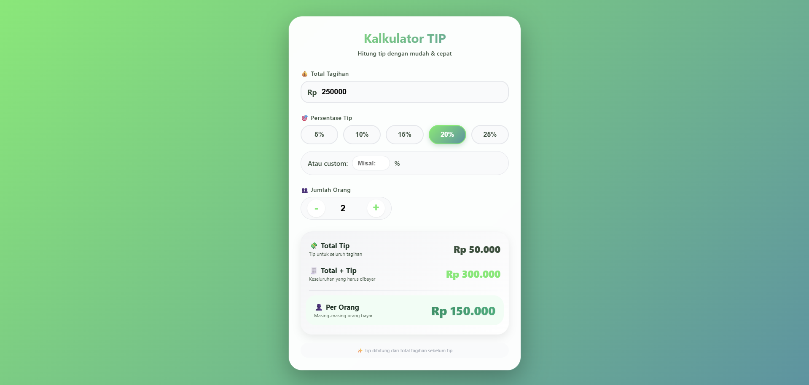

# 💰 Kalkulator TIP

<div align="center">

**Aplikasi kalkulator tip yang memudahkan perhitungan persentase tip dan pembagian tagihan secara merata antar beberapa orang**

</div>

## 📋 Deskripsi Proyek

**Kalkulator TIP** adalah aplikasi web yang membantu pengguna menghitung jumlah tip (uang terima kasih) berdasarkan total tagihan, persentase tip yang dipilih, dan jumlah orang yang akan membagi pembayaran. Aplikasi ini mendukung persentase tip preset (5%, 10%, 15%, 20%, 25%), input custom untuk persentase tip khusus, serta kontrol jumlah orang dengan tombol increment/decrement. Hasil perhitungan ditampilkan secara real-time dengan format mata uang Rupiah (IDR).

Aplikasi ini sangat berguna saat makan bersama di restoran, kafe, atau menggunakan layanan pengantaran makanan. Dengan fitur pembagian per orang, pengguna dapat dengan mudah menentukan berapa banyak setiap orang harus membayar, termasuk tip yang telah disepakati.

Fitur utama aplikasi ini:
- **Persentase Tip Preset**: Tombol cepat untuk 5%, 10%, 15%, 20%, dan 25%
- **Custom Tip Input**: Masukkan persentase tip khusus sesuai keinginan
- **Pembagian per Orang**: Hitung total yang harus dibayar setiap orang
- **Format Mata Uang Rupiah**: Menampilkan hasil dalam format IDR yang familiar
- **Kontrol Jumlah Orang**: Tombol + dan - untuk mengatur jumlah pembagi
- **Perhitungan Real-time**: Hasil terupdate saat pengguna mengubah nilai

## 📑 Daftar Isi

- [Deskripsi Proyek](#-deskripsi-proyek)
- [Tampilan Aplikasi](#-tampilan-aplikasi)
- [Latar Belakang](#-latar-belakang)
- [Fitur Utama](#-fitur-utama)
- [Teknologi yang Digunakan](#-teknologi-yang-digunakan)
- [Cara Penggunaan](#-cara-penggunaan)
- [Peran Developer](#-peran-developer)
- [Pembelajaran dari Proyek](#-pembelajaran-dari-proyek-lessons-learned)
- [Ucapan Terima Kasih](#-ucapan-terima-kasih)

## 📸 Tampilan Aplikasi

### Tampilan Utama



## 🎯 Latar Belakang

Proyek ini dibuat sebagai proyek pribadi untuk mengembangkan keterampilan dalam:

- **Perhitungan Persentase & Pembagian**: Mengimplementasikan rumus tip dan pembagian rata per orang
- **Format Mata Uang**: Menggunakan Intl.NumberFormat untuk format Rupiah yang sesuai standar Indonesia
- **Manajemen State UI**: Mengelola state persentase tip aktif dan sinkronisasi dengan input custom
- **Event Handling Real-time**: Menangani berbagai event (input, click, keypress) untuk update instan
- **Animasi Mikro**: Menambahkan efek skala pada hasil perhitungan untuk feedback visual

Kebutuhan yang melatarbelakangi proyek ini:
- **Kebutuhan alat perhitungan tip** yang cepat dan mudah di restoran/kafe
- **Keinginan memahami** format mata uang dengan Intl API JavaScript
- **Kebutuhan pembagian tagihan** yang adil untuk kelompok
- **Pengalaman pengguna** yang responsif dengan update real-time

## 🌟 Fitur Utama

### 💸 **Rumus Perhitungan**

| Komponen | Rumus | Contoh |
|----------|-------|--------|
| **Total Tip** | `Tagihan × (Persentase Tip / 100)` | Rp250.000 × 15% = Rp37.500 |
| **Total + Tip** | `Tagihan + Total Tip` | Rp250.000 + Rp37.500 = Rp287.500 |
| **Per Orang** | `Total + Tip / Jumlah Orang` | Rp287.500 / 2 = Rp143.750 |

### 🎯 **Persentase Tip**

| Metode | Pilihan | Deskripsi |
|--------|---------|-----------|
| **Preset Buttons** | 5%, 10%, 15%, 20%, 25% | Tombol cepat untuk persentase umum |
| **Custom Input** | Bebas (desimal) | Input manual untuk persentase khusus |

### 👥 **Pembagian per Orang**

| Kontrol | Fungsi |
|---------|--------|
| **Tombol +** | Menambah jumlah orang (+1) |
| **Tombol -** | Mengurangi jumlah orang (-1, minimal 1) |
| **Input Manual** | Ketik langsung jumlah orang |

### 📊 **Hasil yang Ditampilkan**

| Hasil | Deskripsi | Contoh |
|-------|-----------|--------|
| **Total Tip** | Jumlah tip untuk seluruh tagihan | Rp37.500 |
| **Total + Tip** | Keseluruhan yang harus dibayar | Rp287.500 |
| **Per Orang** | Masing-masing orang membayar | Rp143.750 |

### 🎨 **Fitur Visual**

| Komponen | Efek |
|----------|------|
| **Tombol Tip Aktif** | Gradien hijau dengan bayangan |
| **Hasil Per Orang** | Gradien teks hijau, ukuran lebih besar |
| **Animasi Hasil** | Efek scale saat perhitungan berubah |
| **Hover Effect** | Tombol dan card terangkat saat hover |

## 🛠️ Teknologi yang Digunakan

### Core Technologies

| Teknologi | Fungsi | Alasan Penggunaan |
|-----------|--------|-------------------|
| **HTML5** | Struktur halaman | Semantik, form elements, button group |
| **CSS3** | Styling dan layout | Flexbox, gradient, animasi, glassmorphism |
| **JavaScript (ES6+)** | Logika dan interaktivitas | Perhitungan tip, format mata uang, DOM manipulation |

### Web API yang Digunakan

| API / Fitur | Penggunaan |
|-------------|------------|
| **Intl.NumberFormat** | Format mata uang Rupiah (id-ID) |
| **parseFloat / parseInt** | Konversi nilai input dari string ke angka |
| **Event Listeners** | `input`, `click`, `keypress`, `change` |
| **IIFE (Immediately Invoked Function Expression)** | Membungkus kode untuk menghindari global variable |

### CSS Modern yang Diterapkan

| Fitur | Penggunaan |
|-------|------------|
| **CSS Gradient** | Background card, tombol aktif, teks hasil |
| **Flexbox** | Layout tombol tip, kontrol jumlah orang |
| **Backdrop-filter** | Efek glassmorphism pada back button |
| **Transform & Transition** | Animasi hover, scale, dan translate |
| **Media Queries** | Responsif untuk layar di bawah 480px |
| **Custom Number Input Styling** | Menyembunyikan spinner number bawaan |

### Penjelasan File

| File | Fungsi |
|------|--------|
| **index.html** | Struktur aplikasi kalkulator tip. Berisi input total tagihan dengan prefix mata uang, grup tombol persentase tip (5%/10%/15%/20%/25%), input custom tip, kontrol jumlah orang dengan tombol +/- dan input manual, serta area hasil perhitungan (total tip, total+tip, per orang). |
| **style.css** | Styling lengkap dengan tema gradien hijau-biru, desain card modern, efek hover pada tombol, styling khusus untuk input number tanpa spinner, layout responsif, dan animasi pada hasil perhitungan. |
| **script.js** | Logika inti aplikasi. Mengelola state persentase tip, melakukan perhitungan tip, total bill, dan pembagian per orang, memformat hasil ke Rupiah, menangani event dari semua input, serta menambahkan efek animasi pada update hasil. |

## 🎮 Cara Penggunaan

### Panduan Penggunaan Lengkap

#### 1. **Memasukkan Total Tagihan**

1. Pada kolom **"💰 Total Tagihan"**, masukkan jumlah tagihan
2. Format menggunakan Rupiah (contoh: 250000 untuk Rp250.000)
3. Gunakan tombol panah pada input atau ketik manual

> Nilai default: Rp250.000

#### 2. **Memilih Persentase Tip**

| Metode | Cara |
|--------|------|
| **Tombol Preset** | Klik salah satu tombol: 5%, 10%, 15%, 20%, atau 25% |
| **Custom** | Ketik persentase di kolom "Atau custom:" (contoh: 18 untuk 18%) |

> **Catatan**: Custom input akan override tombol preset. Hapus custom input untuk kembali ke preset.

#### 3. **Mengatur Jumlah Orang**

| Aksi | Hasil |
|------|-------|
| Klik **+** | Menambah jumlah orang (+1) |
| Klik **-** | Mengurangi jumlah orang (-1, minimal 1) |
| Ketik manual | Isi langsung jumlah orang |

> Nilai default: 2 orang

#### 4. **Membaca Hasil**

| Area | Informasi |
|------|-----------|
| **💸 Total Tip** | Jumlah tip yang harus diberikan |
| **🧾 Total + Tip** | Total keseluruhan (tagihan + tip) |
| **👤 Per Orang** | Setiap orang membayar (total ÷ jumlah orang) |

### Contoh Skenario Penggunaan

#### Skenario 1: Makan Berdua di Restoran

| Input | Nilai |
|-------|-------|
| Total Tagihan | Rp250.000 |
| Persentase Tip | 15% (default) |
| Jumlah Orang | 2 |

**Hasil Perhitungan:**
- Total Tip: **Rp37.500**
- Total + Tip: **Rp287.500**
- Per Orang: **Rp143.750**

#### Skenario 2: Makan Bertiga dengan Layanan Baik

| Input | Nilai |
|-------|-------|
| Total Tagihan | Rp450.000 |
| Persentase Tip | 20% |
| Jumlah Orang | 3 |

**Hasil Perhitungan:**
- Total Tip: **Rp90.000**
- Total + Tip: **Rp540.000**
- Per Orang: **Rp180.000**

#### Skenario 3: Custom Tip dengan Banyak Orang

| Input | Nilai |
|-------|-------|
| Total Tagihan | Rp1.200.000 |
| Persentase Tip | 12% (custom) |
| Jumlah Orang | 8 |

**Hasil Perhitungan:**
- Total Tip: **Rp144.000**
- Total + Tip: **Rp1.344.000**
- Per Orang: **Rp168.000**

### Validasi Input

| Skenario | Penanganan |
|----------|------------|
| Tagihan kosong atau negatif | Diset menjadi 0 |
| Jumlah orang kurang dari 1 | Diset menjadi 1 |
| Custom tip kosong | Kembali ke persentase preset aktif |
| Custom tip negatif | Diabaikan, perhitungan menggunakan preset |

### Tips Penggunaan

1. **Gunakan tombol preset** untuk persentase tip umum (10-20%)
2. **Custom tip berguna** untuk layanan premium atau tradisi tip yang berbeda
3. **Perhatikan pembulatan** pada format Rupiah tidak menggunakan desimal
4. **Hasil terupdate otomatis** setiap kali mengubah input apapun
5. **Tekan Enter** pada input untuk memastikan perhitungan (meskipun sudah real-time)

## 👨‍💻 Peran Developer

Sebagai developer proyek pribadi ini, saya bertanggung jawab atas:

### Peran dalam Proyek

| Area | Kontribusi |
|------|------------|
| **Perencanaan** | Merancang fitur kalkulator tip dengan preset dan custom |
| **UI/UX Design** | Mendesain antarmuka yang bersih dengan kontrol intuitif |
| **Frontend Development** | Membangun struktur HTML dan styling CSS modern |
| **JavaScript Logic** | Implementasi rumus tip, pembagian per orang, format mata uang |
| **Real-time Updates** | Menghubungkan event handler ke semua input |
| **Animasi & Feedback** | Menambahkan efek visual pada hasil perhitungan |

### Fokus Pengembangan

1. **Fungsionalitas Inti**
   - Implementasi rumus tip yang akurat
   - Pembagian total tagihan secara merata
   - Format Rupiah dengan Intl.NumberFormat

2. **Pengalaman Pengguna**
   - Update real-time tanpa tombol hitung terpisah
   - Tombol preset untuk persentase umum
   - Kontrol increment/decrement untuk jumlah orang
   - Dukungan keyboard (Enter)

3. **Desain Visual**
   - Tema gradien hijau-biru yang segar
   - Tombol aktif dengan efek gradien dan bayangan
   - Animasi mikro pada hasil perhitungan
   - Responsif untuk layar kecil

## 📚 Pembelajaran dari Proyek (Lessons Learned)

### Keterampilan Teknis yang Diperoleh

1. **Format Mata Uang dengan Intl API**
   ```javascript
   new Intl.NumberFormat('id-ID', {
       style: 'currency',
       currency: 'IDR',
       minimumFractionDigits: 0
   }).format(amount);
   ```

2. **Manajemen State dengan Prioritas**
   - Custom tip override preset buttons
   - Sinkronisasi visual active state pada tombol
   - Penanganan input kosong dan nilai tidak valid

3. **Real-time Calculation Pattern**
   - Event `input` untuk update instan
   - Validasi sebelum perhitungan
   - Memisahkan fungsi perhitungan dari event handler

4. **Custom Number Input Styling**
   - Menyembunyikan spinner default dengan `appearance: none`
   - Membuat kontrol +/- sendiri untuk pengalaman lebih baik

5. **Animasi Mikro untuk Feedback**
   - Efek scale pada hasil saat perhitungan berubah
   - Menggunakan `setTimeout` untuk reset animasi

### Soft Skills yang Dikembangkan

#### 1. **Perhatian terhadap Detail UX**
- Menyediakan preset persentase yang umum digunakan
- Konfirmasi visual tombol aktif
- Animasi halus yang tidak mengganggu

#### 2. **Pemahaman Konteks Penggunaan**
- Memahami kebiasaan memberi tip di restoran/kafe
- Menyadari pentingnya pembagian per orang untuk kelompok

#### 3. **Testing Edge Cases**
- Menangani tagihan nol
- Menangani pembagian dengan satu orang
- Menangani custom tip yang dihapus

## 🙏 Ucapan Terima Kasih

### Sumber Daya dan Referensi

#### Dokumentasi Resmi
- [MDN Web Docs](https://developer.mozilla.org/) - Dokumentasi JavaScript dan Web APIs
- [Intl.NumberFormat Documentation](https://developer.mozilla.org/en-US/docs/Web/JavaScript/Reference/Global_Objects/Intl/NumberFormat) - Panduan format mata uang
- [CSS Gradient Generator](https://cssgradient.io/) - Inspirasi gradien

#### Inspirasi
- **Kalkulator tip pada aplikasi GoFood/GrabFood** - Inspirasi fitur
- **Restoran di Indonesia** - Standar persentase tip lokal

#### Tools yang Membantu
- **GitHub** - Hosting repository dan version control
- **VS Code** - Editor kode dengan Live Server

---

<div align="center">

**⭐ Jika proyek ini membantu Anda menghitung tip dengan mudah, berikan bintang! ⭐**

**"Tip adalah bentuk apresiasi untuk pelayanan yang baik. Hitung dengan adil!"**

</div>