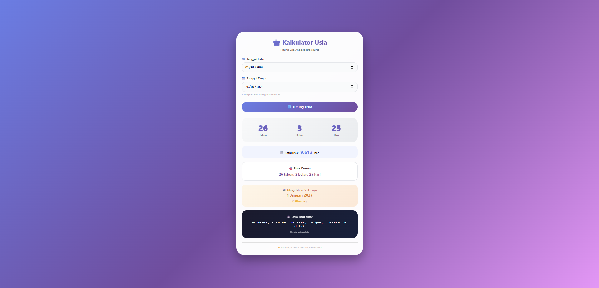

# 🎂 Kalkulator Usia

<div align="center">

**Aplikasi kalkulator usia yang menghitung umur secara akurat dalam tahun, bulan, hari, total hari, dilengkapi hitungan mundur menuju ulang tahun berikutnya dan usia real-time hingga detik**

</div>

## 📋 Deskripsi Proyek

**Kalkulator Usia** adalah aplikasi web yang menghitung usia seseorang berdasarkan tanggal lahir dan tanggal target yang ditentukan. Aplikasi ini menampilkan hasil perhitungan dalam berbagai format: tahun, bulan, hari, total hari, serta usia presisi lengkap. Fitur unggulan termasuk hitungan mundur menuju ulang tahun berikutnya dan tampilan usia real-time yang terus berdetak setiap detik. Perhitungan sudah mempertimbangkan tahun kabisat untuk akurasi maksimal.

Aplikasi ini sangat berguna untuk berbagai keperluan seperti menghitung usia untuk pendaftaran sekolah, kerja, pernikahan, asuransi, atau sekadar keperluan pribadi untuk mengetahui usia tepat seseorang. Dengan fitur tanggal target yang dapat diubah, pengguna dapat menghitung usia di masa lalu maupun masa depan.

Fitur utama aplikasi ini:
- **Perhitungan Usia Lengkap**: Tahun, bulan, dan hari (akurat hingga level hari)
- **Total Hari**: Menampilkan total usia dalam satuan hari
- **Tanggal Target Fleksibel**: Bisa menghitung usia hingga tanggal tertentu (bisa di masa lalu atau depan)
- **Ulang Tahun Berikutnya**: Menampilkan kapan ulang tahun berikutnya dan berapa hari lagi
- **Usia Real-time**: Tampilan usia yang berdetak hingga detik (live counter)
- **Akurasi Tahun Kabisat**: Perhitungan memperhitungkan tanggal 29 Februari

## 📑 Daftar Isi

- [Deskripsi Proyek](#-deskripsi-proyek)
- [Tampilan Aplikasi](#-tampilan-aplikasi)
- [Latar Belakang](#-latar-belakang)
- [Fitur Utama](#-fitur-utama)
- [Teknologi yang Digunakan](#-teknologi-yang-digunakan)
- [Cara Penggunaan](#-cara-penggunaan)
- [Peran Developer](#-peran-developer)
- [Pembelajaran dari Proyek](#-pembelajaran-dari-proyek-lessons-learned)
- [Ucapan Terima Kasih](#-ucapan-terima-kasih)

## 📸 Tampilan Aplikasi

### Tampilan Utama



## 🎯 Latar Belakang

Proyek ini dibuat sebagai proyek pribadi untuk mengembangkan keterampilan dalam:

- **Manipulasi Tanggal Kompleks**: Menghitung selisih dua tanggal dengan akurasi level hari, bulan, tahun
- **Penanganan Tahun Kabisat**: Memastikan perhitungan tanggal 29 Februari ditangani dengan benar
- **Real-time Counter dengan setInterval**: Mengimplementasikan counter yang update setiap detik
- **Format Tanggal Lokal**: Menggunakan `toLocaleDateString` untuk format tanggal Indonesia
- **Antarmuka Pengguna yang Informatif**: Menyajikan informasi usia dalam berbagai perspektif

Kebutuhan yang melatarbelakangi proyek ini:
- **Kebutuhan alat hitung usia** yang tidak hanya menampilkan tahun tetapi juga detail bulan dan hari
- **Keinginan memahami** kompleksitas manipulasi tanggal JavaScript (objek Date)
- **Kebutuhan perhitungan usia** untuk berbagai keperluan administratif
- **Eksplorasi real-time counter** yang terus berjalan

## 🌟 Fitur Utama

### 📅 **Perhitungan Usia Dasar**

| Komponen | Deskripsi | Rumus / Metode |
|----------|-----------|----------------|
| **Tahun** | Selisih tahun antara tanggal lahir dan target | `endYear - startYear`, dengan penyesuaian jika bulan/hari belum terpenuhi |
| **Bulan** | Selisih bulan, disesuaikan jika hari negatif | `endMonth - startMonth`, +12 jika negatif |
| **Hari** | Selisih hari, menggunakan tanggal pada bulan sebelumnya | Mengambil jumlah hari dari bulan sebelumnya jika perlu |

### 📊 **Format Hasil yang Ditampilkan**

| Hasil | Format | Contoh |
|-------|--------|--------|
| **Usia (Tahun/Bulan/Hari)** | 3 angka dengan label | 25 tahun, 6 bulan, 15 hari |
| **Total Hari** | Angka dengan format ribuan | 9.492 hari |
| **Usia Presisi** | Kalimat lengkap | 25 tahun, 6 bulan, 15 hari |
| **Ulang Tahun Berikutnya** | Tanggal dan hitung mundur | 25 Desember 2026 (150 hari lagi) |
| **Usia Real-time** | Update per detik hingga detik | 25 tahun 6 bulan 15 hari 10 jam 30 menit 45 detik |

### 🎯 **Penanganan Kasus Khusus**

| Kasus | Penanganan |
|-------|------------|
| **Bulan/hari negatif** | Melakukan rollback (kurangi tahun/bulan, tambah hari dari bulan sebelumnya) |
| **Tahun kabisat** | Menggunakan `new Date(year, month, 0)` untuk mendapatkan hari terakhir bulan secara akurat |
| **Tanggal lahir > tanggal target** | Menampilkan alert dan tidak melanjutkan perhitungan |
| **Tanggal target kosong** | Otomatis menggunakan tanggal hari ini |

### ⏱️ **Live Counter (Usia Real-time)**

| Komponen | Deskripsi |
|----------|-----------|
| **Tingkat Akurasi** | Tahun, bulan, hari, jam, menit, detik |
| **Update Rate** | Setiap 1 detik (1000ms) |
| **Metode** | Kombinasi perhitungan milidetik dan penyesuaian tanggal |
| **Warna Tema** | Dark theme (latar gelap, teks terang) untuk kontras |

### 🎨 **Desain Antarmuka**

| Komponen | Deskripsi |
|----------|-----------|
| **Gradient Background** | Linear gradien dari ungu (#667eea) ke pink (#f093fb) |
| **Card Utama** | Latar putih dengan border-radius besar dan bayangan |
| **Display Usia** | Tiga kolom (tahun/bulan/hari) dengan angka gradien |
| **Ulang Tahun Card** | Tema oranye khusus untuk informasi ulang tahun |
| **Live Counter Card** | Dark theme untuk membedakan dengan konten lain |

## 🛠️ Teknologi yang Digunakan

### Core Technologies

| Teknologi | Fungsi | Alasan Penggunaan |
|-----------|--------|-------------------|
| **HTML5** | Struktur halaman | Semantik, form elements (input date) |
| **CSS3** | Styling dan layout | Flexbox, gradient, animasi, glassmorphism |
| **JavaScript (ES6+)** | Logika dan interaktivitas | Date manipulation, setInterval, DOM manipulation |

### Objek Date API yang Digunakan

| Method | Penggunaan |
|--------|------------|
| `new Date()` | Membuat objek tanggal saat ini |
| `getFullYear()` / `setFullYear()` | Mendapatkan/mengatur tahun |
| `getMonth()` / `setMonth()` | Mendapatkan/mengatur bulan (0-11) |
| `getDate()` | Mendapatkan tanggal (1-31) |
| `getDay()` | Mendapatkan hari dalam minggu (untuk keperluan lain) |
| `toLocaleDateString()` | Format tanggal ke Bahasa Indonesia |

### Fitur JavaScript yang Digunakan

| Fitur | Penggunaan |
|-------|------------|
| **setInterval / clearInterval** | Live counter update setiap detik |
| **setHours(0,0,0,0)** | Reset waktu ke tengah malam untuk perbandingan akurat |
| **parseInt / parseFloat** | Konversi nilai |
| **Event Listeners** | `click`, `change`, `keypress` |
| **IIFE (Immediately Invoked Function Expression)** | Membungkus kode untuk menghindari global variable |

### CSS Modern yang Diterapkan

| Fitur | Penggunaan |
|-------|------------|
| **CSS Gradient** | Background linear-gradient 3 warna, teks gradien |
| **Flexbox** | Layout display usia (3 kolom) |
| **Animasi Keyframes** | FadeIn untuk result section |
| **Transform & Transition** | Hover effect pada card dan tombol |
| **Media Queries** | Responsif untuk layar di bawah 550px |
| **Backdrop-filter** | Efek glassmorphism pada back button |

### Penjelasan File

| File | Fungsi |
|------|--------|
| **index.html** | Struktur aplikasi kalkulator usia. Berisi input tanggal lahir, input tanggal target (opsional), tombol hitung, area hasil yang menampilkan display usia (tahun/bulan/hari), total hari, usia presisi, informasi ulang tahun berikutnya, dan live counter real-time. |
| **style.css** | Styling lengkap dengan tema gradien ungu-pink, desain card modern, layout display usia 3 kolom, styling khusus untuk live counter dark theme, dan responsif. |
| **script.js** | Logika inti aplikasi. Menghitung selisih usia dengan metode tanggal yang akurat (memperhitungkan tahun kabisat), menghitung total hari, menentukan ulang tahun berikutnya, mengimplementasikan live counter dengan setInterval, dan menangani event dari semua input. |

## 🎮 Cara Penggunaan

### Panduan Penggunaan Lengkap

#### 1. **Memasukkan Tanggal Lahir**

1. Pada kolom **"📅 Tanggal Lahir"**, pilih tanggal menggunakan date picker
2. Format: YYYY-MM-DD (tahun-bulan-tanggal)
3. Nilai default: 1 Januari 2000

> **Catatan**: Tanggal lahir tidak boleh lebih besar dari tanggal target

#### 2. **Menentukan Tanggal Target (Opsional)**

| Target | Cara |
|--------|------|
| **Hari ini** | Kosongkan kolom (akan otomatis menggunakan hari ini) |
| **Tanggal tertentu** | Pilih tanggal menggunakan date picker |

> Contoh penggunaan tanggal target:
> - Untuk menghitung usia saat ini → kosongkan (pakai hari ini)
> - Untuk mengetahui usia pada tanggal tertentu di masa lalu → pilih tanggal tersebut
> - Untuk mengetahui usia yang akan datang → pilih tanggal di masa depan

#### 3. **Menghitung Usia**

| Metode | Cara |
|--------|------|
| **Tombol** | Klik tombol **"🔢 Hitung Usia"** |
| **Keyboard** | Tekan **Enter** setelah mengisi salah satu input |

#### 4. **Membaca Hasil**

| Area Hasil | Informasi yang Ditampilkan |
|------------|---------------------------|
| **Display Besar (3 angka)** | Tahun, bulan, hari (terpisah dalam 3 kolom) |
| **Total Usia** | Total hari yang telah dijalani (diformat dengan pemisah ribuan) |
| **Usia Presisi** | Kalimat lengkap: "X tahun Y bulan Z hari" |
| **Ulang Tahun Berikutnya** | Tanggal ulang tahun berikutnya + hitungan mundur hari |
| **Usia Real-time** | Update setiap detik: tahun, bulan, hari, jam, menit, detik |

### Contoh Perhitungan

#### Contoh 1: Usia dari tanggal lahir ke hari ini

| Input | Nilai |
|-------|-------|
| Tanggal Lahir | 2000-01-01 |
| Tanggal Target | (kosong - pakai hari ini) |
| Hari ini | 2026-04-26 |

**Hasil Perhitungan:**
- **Usia**: 26 tahun, 3 bulan, 25 hari
- **Total Hari**: 9.612 hari
- **Ulang Tahun Berikutnya**: 1 Januari 2027 (250 hari lagi)

#### Contoh 2: Usia pada tanggal tertentu di masa lalu

| Input | Nilai |
|-------|-------|
| Tanggal Lahir | 1995-08-17 |
| Tanggal Target | 2020-12-31 |

**Hasil Perhitungan:**
- **Usia**: 25 tahun, 4 bulan, 14 hari
- **Total Hari**: 9.264 hari

#### Contoh 3: Usia yang akan datang

| Input | Nilai |
|-------|-------|
| Tanggal Lahir | 2010-05-20 |
| Tanggal Target | 2030-05-20 |

**Hasil Perhitungan:**
- **Usia**: 20 tahun, 0 bulan, 0 hari *(tepat 20 tahun)*

### Kasus Khusus: Tahun Kabisat

| Skenario | Penanganan |
|----------|------------|
| Lahir 29 Februari 2000 | Perhitungan usia untuk tahun non-kabisat menggunakan tanggal 28 Februari atau 1 Maret? (objek Date JS menangani secara otomatis) |
| Menghitung selisih lintas tahun kabisat | Fungsi `getTotalDays` menggunakan selisih milidetik, akurat |

### Validasi Input

| Skenario | Pesan Validasi |
|----------|----------------|
| Tanggal lahir kosong | "Silakan pilih tanggal lahir!" |
| Tanggal lahir > tanggal target | "Tanggal lahir tidak boleh lebih besar dari tanggal target!" |
| Tanggal tidak valid | "Tanggal lahir/target tidak valid!" |

### Tips Penggunaan

1. **Gunakan fitur tanggal target** untuk mengetahui usia pada momen spesifik (misalnya saat menikah, saat lulus)
2. **Live counter** akan terus berjalan setelah menghitung - gunakan untuk melihat penuaan dalam hitungan detik
3. **Ulang tahun berikutnya** membantu Anda mengingat kapan akan bertambah usia
4. **Total hari** berguna untuk perhitungan yang membutuhkan satuan hari (misalnya kontrak kerja)

## 👨‍💻 Peran Developer

Sebagai developer proyek pribadi ini, saya bertanggung jawab atas:

### Peran dalam Proyek

| Area | Kontribusi |
|------|------------|
| **Perencanaan** | Merancang fitur kalkulator usia dengan berbagai format output |
| **UI/UX Design** | Mendesain antarmuka yang informatif dengan display 3 kolom |
| **Frontend Development** | Membangun struktur HTML dan styling CSS dengan gradien |
| **JavaScript Logic** | Implementasi logika perhitungan usia akurat (tahun/bulan/hari) |
| **Real-time Features** | Implementasi live counter yang update setiap detik |
| **Penanganan Tahun Kabisat** | Memastikan akurasi tanggal lintas tahun kabisat |

### Fokus Pengembangan

1. **Fungsionalitas Inti**
   - Logika `calculateAgeDifference` yang memproses selisih tahun, bulan, hari dengan rollback jika negatif
   - Fungsi `getTotalDays` untuk perhitungan total hari
   - Fungsi `getNextBirthday` dan `getDaysToNextBirthday`

2. **Pengalaman Pengguna**
   - Live counter yang memberikan sensasi "hidup"
   - Informasi ulang tahun berikutnya yang membantu perencanaan
   - Dukungan input tanggal target opsional (default hari ini)

3. **Desain Visual**
   - Tiga tema berbeda: gradien ungu (header), display putih, live counter dark
   - Animasi fade-in untuk hasil perhitungan
   - Efek hover pada card

## 📚 Pembelajaran dari Proyek (Lessons Learned)

### Keterampilan Teknis yang Diperoleh

1. **Perhitungan Selisih Tanggal yang Akurat**
   ```javascript
   // Penanganan rollback bulan dan hari
   if (days < 0) {
       months--;
       const lastMonth = new Date(endDate.getFullYear(), endDate.getMonth(), 0);
       days += lastMonth.getDate();
   }
   ```

2. **Konversi Milidetik ke Unit Waktu**
   - Detik: `Math.floor(diffMs / 1000) % 60`
   - Menit: `Math.floor(diffMs / (1000 * 60)) % 60`
   - Jam: `Math.floor(diffMs / (1000 * 60 * 60)) % 24`
   - Hari: `Math.floor(diffMs / (1000 * 60 * 60 * 24))`

3. **Pengelolaan Timer Real-time**
   - Menggunakan `setInterval` dengan periode 1000ms
   - Membersihkan interval dengan `clearInterval` saat tidak diperlukan
   - Menyimpan `intervalId` untuk referensi

4. **Fungsi Pembantu Tanggal**
   - `toLocaleDateString('id-ID', options)` untuk format Indonesia
   - `new Date(year, month, 0)` untuk mendapatkan hari terakhir bulan

5. **Penanganan Default Value**
   - Mengisi tanggal target dengan hari ini jika kosong
   - Mengatur nilai default untuk birth date (2000-01-01)

### Soft Skills yang Dikembangkan

#### 1. **Pemahaman Konsep Waktu**
- Memahami kompleksitas kalender (panjang bulan berbeda, tahun kabisat)
- Mengetahui perbedaan antara perhitungan hari biasa vs perhitungan kalender

#### 2. **Perhatian terhadap Detail**
- Memastikan penanganan rollback bulan dan hari tepat
- Validasi bahwa tanggal lahir tidak melebihi tanggal target

#### 3. **Kreativitas Antarmuka**
- Menyajikan informasi usia dari berbagai perspektif (tahun/bulan/hari, total hari, presisi, real-time)
- Membedakan visual untuk informasi yang berbeda (live counter dengan dark theme)

## 🙏 Ucapan Terima Kasih

### Sumber Daya dan Referensi

#### Dokumentasi Resmi
- [MDN Web Docs - Date](https://developer.mozilla.org/en-US/docs/Web/JavaScript/Reference/Global_Objects/Date) - Dokumentasi lengkap objek Date JavaScript
- [MDN Web Docs - setInterval](https://developer.mozilla.org/en-US/docs/Web/API/setInterval) - Panduan timer dan interval
- [MDN Web Docs - toLocaleDateString](https://developer.mozilla.org/en-US/docs/Web/JavaScript/Reference/Global_Objects/Date/toLocaleDateString) - Format tanggal lokal

#### Inspirasi Kalkulator Usia
- **Online Age Calculator Tools** - Inspirasi fitur dan tampilan
- **Wikipedia - Tahun Kabisat** - Referensi penanganan tanggal 29 Februari

#### Tools yang Membantu
- **GitHub** - Hosting repository dan version control
- **VS Code** - Editor kode dengan Live Server

---

<div align="center">

**⭐ Jika proyek ini membantu Anda menghitung usia dengan mudah dan akurat, berikan bintang! ⭐**

**"Setiap detik dalam hidup berharga. Hitung usiamu, hargai waktumu!"**

</div>