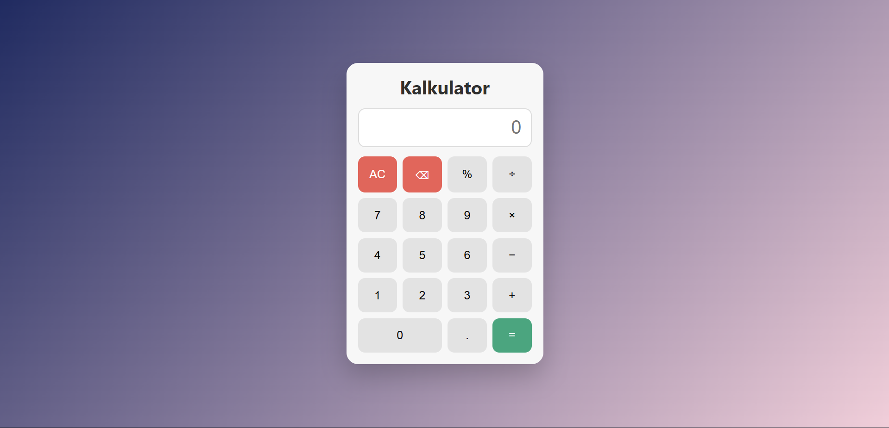

# 🧮 Kalkulator

<div align="center">

**Aplikasi kalkulator web dengan antarmuka yang elegan dan dukungan keyboard**

</div>

## 📋 Deskripsi Proyek

**Kalkulator** adalah aplikasi kalkulator berbasis web yang dirancang untuk memberikan pengalaman berhitung yang cepat, akurat, dan nyaman. Dibangun dengan teknologi web standar (HTML5, CSS3, JavaScript), kalkulator ini mendukung operasi aritmatika dasar dengan antarmuka yang bersih, responsif, dan dilengkapi dengan dukungan keyboard penuh.

Aplikasi ini sangat berguna bagi siapa saja yang membutuhkan alat hitung cepat dalam aktivitas sehari-hari, baik untuk keperluan belajar, bekerja, maupun penggunaan pribadi. Dengan desain modern yang menggunakan gradient background dan efek hover yang halus, kalkulator ini tidak hanya fungsional tetapi juga menarik secara visual.

Fitur utama aplikasi ini:
- Operasi Aritmatika Dasar: Penjumlahan, pengurangan, perkalian, pembagian, dan persen
- Dukungan Keyboard: Semua tombol dapat diakses melalui keyboard
- Penanganan Error: Pembagian dengan nol dan operasi tidak valid ditangani dengan baik
- Antarmuka Responsif: Tampilan optimal di berbagai ukuran layar
- Desain Modern: Gradien background, efek hover, dan tata letak grid

## 📑 Daftar Isi

- [Deskripsi Proyek](#-deskripsi-proyek)
- [Tampilan Aplikasi](#-tampilan-aplikasi)
- [Latar Belakang](#-latar-belakang)
- [Fitur Utama](#-fitur-utama)
- [Teknologi yang Digunakan](#-teknologi-yang-digunakan)
- [Cara Penggunaan](#-cara-penggunaan)
- [Peran Developer](#-peran-developer)
- [Pembelajaran dari Proyek](#-pembelajaran-dari-proyek-lessons-learned)
- [Ucapan Terima Kasih](#-ucapan-terima-kasih)

## 📸 Tampilan Aplikasi

### Tampilan Utama Kalkulator




## 🎯 Latar Belakang

Proyek ini dibuat sebagai proyek pribadi untuk mengembangkan keterampilan dalam:

- **Pengembangan Frontend dengan HTML5/CSS3/JavaScript**: Mempelajari cara membuat antarmuka yang interaktif dan responsif
- **Event Handling**: Menangani klik tombol dan event keyboard dengan baik
- **Ekspresi Aritmatika**: Mengimplementasikan evaluasi ekspresi matematika dengan penanganan error
- **Desain Responsif**: Membuat tampilan yang optimal di berbagai ukuran layar
- **User Experience**: Menambahkan dukungan keyboard dan feedback visual

Kebutuhan yang melatarbelakangi proyek ini:
- **Keinginan untuk memahami** manipulasi DOM dan event handling
- **Kebutuhan aplikasi ringan** yang tidak memerlukan instalasi

## 🌟 Fitur Utama

### 🔢 **Operasi Aritmatika**

| Operasi | Tombol | Fungsi |
|---------|--------|--------|
| Penjumlahan | `+` | Menjumlahkan dua bilangan |
| Pengurangan | `−` | Mengurangkan dua bilangan |
| Perkalian | `×` | Mengalikan dua bilangan |
| Pembagian | `÷` | Membagi dua bilangan |
| Persen | `%` | Menghitung persentase |

### ⌨️ **Dukungan Keyboard**

| Tombol | Fungsi |
|--------|--------|
| `0-9` | Memasukkan angka |
| `.` | Memasukkan desimal |
| `+` | Penjumlahan |
| `-` | Pengurangan |
| `*` | Perkalian (dikonversi ke ×) |
| `/` | Pembagian (dikonversi ke ÷) |
| `Enter` atau `=` | Menghitung hasil |
| `Backspace` | Menghapus satu karakter |
| `Escape` atau `Delete` | Menghapus semua |

### 🛡️ **Penanganan Error**

| Error | Pesan |
|-------|-------|
| Pembagian dengan nol | `Error: ÷0` |
| Operasi tidak valid | `Error` |
| Hasil tak terhingga | `Error` |

### 🎨 **Desain Modern**

| Komponen | Deskripsi |
|----------|-----------|
| **Background Gradient** | Gradien dari biru ke merah muda (135deg) |
| **Card Calculator** | Latar putih dengan bayangan lembut |
| **Button Hover** | Efek naik 1px saat hover |
| **Button Active** | Efek turun 1px saat diklik |
| **Tombol Khusus** | Warna berbeda untuk equals, clear, backspace |
| **Tombol 0 Lebar** | Grid column span 2 |

## 🛠️ Teknologi yang Digunakan

### Core Technologies

| Teknologi | Fungsi | Alasan Penggunaan |
|-----------|--------|-------------------|
| **HTML5** | Struktur halaman | Standar web, semantik |
| **CSS3** | Styling dan layout | Flexbox, grid, gradient, animasi |
| **JavaScript (ES6+)** | Logika dan interaktivitas | Manipulasi DOM, event handling, eval |

### Fitur yang Digunakan

| Fitur | Penggunaan |
|-------|------------|
| **CSS Grid** | Tata letak tombol 4 kolom |
| **CSS Flexbox** | Alignment konten |
| **CSS Gradient** | Background linear-gradient |
| **CSS Transform** | Efek hover dan active |
| **Event Listener** | Klik tombol dan keyboard |
| **Dataset API** | Data-value dan data-action |
| **eval()** | Evaluasi ekspresi matematika |

### Penjelasan File

| File | Fungsi |
|------|--------|
| **index.html** | Struktur dasar halaman kalkulator. Berisi elemen display input dan grid tombol dengan data-value dan data-action. |
| **styles.css** | Styling aplikasi. Mengatur layout dengan CSS Grid, gradient background, efek hover, dan tampilan responsif. |
| **script.js** | Logika kalkulator. Menangani event klik tombol, event keyboard, evaluasi ekspresi, dan update display. |

## 🎮 Cara Penggunaan

### Menjalankan Aplikasi

Buka file `index.html` di browser web.

### Panduan Penggunaan Lengkap

#### 1. **Menggunakan Mouse/Touch**

| Tombol | Fungsi |
|--------|--------|
| **Angka 0-9** | Memasukkan angka |
| **.** | Memasukkan koma desimal |
| **+** | Operasi penjumlahan |
| **−** | Operasi pengurangan |
| **×** | Operasi perkalian |
| **÷** | Operasi pembagian |
| **%** | Operasi persen |
| **AC** | Menghapus semua (All Clear) |
| **⌫** | Menghapus satu karakter (Backspace) |
| **=** | Menampilkan hasil perhitungan |

#### 2. **Menggunakan Keyboard**

| Tombol Keyboard | Fungsi |
|-----------------|--------|
| `0-9` | Memasukkan angka |
| `.` | Memasukkan desimal |
| `+` | Penjumlahan |
| `-` | Pengurangan |
| `*` | Perkalian (ditampilkan sebagai ×) |
| `/` | Pembagian (ditampilkan sebagai ÷) |
| `Enter` atau `=` | Menghitung hasil |
| `Backspace` | Menghapus satu karakter |
| `Escape` atau `Delete` | Menghapus semua |

#### 3. **Melakukan Perhitungan**

**Contoh 1: Penjumlahan**
```
1. Klik tombol "1"
2. Klik tombol "+"
3. Klik tombol "2"
4. Klik tombol "="
Hasil: 3
```

**Contoh 2: Perkalian dengan Keyboard**
```
1. Tekan tombol "4" di keyboard
2. Tekan tombol "*" di keyboard (ditampilkan sebagai ×)
3. Tekan tombol "5"
4. Tekan tombol "Enter"
Hasil: 20
```

**Contoh 3: Pembagian dengan Desimal**
```
1. Klik "1", "0", "."
2. Klik "÷"
3. Klik "2"
4. Klik "="
Hasil: 5
```

**Contoh 4: Persen**
```
1. Klik "5", "0"
2. Klik "%"
3. Hasil: 0.5 (50% dari 1)
```

#### 4. **Mengoreksi Input**

- **Salah satu karakter**: Klik tombol **⌫** atau tekan **Backspace**
- **Mulai dari awal**: Klik tombol **AC** atau tekan **Escape**

### Penanganan Error

| Skenario | Pesan yang Ditampilkan |
|----------|------------------------|
| Membagi dengan nol (contoh: `5÷0`) | `Error: ÷0` |
| Operasi tidak valid (contoh: `5++2`) | `Error` |
| Hasil tak terhingga | `Error` |

### Tips Penggunaan

1. **Gunakan keyboard** untuk perhitungan yang lebih cepat
2. **Operator berurutan** akan otomatis diganti dengan operator terakhir
3. **Desimal** menggunakan titik (.) sebagai pemisah
4. **Setelah error**, Anda dapat langsung memasukkan perhitungan baru
5. **Tombol 0 lebar** memudahkan input angka nol

## 👨‍💻 Peran Developer

Sebagai developer proyek pribadi ini, saya bertanggung jawab atas:

### Peran dalam Proyek

| Area | Kontribusi |
|------|------------|
| **Perencanaan** | Merancang fitur-fitur kalkulator dan antarmuka |
| **UI/UX Design** | Mendesain tampilan modern dengan CSS Grid dan gradient |
| **Frontend Development** | Membangun struktur HTML dan logika JavaScript |
| **Event Handling** | Implementasi event click dan keyboard |
| **Error Handling** | Penanganan pembagian dengan nol dan operasi tidak valid |
| **Responsive Design** | Memastikan tampilan optimal di berbagai ukuran layar |

### Fokus Pengembangan

1. **Fungsionalitas Inti**
   - Operasi aritmatika dasar
   - Evaluasi ekspresi dengan eval()
   - Konversi operator tampilan ke JavaScript

2. **User Experience**
   - Dukungan penuh keyboard
   - Feedback visual dengan efek hover dan active
   - Penanganan operator ganda berurutan

3. **Error Handling**
   - Pengecekan pembagian dengan nol
   - Validasi hasil tak terhingga
   - Pesan error yang informatif

## 📚 Pembelajaran dari Proyek (Lessons Learned)

### Keterampilan Teknis yang Diperoleh

#### 1. **CSS Grid untuk Tata Letak Tombol**
```css
.buttons {
  display: grid;
  grid-template-columns: repeat(4, 1fr);
  gap: 10px;
}

button.wide {
  grid-column: span 2;
}
```

#### 2. **Event Delegation untuk Tombol Dinamis**
```javascript
document.querySelector('.buttons').addEventListener('click', (event) => {
  const button = event.target.closest('button');
  if (!button) return;
  
  const value = button.dataset.value;
  const action = button.dataset.action;
  
  if (action === 'clear') clearAll();
  else if (action === 'backspace') backspace();
  else if (action === 'equals') doEquals();
  else if (value) append(value);
});
```

#### 3. **Dukungan Keyboard dengan Event Listener**
```javascript
document.addEventListener('keydown', (e) => {
  const key = e.key;
  const angka = /[\d.]/.test(key);
  const operator = ['+', '-', '*', '/', '%'].includes(key);
  
  if (angka || operator) {
    e.preventDefault();
    if (key === '*') append('×');
    else if (key === '/') append('÷');
    else if (key === '-') append('−');
    else append(key);
  } else if (key === 'Enter' || key === '=') {
    e.preventDefault();
    doEquals();
  } else if (key === 'Backspace') {
    e.preventDefault();
    backspace();
  } else if (key === 'Escape' || key === 'Delete') {
    e.preventDefault();
    clearAll();
  }
});
```

#### 4. **Evaluasi Ekspresi dengan Konversi Operator**
```javascript
function calculate(expression) {
  try {
    const safeExpr = expression
      .replace(/×/g, '*')
      .replace(/÷/g, '/')
      .replace(/−/g, '-')
      .replace(/,/g, '.');
    
    if (safeExpr.includes('/0') && !safeExpr.includes('/0.')) {
      throw new Error('Tidak bisa membagi dengan nol');
    }
    
    let result = eval(safeExpr);
    if (!Number.isFinite(result)) throw new Error('Tak terhingga');
    
    return parseFloat(result.toFixed(8)).toString();
  } catch (error) {
    if (error.message === 'Tidak bisa membagi dengan nol') return 'Error: ÷0';
    return 'Error';
  }
}
```

#### 5. **Pencegahan Operator Ganda**
```javascript
function append(char) {
  const operators = ['+', '-', '*', '/', '%', '×', '÷', '−'];
  const lastChar = currentExpression.slice(-1);
  
  if (operators.includes(char) && operators.includes(lastChar)) {
    // Ganti operator terakhir
    currentExpression = currentExpression.slice(0, -1) + char;
  } else {
    currentExpression += char;
  }
  updateDisplay(currentExpression);
}
```

#### 6. **Efek Hover dan Active dengan CSS**
```css
button {
  transition: transform .1s ease, background .15s ease;
  cursor: pointer;
}

button:hover {
  transform: translateY(-1px);
}

button:active {
  transform: translateY(1px);
}
```

### Soft Skills yang Dikembangkan

#### 1. **Perhatian terhadap Detail**
- Penanganan operator tampilan yang berbeda dari operator JavaScript
- Validasi input sebelum evaluasi
- Pencegahan error dengan pengecekan kondisi

#### 2. **User Experience Design**
- Dukungan penuh keyboard untuk aksesibilitas
- Feedback visual yang responsif
- Pesan error yang jelas dan informatif

#### 3. **Responsive Design**
- Menggunakan viewport width untuk skala
- Layout grid yang fleksibel
- Media queries untuk perangkat yang lebih kecil

## 🙏 Ucapan Terima Kasih

### Sumber Daya dan Referensi

#### Dokumentasi Resmi
- [MDN Web Docs](https://developer.mozilla.org/) - Dokumentasi HTML, CSS, JavaScript
- [CSS Grid Guide](https://css-tricks.com/snippets/css/complete-guide-grid/) - Panduan CSS Grid
- [JavaScript Event Reference](https://developer.mozilla.org/en-US/docs/Web/Events) - Event handling

#### Tutorial dan Artikel
- **CSS-Tricks** - Tutorial CSS Grid dan Flexbox
- **JavaScript.info** - Tutorial JavaScript modern
- **Stack Overflow** - Solusi untuk berbagai masalah coding

#### Tools yang Membantu
- **GitHub** - Hosting repository dan version control
- **Visual Studio Code** - Editor kode

---

<div align="center">

**⭐ Jika proyek ini membantu perhitungan Anda, berikan bintang! ⭐**

**"Matematika adalah bahasa universal, dan kalkulator adalah alat yang membuatnya lebih mudah diakses"**

</div>