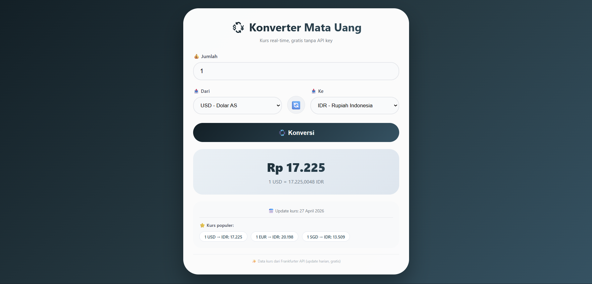

# 💱 Konverter Mata Uang

<div align="center">

**Aplikasi konverter mata uang real-time dengan kurs harian, dukungan 16 mata uang global, swap currency, dan data gratis tanpa API key**

</div>

## 📋 Deskripsi Proyek

**Konverter Mata Uang** adalah aplikasi web yang memungkinkan pengguna untuk mengkonversi nilai antar mata uang dunia secara real-time. Aplikasi ini menggunakan API kurs gratis yang diperbarui setiap hari, mendukung 16 mata uang global termasuk IDR (Rupiah Indonesia), USD, EUR, SGD, dan lainnya. Dilengkapi dengan fitur swap currency, konversi otomatis, kurs populer, dan fallback data offline jika koneksi internet bermasalah.

Aplikasi ini sangat berguna bagi pelancong, pebisnis internasional, pelajar, atau siapa saja yang perlu menghitung nilai tukar mata uang asing dengan cepat dan akurat. Tanpa perlu registrasi atau API key, aplikasi ini siap digunakan kapan saja.

Fitur utama aplikasi ini:
- **16 Mata Uang Global**: USD, EUR, GBP, JPY, IDR, SGD, MYR, THB, CNY, INR, AUD, CAD, CHF, KRW, SAR, AED
- **Kurs Real-time**: Data dari API gratis yang diperbarui setiap hari
- **Swap Currency**: Tukar posisi mata uang "Dari" dan "Ke" dengan satu klik
- **Konversi Otomatis**: Hasil terupdate saat mengubah jumlah atau mata uang
- **Kurs Populer**: Menampilkan kurs populer (USD/IDR, EUR/IDR, SGD/IDR)
- **Fallback Offline**: Data cadangan jika koneksi internet bermasalah

## 📑 Daftar Isi

- [Deskripsi Proyek](#-deskripsi-proyek)
- [Tampilan Aplikasi](#-tampilan-aplikasi)
- [Latar Belakang](#-latar-belakang)
- [Fitur Utama](#-fitur-utama)
- [Teknologi yang Digunakan](#-teknologi-yang-digunakan)
- [Cara Penggunaan](#-cara-penggunaan)
- [Peran Developer](#-peran-developer)
- [Pembelajaran dari Proyek](#-pembelajaran-dari-proyek-lessons-learned)
- [Ucapan Terima Kasih](#-ucapan-terima-kasih)

## 📸 Tampilan Aplikasi

### Tampilan Utama




## 🎯 Latar Belakang

Proyek ini dibuat sebagai proyek pribadi untuk mengembangkan keterampilan dalam:

- **Fetch API & Asynchronous JavaScript**: Mengambil data kurs dari API eksternal
- **Error Handling & Fallback**: Menangani kegagalan jaringan dengan data offline
- **Real-time Data Processing**: Memproses dan menampilkan data kurs secara dinamis
- **Internationalization**: Format mata uang dan simbol untuk berbagai negara
- **Debounce Pattern**: Mengoptimalkan auto-convert dengan debounce timer

Kebutuhan yang melatarbelakangi proyek ini:
- **Kebutuhan konversi mata uang** yang cepat dan akurat
- **Keinginan memahami** integrasi API pihak ketiga
- **Kebutuhan data kurs** tanpa biaya berlangganan
- **Pembuatan aplikasi** yang dapat berfungsi offline (dengan fallback)

## 🌟 Fitur Utama

### 💱 **Mata Uang yang Didukung**

| Kode | Mata Uang | Simbol |
|------|-----------|--------|
| USD | Dolar AS | $ |
| EUR | Euro | € |
| GBP | Pound Sterling | £ |
| JPY | Yen Jepang | ¥ |
| IDR | Rupiah Indonesia | Rp |
| SGD | Dolar Singapura | S$ |
| MYR | Ringgit Malaysia | RM |
| THB | Baht Thailand | ฿ |
| CNY | Yuan China | ¥ |
| INR | Rupee India | ₹ |
| AUD | Dolar Australia | A$ |
| CAD | Dolar Kanada | C$ |
| CHF | Franc Swiss | CHF |
| KRW | Won Korea | ₩ |
| SAR | Riyal Saudi | ﷼ |
| AED | Dirham UAE | د.إ |

### 🔄 **Fitur Konversi**

| Fitur | Deskripsi |
|-------|-----------|
| **Jumlah** | Input angka dengan dukungan desimal |
| **Dari / Ke** | Pilih mata uang sumber dan tujuan |
| **Swap (🔄)** | Tukar posisi mata uang dengan satu klik |
| **Konversi** | Hitung manual atau otomatis (debounce 300ms) |
| **Hasil** | Tampilan besar dengan simbol mata uang |
| **Rate** | Menampilkan kurs 1 unit sumber ke tujuan |

### 📊 **Informasi Tambahan**

| Informasi | Deskripsi |
|-----------|-----------|
| **Last Update** | Tanggal terakhir data kurs diperbarui |
| **Popular Rates** | Kurs populer (USD/IDR, EUR/IDR, SGD/IDR) |
| **Format Number** | Rupiah tanpa desimal, mata uang lain 2 desimal |

### 🔌 **API & Data Source**

| Aspek | Deskripsi |
|-------|-----------|
| **API Endpoint** | `cdn.jsdelivr.net/npm/@fawazahmed0/currency-api` |
| **Keunggulan** | 100% GRATIS, UNLIMITED, update harian, tanpa API key, tanpa login, tanpa trial |
| **Fallback** | Data offline jika koneksi internet bermasalah |
| **Auto Refresh** | Update kurs setiap 1 jam |

### 🎨 **Format Angka Spesifik Mata Uang**

| Mata Uang | Format Desimal | Contoh |
|-----------|----------------|--------|
| **IDR** | 0 desimal | Rp 15,000 |
| **JPY, KRW** | 0 desimal | ¥ 1,500 |
| **Lainnya** | 2 desimal | $ 10.50 |

## 🛠️ Teknologi yang Digunakan

### Core Technologies

| Teknologi | Fungsi | Alasan Penggunaan |
|-----------|--------|-------------------|
| **HTML5** | Struktur halaman | Semantik, form elements (select, input) |
| **CSS3** | Styling dan layout | Flexbox, gradient, responsive |
| **JavaScript (ES6+)** | Logika dan interaktivitas | Fetch API, async/await, debounce pattern |

### Web API yang Digunakan

| API / Fitur | Penggunaan |
|-------------|------------|
| **Fetch API** | Mengambil data kurs dari endpoint eksternal |
| **async/await** | Menangani operasi asynchronous dengan bersih |
| **setInterval** | Auto-refresh data kurs setiap jam |
| **setTimeout** | Debounce untuk auto-convert |
| **toLocaleString** | Format angka dengan pemisah ribuan |
| **JSON.parse/stringify** | (Tidak digunakan langsung, API response JSON) |

### Fitur JavaScript yang Digunakan

| Fitur | Penggunaan |
|-------|------------|
| **Object.entries()** | Iterasi data kurs dari API response |
| **Debounce Pattern** | Optimalisasi auto-convert (300ms delay) |
| **Error Handling (try/catch)** | Menangani kegagalan fetch API |
| **Fallback Data** | Data offline jika tidak ada koneksi |
| **Conditional Formatting** | Format desimal berbeda per mata uang |

### CSS Modern yang Diterapkan

| Fitur | Penggunaan |
|-------|------------|
| **Linear Gradient** | Background tema gelap kebiruan, tombol, header |
| **Flexbox** | Layout currency section, swap icon, rate chips |
| **Keyframes Animation** | Pulse animation untuk loading state |
| **Transform & Transition** | Hover scale, active scale pada tombol |
| **Media Queries** | Responsif dengan swap icon rotate di mobile |
| **Box Shadow** | Efek kedalaman pada card |

### Penjelasan File

| File | Fungsi |
|------|--------|
| **index.html** | Struktur aplikasi konverter mata uang. Berisi input jumlah, dua select dropdown untuk mata uang sumber dan tujuan, tombol swap 🔄, tombol konversi, area hasil (nilai konversi + kurs), info last update, dan kurs populer. |
| **style.css** | Styling lengkap dengan tema gelap kebiruan (teal gradient), desain card membulat, efek hover pada tombol dan swap icon, layout responsif yang di mobile mengubah swap icon menjadi horizontal, dan animasi loading. |
| **script.js** | Logika inti aplikasi. Mengambil data kurs dari API fawazahmed0/currency-api, mengelola exchange rates dalam state object, fungsi konversi dengan perhitungan rate cross, swap mata uang, debounce untuk auto-convert, fallback offline jika API gagal, auto-refresh setiap jam, dan format angka sesuai mata uang. |

## 🎮 Cara Penggunaan

### Panduan Penggunaan Lengkap

#### 1. **Memasukkan Jumlah**

| Langkah | Instruksi |
|---------|-----------|
| 1 | Pada kolom **"💰 Jumlah"**, masukkan angka yang ingin dikonversi |
| 2 | Dukungan angka desimal (contoh: 100.50) |
| 3 | Nilai default: 100 |

#### 2. **Memilih Mata Uang**

| Peran | Select Dropdown | Default |
|-------|-----------------|---------|
| **Dari (sumber)** | Pilih mata uang yang akan dikonversi | IDR (Rupiah) |
| **Ke (tujuan)** | Pilih mata uang hasil konversi | USD (Dolar AS) |

#### 3. **Melakukan Konversi**

| Metode | Cara |
|--------|------|
| **Tombol** | Klik **"💱 Konversi"** |
| **Otomatis** | Ubah jumlah atau pilih mata uang berbeda (delay 300ms) |

#### 4. **Swap Mata Uang**

- Klik tombol **🔄** di tengah antara dua pilihan mata uang
- Posisi "Dari" dan "Ke" akan bertukar
- Konversi akan otomatis dihitung ulang

#### 5. **Membaca Hasil**

| Area | Informasi |
|------|-----------|
| **Hasil Besar** | Nilai hasil konversi dengan simbol mata uang (contoh: $ 2.56) |
| **Rate** | Kurs 1 unit mata uang sumber ke tujuan (contoh: 1 IDR = 0.000064 USD) |
| **Last Update** | Tanggal data kurs terakhir diperbarui |
| **Popular Rates** | Kurs populer USD/IDR, EUR/IDR, SGD/IDR |

### Contoh Skenario Penggunaan

#### Skenario 1: Liburan ke Luar Negeri

| Langkah | Aksi | Hasil |
|---------|------|-------|
| 1 | Dari: IDR, Ke: USD | - |
| 2 | Jumlah: 2,000,000 | - |
| 3 | Klik Konversi | Hasil: $ 127.00 (contoh) |

#### Skenario 2: Belanja Online dari Luar Negeri

| Langkah | Aksi | Hasil |
|---------|------|-------|
| 1 | Dari: USD, Ke: IDR | - |
| 2 | Jumlah: 50 | - |
| 3 | Swap jika perlu | Hasil: Rp 782,500 |

#### Skenario 3: Membandingkan Mata Uang

| Langkah | Aksi |
|---------|------|
| 1 | Dari: IDR, Ke: SGD (Dolar Singapura) |
| 2 | Catat hasilnya |
| 3 | Ubah Ke: MYR (Ringgit Malaysia) |
| 4 | Bandingkan nilai tukar |

### Tips Penggunaan

1. **Gunakan Swap (🔄)** untuk membalik konversi tanpa mengubah input
2. **Konversi otomatis** akan terjadi setelah Anda selesai mengetik (delay 300ms)
3. **Kurs populer** membantu Anda melihat nilai tukar utama tanpa konversi
4. **Jika offline**, aplikasi masih berfungsi dengan data kurs cadangan
5. **Data refresh otomatis** setiap jam untuk kurs terbaru

### Validasi & Error Handling

| Skenario | Penanganan |
|----------|------------|
| Jumlah kosong / bukan angka | Tampilkan "Masukkan angka" |
| Jumlah <= 0 | Tampilkan "0" |
| Gagal fetch API | Gunakan data offline fallback |
| Kurs tidak tersedia | Tampilkan pesan error |
| Koneksi lambat | Indikator "Memuat kurs..." |

## 👨‍💻 Peran Developer

Sebagai developer proyek pribadi ini, saya bertanggung jawab atas:

### Peran dalam Proyek

| Area | Kontribusi |
|------|------------|
| **Perencanaan** | Merancang fitur konverter dengan 16 mata uang |
| **UI/UX Design** | Mendesain antarmuka yang bersih dengan tema gelap kebiruan |
| **Frontend Development** | Membangun struktur HTML dan styling CSS |
| **API Integration** | Mengintegrasikan currency-api gratis (fawazahmed0) |
| **Error Handling** | Implementasi fallback offline dan error handling |
| **Formatting Logic** | Format angka berbeda untuk setiap mata uang |

### Fokus Pengembangan

1. **API Integration & Async Handling**
   - Fetch data dari endpoint eksternal
   - Parsing response ke dalam exchangeRates object
   - Fallback data offline saat fetch gagal

2. **Perhitungan Kurs**
   - Rumus: `convertedAmount = amount × (toRate / fromRate)`
   - Menangani kasus from === to (return 1)
   - Rate cross untuk mata uang yang tidak langsung

3. **Pengalaman Pengguna**
   - Auto-convert dengan debounce (tidak terlalu sering fetch)
   - Swap currency dengan animasi
   - Format number lokal Indonesia (pemisah ribuan)
   - Desimal berbeda untuk mata uang tertentu (IDR 0 desimal)

4. **Keandalan & Performa**
   - Auto-refresh kurs setiap jam
   - Loading state saat fetching
   - Error state dengan pesan jelas

## 📚 Pembelajaran dari Proyek (Lessons Learned)

### Keterampilan Teknis yang Diperoleh

1. **Fetch API dengan Async/Await**
   ```javascript
   async function fetchExchangeRates(baseCurrency) {
       const response = await fetch(`https://.../${baseCurrency}.json`);
       const data = await response.json();
       const rates = data[baseCurrency.toLowerCase()];
   }
   ```

2. **Perhitungan Kurs Cross**
   ```javascript
   function getExchangeRate(from, to) {
       if (from === to) return 1;
       const fromRate = exchangeRates[from];
       const toRate = exchangeRates[to];
       return toRate / fromRate;
   }
   ```

3. **Debounce Pattern untuk Auto-Convert**
   ```javascript
   let debounceTimer;
   function autoConvert() {
       clearTimeout(debounceTimer);
       debounceTimer = setTimeout(() => performConversion(), 300);
   }
   ```

4. **Fallback Data Pattern**
   ```javascript
   try {
       // Fetch real data
   } catch (error) {
       // Use offline fallback
       useOfflineFallback(baseCurrency);
   }
   ```

5. **Conditional Number Formatting**
   ```javascript
   const decimals = (toCurrency === 'IDR' || fromCurrency === 'IDR') ? 0 : 2;
   ```

### Soft Skills yang Dikembangkan

#### 1. **Pemahaman API Integration**
- Memilih API yang tepat (gratis, update harian, tanpa limit)
- Menangani berbagai skenario kegagalan jaringan

#### 2. **Perhatian terhadap Detail**
- Desimal berbeda untuk mata uang yang berbeda (IDR tidak pakai desimal)
- Simbol mata uang yang akurat untuk setiap negara

#### 3. **Problem Solving**
- Fallback offline untuk menjaga aplikasi tetap berfungsi
- Rate cross calculation untuk semua pasangan mata uang

## 🙏 Ucapan Terima Kasih

### Sumber Daya dan Referensi

#### API & Data Kurs
- **fawazahmed0/currency-api** - API kurs gratis, update harian, tanpa API key
  (https://github.com/fawazahmed0/exchange-api)

#### Dokumentasi Resmi
- [MDN Web Docs - Fetch API](https://developer.mozilla.org/en-US/docs/Web/API/Fetch_API) - Panduan fetch data
- [MDN Web Docs - Async/Await](https://developer.mozilla.org/en-US/docs/Learn/JavaScript/Asynchronous/Async_await) - Panduan asynchronous
- [MDN Web Docs - toLocaleString](https://developer.mozilla.org/en-US/docs/Web/JavaScript/Reference/Global_Objects/Number/toLocaleString) - Format angka

#### Inspirasi Desain
- **Google Finance** - Inspirasi konverter mata uang
- **XE Currency** - Referensi kurs populer
- **Dribbble** - Inspirasi desain modern

#### Tools yang Membantu
- **GitHub** - Hosting repository dan version control
- **VS Code** - Editor kode dengan Live Server

---

<div align="center">

**⭐ Jika proyek ini membantu Anda menghitung nilai tukar mata uang, berikan bintang! ⭐**

**"Ketahui nilai uang Anda di mana pun Anda berada. Konversi mata uang jadi lebih mudah!"**

</div>