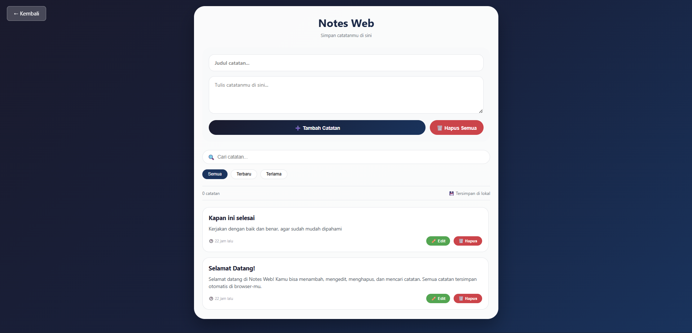

# 📝 Notes Web

<div align="center">

**Aplikasi pencatat digital dengan fitur CRUD lengkap, pencarian real-time, filter sorting, dan penyimpanan lokal di browser**

</div>

## 📋 Deskripsi Proyek

**Notes Web** adalah aplikasi web pencatat digital yang memungkinkan pengguna untuk membuat, membaca, memperbarui, dan menghapus catatan dengan mudah. Aplikasi ini dilengkapi dengan fitur pencarian real-time, filter urutan (terbaru/terlama), serta penyimpanan otomatis ke LocalStorage sehingga catatan tetap tersimpan meskipun browser ditutup. Dengan antarmuka yang bersih dan responsif, aplikasi ini cocok untuk mencatat ide, daftar tugas, atau informasi penting sehari-hari.

Aplikasi ini sangat berguna bagi siapa saja yang membutuhkan alat pencatat sederhana namun powerful, tanpa perlu registrasi atau koneksi internet setelah halaman dimuat. Semua data tersimpan secara lokal dan aman di perangkat pengguna.

Fitur utama aplikasi ini:
- **CRUD Lengkap**: Create, Read, Update, Delete catatan
- **Pencarian Real-time**: Filter catatan berdasarkan judul atau isi
- **Urutan Filter**: Terbaru (default), Terlama, Semua
- **Edit Mode**: Ubah catatan yang sudah ada
- **Penyimpanan Lokal**: Auto-save ke LocalStorage
- **Catatan Contoh**: Catatan demo untuk memulai
- **Keyboard Shortcut**: Ctrl+Enter untuk menyimpan

## 📑 Daftar Isi

- [Deskripsi Proyek](#-deskripsi-proyek)
- [Tampilan Aplikasi](#-tampilan-aplikasi)
- [Latar Belakang](#-latar-belakang)
- [Fitur Utama](#-fitur-utama)
- [Teknologi yang Digunakan](#-teknologi-yang-digunakan)
- [Cara Penggunaan](#-cara-penggunaan)
- [Peran Developer](#-peran-developer)
- [Pembelajaran dari Proyek](#-pembelajaran-dari-proyek-lessons-learned)
- [Ucapan Terima Kasih](#-ucapan-terima-kasih)

## 📸 Tampilan Aplikasi

### Tampilan Utama 

 


## 🎯 Latar Belakang

Proyek ini dibuat sebagai proyek pribadi untuk mengembangkan keterampilan dalam:

- **CRUD Operations**: Implementasi lengkap Create, Read, Update, Delete pada data
- **LocalStorage API**: Menyimpan dan memuat data secara persisten di browser
- **Filter & Search**: Implementasi pencarian real-time dan sorting data
- **State Management**: Mengelola state aplikasi (edit mode, filter aktif)
- **Keyboard Shortcut**: Menambahkan Ctrl+Enter untuk akses cepat
- **Dynamic Rendering**: Menampilkan data secara dinamis ke DOM

Kebutuhan yang melatarbelakangi proyek ini:
- **Kebutuhan aplikasi pencatat** yang sederhana dan cepat
- **Keinginan memahami** konsep CRUD pada JavaScript murni
- **Kebutuhan penyimpanan data** tanpa backend (menggunakan LocalStorage)
- **Pembelajaran tentang** filter, search, dan sort data di frontend

## 🌟 Fitur Utama

### 📝 **CRUD Catatan**

| Operasi | Deskripsi | Metode |
|---------|-----------|--------|
| **Create** | Membuat catatan baru dengan judul dan isi | Tombol "Tambah Catatan" atau Ctrl+Enter |
| **Read** | Menampilkan semua catatan dengan informasi tanggal | Render otomatis |
| **Update** | Mengedit catatan yang sudah ada | Klik Edit → Ubah → Update |
| **Delete** | Menghapus catatan | Klik Hapus (dengan konfirmasi) |

### 🔍 **Pencarian & Filter**

| Fitur | Deskripsi | Perilaku |
|-------|-----------|----------|
| **Search Box** | Mencari catatan berdasarkan judul atau isi | Update real-time saat mengetik |
| **Filter: Semua** | Menampilkan semua catatan (terbaru di atas) | Default |
| **Filter: Terbaru** | Urutkan dari catatan terbaru | Sama seperti Semua |
| **Filter: Terlama** | Urutkan dari catatan tertua | Kebalikan dari terbaru |

### 📊 **Informasi & Statistik**

| Informasi | Deskripsi |
|-----------|-----------|
| **Total Catatan** | Menampilkan jumlah catatan yang ada |
| **Storage Status** | Informasi bahwa data tersimpan di LocalStorage |
| **Tanggal Relatif** | "Baru saja", "5 menit lalu", "2 jam lalu", "3 hari lalu" |

### ✏️ **Edit Mode**

| Indikator | Perubahan UI |
|-----------|--------------|
| **Tombol Berubah** | "Tambah Catatan" → "Update Catatan" |
| **Form Terisi** | Judul dan isi catatan yang akan diedit |
| **Scroll Otomatis** | Scroll ke form saat edit |
| **Reset Otomatis** | Setelah update atau cancel |

### ⌨️ **Keyboard Shortcut**

| Shortcut | Fungsi |
|----------|--------|
| **Ctrl + Enter** | Menyimpan catatan (tambah/update) |

### 🗑️ **Penghapusan Massal**

| Fitur | Deskripsi |
|-------|-----------|
| **Hapus Semua** | Menghapus semua catatan dengan konfirmasi ganda |
| **Konfirmasi** | Alert peringatan sebelum eksekusi |

### 📅 **Format Waktu Relatif**

| Waktu | Format Tampilan |
|-------|-----------------|
| < 1 menit | Baru saja |
| < 1 jam | X menit lalu |
| < 24 jam | X jam lalu |
| < 7 hari | X hari lalu |
| > 7 hari | Tanggal (contoh: 25 Apr 2026) |

## 🛠️ Teknologi yang Digunakan

### Core Technologies

| Teknologi | Fungsi | Alasan Penggunaan |
|-----------|--------|-------------------|
| **HTML5** | Struktur halaman | Semantik, form elements |
| **CSS3** | Styling dan layout | Flexbox, gradient, animasi |
| **JavaScript (ES6+)** | Logika dan interaktivitas | LocalStorage, array methods, DOM manipulation |

### Fitur JavaScript yang Digunakan

| Fitur | Penggunaan |
|-------|------------|
| **localStorage API** | `getItem` / `setItem` untuk persistensi data |
| **Array Methods** | `filter()`, `map()`, `find()`, `sort()`, `unshift()` |
| **Date API** | `new Date()`, `toISOString()`, `toLocaleDateString()` |
| **Event Listeners** | `click`, `input`, `keydown` |
| **String Methods** | `trim()`, `toLowerCase()`, `includes()` |
| **escapeHtml()** | Mencegah XSS (Cross-site scripting) |
| **JSON.parse / stringify** | Konversi data untuk storage |

### CSS Modern yang Diterapkan

| Fitur | Penggunaan |
|-------|------------|
| **Linear Gradient** | Background body, tombol utama, header |
| **Flexbox** | Layout input actions, filter buttons, note card |
| **Keyframes Animation** | Animasi fadeIn untuk note card |
| **Custom Scrollbar** | Styling scrollbar pada notes list |
| **Transform & Transition** | Hover scale, translateY |
| **Media Queries** | Responsif untuk layar di bawah 550px |
| **Box Shadow** | Efek kedalaman pada card dan hover |

### Penjelasan File

| File | Fungsi |
|------|--------|
| **index.html** | Struktur aplikasi notes web. Berisi header, input section (judul, isi, tombol tambah/hapus semua), search section (search box dan filter buttons), stats area, dan notes list container. |
| **style.css** | Styling lengkap dengan tema gelap kebiruan (dark theme), desain card modern, efek hover pada note card, custom scrollbar, animasi fadeIn untuk catatan baru, dan layout responsif. |
| **script.js** | Logika inti aplikasi. Mengelola array notes, fungsi load/save ke localStorage, render dinamis notes berdasarkan search dan filter, format tanggal relatif, fungsi add/update/delete note, edit mode management, dan event handlers. |

## 🎮 Cara Penggunaan

### Panduan Penggunaan Lengkap

#### 1. **Membuat Catatan Baru**

| Langkah | Instruksi |
|---------|-----------|
| 1 | Isi **"Judul catatan"** (opsional, maksimal 100 karakter) |
| 2 | Isi **"Tulis catatanmu di sini"** (wajib salah satu) |
| 3 | Klik tombol **"➕ Tambah Catatan"** |
| 4 | Atau tekan **Ctrl + Enter** dari mana saja |

> **Validasi**: Judul atau isi tidak boleh keduanya kosong

#### 2. **Membaca Catatan**

- Catatan ditampilkan dalam bentuk **card** di bawah form
- Setiap card menampilkan:
  - **Judul** (tebal)
  - **Isi catatan**
  - **Waktu** (format relatif)
  - Tombol **✏️ Edit** dan **🗑️ Hapus**

#### 3. **Mengedit Catatan**

| Langkah | Instruksi |
|---------|-----------|
| 1 | Klik tombol **Edit** pada catatan yang ingin diubah |
| 2 | Form akan terisi dengan data catatan tersebut |
| 3 | Tombol berubah menjadi **"✏️ Update Catatan"** |
| 4 | Ubah judul dan/atau isi sesuai keinginan |
| 5 | Klik **"✏️ Update Catatan"** atau tekan **Ctrl+Enter** |
| 6 | Catatan akan terupdate dengan waktu baru |

#### 4. **Menghapus Catatan**

| Metode | Cara |
|--------|------|
| **Satu catatan** | Klik tombol **Hapus** pada card → konfirmasi → terhapus |
| **Semua catatan** | Klik tombol **"🗑️ Hapus Semua"** → konfirmasi ganda → semua catatan terhapus |

#### 5. **Mencari Catatan**

1. Ketik kata kunci di kotak **pencarian** (🔍)
2. Catatan akan **langsung terfilter** saat Anda mengetik
3. Pencarian mencakup **judul** dan **isi** catatan
4. Kosongkan kotak pencarian untuk melihat semua catatan

#### 6. **Mengurutkan Catatan**

| Filter | Fungsi |
|--------|--------|
| **Semua** | Menampilkan semua catatan (terbaru di atas) |
| **Terbaru** | Urutan dari catatan yang paling baru dibuat |
| **Terlama** | Urutan dari catatan yang paling lama dibuat |

### Contoh Skenario Penggunaan

#### Skenario 1: Mencatat Ide

| Langkah | Aksi | Hasil |
|---------|------|-------|
| 1 | Klik Ctrl+Enter setelah menulis ide | Catatan tersimpan |
| 2 | Lanjutkan menulis ide lain | Catatan baru di atas |
| 3 | Cari ide lama | Ketik kata kunci di search |

#### Skenario 2: To Do List Harian

| Langkah | Aksi |
|---------|------|
| 1 | Buat catatan "💼 Kerja: Selesaikan laporan" |
| 2 | Buat catatan 🛒 Belanja: Telur, susu, roti" |
| 3 | Selesai mengerjakan → Hapus catatan |
| 4 | Gunakan filter "Terlama" untuk melihat prioritas |

#### Skenario 3: Mengedit Catatan

| Langkah | Aksi |
|---------|------|
| 1 | Buat catatan draft |
| 2 | Baca ulang, ada yang perlu diperbaiki |
| 3 | Klik Edit, perbaiki, Update |
| 4 | Waktu updatedAt berubah, createdAt tetap |

### Tips Penggunaan

1. **Gunakan Ctrl+Enter** untuk menyimpan tanpa menggeser tangan dari keyboard
2. **Gunakan search** untuk menemukan catatan lama dengan cepat
3. **Filter "Terlama"** berguna untuk melihat catatan yang mungkin terlupakan
4. **Catatan contoh** akan muncul pertama kali untuk menunjukkan fitur
5. **Data aman** di LocalStorage browser Anda sendiri

### Validasi & Keamanan

| Aspek | Penanganan |
|-------|------------|
| **Input Kosong** | Validasi judul atau isi minimal salah satu terisi |
| **XSS Prevention** | Fungsi escapeHtml() untuk semua input user |
| **Konfirmasi Hapus** | Confirm dialog untuk setiap aksi hapus |
| **Maxlength Judul** | 100 karakter untuk mencegah overflow |
| **Edit Mode Conflict** | Reset form jika catatan yang diedit dihapus |

## 👨‍💻 Peran Developer

Sebagai developer proyek pribadi ini, saya bertanggung jawab atas:

### Peran dalam Proyek

| Area | Kontribusi |
|------|------------|
| **Perencanaan** | Merancang fitur CRUD dan penyimpanan lokal |
| **UI/UX Design** | Mendesain antarmuka bersih dengan tema gelap kebiruan |
| **Frontend Development** | Membangun struktur HTML dan styling CSS |
| **JavaScript Logic** | Implementasi CRUD, search, filter, localStorage |
| **Keamanan** | Menambahkan escapeHtml untuk mencegah XSS |
| **Shortcut Integration** | Menambahkan Ctrl+Enter untuk power user |

### Fokus Pengembangan

1. **Fungsionalitas Inti CRUD**
   - Create: validasi input, timestamp, unshift ke array
   - Read: render dinamis dengan search & filter
   - Update: edit mode, overwrite data, update timestamp
   - Delete: single delete & bulk delete dengan konfirmasi

2. **Data Persistence**
   - localStorage.getItem / setItem
   - Load data awal dengan contoh catatan
   - Save setiap ada perubahan data

3. **User Experience**
   - Search real-time tanpa tombol
   - Filter sorting dengan visual active button
   - Format waktu relatif yang ramah pengguna
   - Empty state yang informatif

## 📚 Pembelajaran dari Proyek (Lessons Learned)

### Keterampilan Teknis yang Diperoleh

1. **Logika Edit Mode**
   ```javascript
   let editMode = false;
   let editId = null;
   
   if (editMode) {
       // Update existing note
       notes[noteIndex] = { ...notes[noteIndex], ...updatedData };
   } else {
       // Create new note
       notes.unshift(newNote);
   }
   ```

2. **Filter & Sort Kombinasi**
   ```javascript
   let filtered = filterNotesBySearch(); // berdasarkan keyword
   let sorted = sortNotes(filtered); // berdasarkan filter aktif
   ```

3. **Format Waktu Relatif**
   ```javascript
   const diffMins = Math.floor((now - date) / 60000);
   if (diffMins < 1) return 'Baru saja';
   if (diffMins < 60) return `${diffMins} menit lalu`;
   // ... dan seterusnya
   ```

4. **Escape HTML untuk Keamanan**
   ```javascript
   function escapeHtml(text) {
       const div = document.createElement('div');
       div.textContent = text;
       return div.innerHTML;
   }
   ```

5. **Array Methods untuk CRUD**
   - `unshift()`: tambah catatan di awal (terbaru di atas)
   - `filter()`: hapus catatan berdasarkan id
   - `findIndex()`: cari posisi catatan untuk update
   - `sort()`: urutkan berdasarkan createdAt

### Soft Skills yang Dikembangkan

#### 1. **Pemahaman Data Persistence**
- Mengetahui cara kerja localStorage dan batasannya
- Memilih struktur data yang tepat untuk disimpan

#### 2. **Perhatian terhadap Detail UX**
- Memberikan format waktu yang mudah dipahami
- Empty state yang ramah dan informatif
- Validasi input yang jelas

#### 3. **Keamanan Frontend**
- Menyadari risiko XSS dari input pengguna
- Menerapkan escaping pada konten yang dirender

## 🙏 Ucapan Terima Kasih

### Sumber Daya dan Referensi

#### Dokumentasi Resmi
- [MDN Web Docs - localStorage](https://developer.mozilla.org/en-US/docs/Web/API/Window/localStorage) - Panduan penyimpanan lokal
- [MDN Web Docs - Array Methods](https://developer.mozilla.org/en-US/docs/Web/JavaScript/Reference/Global_Objects/Array) - Referensi array untuk CRUD
- [MDN Web Docs - Date](https://developer.mozilla.org/en-US/docs/Web/JavaScript/Reference/Global_Objects/Date) - Panduan manipulasi tanggal

#### Inspirasi Desain
- **Google Keep** - Inspirasi aplikasi catatan modern
- **Notion** - Referensi desain clean dan minimalis

#### Tools yang Membantu
- **GitHub** - Hosting repository dan version control
- **VS Code** - Editor kode dengan Live Server

---

<div align="center">

**⭐ Jika proyek ini membantu Anda mencatat ide-ide penting, berikan bintang! ⭐**

**"Tulis ide-ide Anda. Catatan kecil hari ini bisa menjadi sesuatu yang besar di masa depan."**

</div>