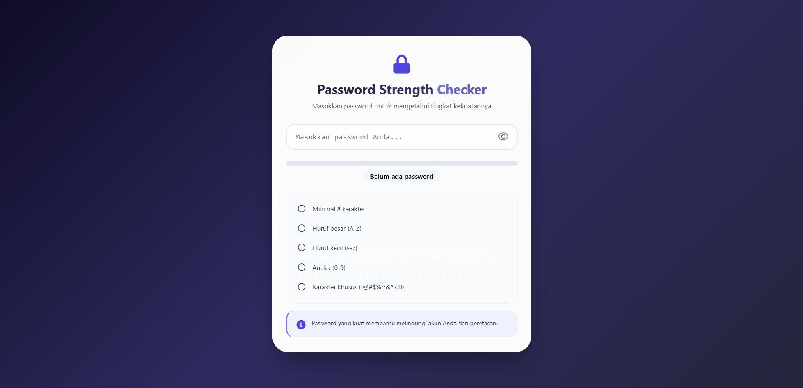

# 🔒 Pemeriksa Kekuatan Sandi

<div align="center">

**Aplikasi pengecek kekuatan password dengan 5 kriteria keamanan, visualisasi meter progresif, checklist real-time, dan saran keamanan**

</div>

## 📋 Deskripsi Proyek

**Pemeriksa Kekuatan Sandi** adalah aplikasi web yang menganalisis kekuatan password secara real-time berdasarkan 5 kriteria keamanan: panjang minimal 8 karakter, huruf besar, huruf kecil, angka, dan karakter khusus. Aplikasi ini menampilkan visualisasi meter bar, checklist kriteria dengan ikon dinamis, serta memberikan saran keamanan yang relevan untuk membantu pengguna membuat password yang lebih aman.

Aplikasi ini sangat berguna untuk website yang memiliki fitur registrasi atau pembuatan akun, membantu pengguna memahami pentingnya password yang kuat, serta memberikan edukasi tentang praktik keamanan kata sandi yang baik.

Fitur utama aplikasi ini:
- **5 Kriteria Keamanan**: Panjang, huruf besar, huruf kecil, angka, karakter khusus
- **Visualisasi Meter**: Progress bar dengan warna berbeda (merah, oranye, kuning, hijau)
- **Checklist Real-time**: Tanda centang hijau untuk kriteria yang terpenuhi
- **Toggle Password**: Tombol mata untuk menampilkan/menyembunyikan password
- **Info Panel Dinamis**: Saran keamanan yang berubah berdasarkan kekuatan password
- **Skor Kekuatan**: 5 level (Sangat Lemah, Lemah, Sedang, Kuat, Sangat Kuat)

## 📑 Daftar Isi

- [Deskripsi Proyek](#-deskripsi-proyek)
- [Tampilan Aplikasi](#-tampilan-aplikasi)
- [Latar Belakang](#-latar-belakang)
- [Fitur Utama](#-fitur-utama)
- [Teknologi yang Digunakan](#-teknologi-yang-digunakan)
- [Cara Penggunaan](#-cara-penggunaan)
- [Peran Developer](#-peran-developer)
- [Pembelajaran dari Proyek](#-pembelajaran-dari-proyek-lessons-learned)
- [Ucapan Terima Kasih](#-ucapan-terima-kasih)

## 📸 Tampilan Aplikasi

### Tampilan Utama

 


## 🎯 Latar Belakang

Proyek ini dibuat sebagai proyek pribadi untuk mengembangkan keterampilan dalam:

- **Regex (Regular Expression)**: Deteksi pola huruf besar, kecil, angka, dan karakter khusus
- **Real-time Validation**: Validasi dan update UI setiap kali pengguna mengetik
- **Progress Bar Dinamis**: Visualisasi persentase kekuatan password
- **Dynamic Class & Icon Management**: Ubah ikon dari lingkaran menjadi centang saat kriteria terpenuhi
- **Accessibility**: Tombol toggle password dengan atribut ARIA

Kebutuhan yang melatarbelakangi proyek ini:
- **Kebutuhan validasi password** yang informatif dan edukatif
- **Keinginan memahami** Regex untuk validasi teks
- **Pembuatan feedback visual** yang menarik untuk pengguna
- **Edukasi keamanan digital** melalui aplikasi interaktif

## 🌟 Fitur Utama

### 🔐 **5 Kriteria Keamanan Password**

| Kriteria | Regex | Deskripsi |
|----------|-------|-----------|
| **Panjang** | `password.length >= 8` | Minimal 8 karakter |
| **Huruf Besar** | `/[A-Z]/` | Mengandung huruf kapital A-Z |
| **Huruf Kecil** | `/[a-z]/` | Mengandung huruf kecil a-z |
| **Angka** | `/[0-9]/` | Mengandung angka 0-9 |
| **Karakter Khusus** | `/[^A-Za-z0-9]/` | Mengandung simbol (!@#$%^&* dll) |

### 📊 **5 Level Kekuatan Password**

| Level | Skor | Warna Meter | Pesan |
|-------|------|-------------|-------|
| **Sangat Lemah** | 0% | 🔴 Merah (#ef4444) | ⚠️ Sangat Lemah |
| **Lemah** | < 30% | 🟠 Oranye (#f97316) | 🔴 Lemah |
| **Sedang** | < 60% | 🟡 Kuning (#eab308) | 🟠 Sedang |
| **Kuat** | < 80% | 🟢 Hijau (#22c55e) | 🟢 Kuat |
| **Sangat Kuat** | ≥ 80% | 🟢 Hijau Tua (#059669) | 💪 Sangat Kuat |

### ✅ **Checklist Dinamis**

| Status | Ikon | Warna |
|--------|------|-------|
| **Tidak Terpenuhi** | ◯ (far fa-circle) | Abu-abu |
| **Terpenuhi** | ✓ (fas fa-check-circle) | Hijau (#10b981) |

### 👁️ **Toggle Visibility**

| Status | Ikon Tombol | Fungsi |
|--------|-------------|--------|
| **Password tersembunyi** | 👁️ (far fa-eye) | Klik untuk menampilkan |
| **Password terlihat** | 👁️‍🗨️ (fas fa-eye-slash) | Klik untuk menyembunyikan |

### 💡 **Info Panel Dinamis**

| Kondisi | Pesan |
|---------|-------|
| **Password kosong** | "Password yang kuat membantu melindungi akun Anda dari peretasan." |
| **Sangat Lemah** | "Password terlalu pendek dan tidak memiliki variasi karakter." |
| **Lemah** | "Tambahkan minimal 8 karakter, campur huruf besar, kecil, dan angka." |
| **Sedang** | "Cukup baik, tapi tambahkan karakter khusus (!@#$%) untuk membuatnya lebih kuat." |
| **Kuat** | "Password kuat! Pastikan tidak menggunakan kata yang umum." |
| **Sangat Kuat** | "Password sangat aman! Tetap jaga kerahasiaannya." |

### 📏 **Perhitungan Skor**

```
Skor = (Jumlah Kriteria Terpenuhi / 5) × 100

Contoh:
- 5 kriteria terpenuhi = 100% (Sangat Kuat)
- 3 kriteria terpenuhi = 60% (Sedang)
- 1 kriteria terpenuhi = 20% (Lemah)
```

## 🛠️ Teknologi yang Digunakan

### Core Technologies

| Teknologi | Fungsi | Alasan Penggunaan |
|-----------|--------|-------------------|
| **HTML5** | Struktur halaman | Semantik, form elements |
| **CSS3** | Styling dan layout | Flexbox, gradient, transition |
| **JavaScript (ES6+)** | Logika dan interaktivitas | Regex, event handling, DOM manipulation |
| **Font Awesome 6** | Ikon | Ikon mata, centang, lingkaran |

### Fitur JavaScript yang Digunakan

| Fitur | Penggunaan |
|-------|------------|
| **Regular Expression (Regex)** | Deteksi huruf besar, kecil, angka, karakter khusus |
| **Event Listeners** | `input`, `click`, `paste`, `keydown` |
| **DOM Manipulation** | Update meter bar, checklist, info panel |
| **setTimeout** | Delay untuk menangani paste event |
| **classList.add/remove** | Tambah/hapus class valid pada kriteria |
| **Template Literals** | Update HTML dinamis |

### Regex Patterns yang Digunakan

| Pattern | Fungsi | Contoh Pencocokan |
|---------|--------|-------------------|
| `/[A-Z]/` | Deteksi huruf besar | "Password" → true, "password" → false |
| `/[a-z]/` | Deteksi huruf kecil | "password" → true, "PASSWORD" → false |
| `/[0-9]/` | Deteksi angka | "pass123" → true, "password" → false |
| `/[^A-Za-z0-9]/` | Deteksi karakter khusus | "pass@123" → true, "pass123" → false |

### CSS Modern yang Diterapkan

| Fitur | Penggunaan |
|-------|------------|
| **Linear Gradient** | Background body, teks gradient header |
| **Flexbox** | Layout input wrapper, criteria list, info panel |
| **Transition** | Animasi meter bar width, hover effects |
| **Border Radius** | Card, input, meter, checklist (rounded corners) |
| **Box Shadow** | Efek kedalaman pada card |
| **Media Queries** | Responsif untuk layar di bawah 480px |
| **Backdrop-filter** | Efek blur ringan pada card |

### Penjelasan File

| File | Fungsi |
|------|--------|
| **index.html** | Struktur aplikasi password checker. Berisi header dengan ikon gembok, input password dengan tombol toggle visibility, strength meter dengan fill bar, label kekuatan, checklist 5 kriteria keamanan, dan info panel untuk saran. |
| **style.css** | Styling lengkap dengan tema gradien ungu gelap, desain card putih membulat, meter bar dengan transition halus, checklist dengan border dashed, info panel dengan border kiri biru, dan layout responsif. |
| **script.js** | Logika inti aplikasi. Berisi fungsi checkPasswordStrength yang menggunakan regex untuk validasi 5 kriteria, perhitungan skor (0-100%), update meter bar dengan warna sesuai level, update checklist dengan ikon centang/lingkaran, toggle visibility password, dan info panel dinamis dengan saran. |

## 🎮 Cara Penggunaan

### Panduan Penggunaan Lengkap

#### 1. **Memasukkan Password**

| Langkah | Instruksi |
|---------|-----------|
| 1 | Klik pada kolom input "Masukkan password Anda..." |
| 2 | Ketik password yang ingin diuji |
| 3 | Hasil analisis akan muncul **secara real-time** saat mengetik |

#### 2. **Membaca Hasil Kekuatan Password**

| Elemen | Informasi |
|--------|-----------|
| **Progress Bar** | Persentase kekuatan (lebar bar) dan warna (merah→hijau) |
| **Label Kekuatan** | Teks level (Sangat Lemah, Lemah, Sedang, Kuat, Sangat Kuat) + (X/5 kriteria) |
| **Checklist** | 5 kriteria dengan ikon centang hijau jika terpenuhi |
| **Info Panel** | Saran spesifik untuk meningkatkan keamanan password |

#### 3. **Menampilkan/Menyembunyikan Password**

| Aksi | Cara |
|------|------|
| **Lihat password** | Klik ikon mata 👁️ di sebelah kanan input |
| **Sembunyikan password** | Klik ikon mata tercoret 👁️‍🗨️ |

> **Manfaat**: Membantu pengguna memeriksa apakah password yang diketik sudah benar

#### 4. **Memahami Kriteria Keamanan**

| Kriteria | Contoh Password | Terpenuhi? |
|----------|-----------------|-------------|
| Minimal 8 karakter | "pass123" (7 karakter) | ❌ Tidak |
| Minimal 8 karakter | "password123" (11 karakter) | ✅ Ya |
| Huruf besar | "password" | ❌ Tidak |
| Huruf besar | "Password" | ✅ Ya |
| Huruf kecil | "PASSWORD" | ❌ Tidak |
| Huruf kecil | "Password" | ✅ Ya |
| Angka | "Password" | ❌ Tidak |
| Angka | "Password123" | ✅ Ya |
| Karakter khusus | "Password123" | ❌ Tidak |
| Karakter khusus | "Password@123" | ✅ Ya |

### Contoh Password & Hasil Analisis

#### Contoh 1: Password Lemah

| Password | Kriteria Terpenuhi | Skor | Level |
|----------|-------------------|------|-------|
| `admin` | Panjang (❌ 5 < 8) | 0% | Sangat Lemah |

#### Contoh 2: Password Sedang

| Password | Kriteria Terpenuhi | Skor | Level |
|----------|-------------------|------|-------|
| `password123` | Panjang ✅, Huruf kecil ✅, Angka ✅ | 60% | Sedang |

#### Contoh 3: Password Kuat

| Password | Kriteria Terpenuhi | Skor | Level |
|----------|-------------------|------|-------|
| `Password123` | Panjang ✅, Huruf besar ✅, Huruf kecil ✅, Angka ✅ | 80% | Kuat |

#### Contoh 4: Password Sangat Kuat

| Password | Kriteria Terpenuhi | Skor | Level |
|----------|-------------------|------|-------|
| `P@ssw0rd123!` | Semua 5 kriteria ✅ | 100% | Sangat Kuat |

### Tips Penggunaan

1. **Gunakan kombinasi** huruf besar, kecil, angka, dan simbol untuk password terkuat
2. **Panjang password** minimal 12 karakter lebih disarankan untuk keamanan ekstra
3. **Jangan gunakan informasi pribadi** seperti nama, tanggal lahir, atau nomor telepon
4. **Gunakan password manager** untuk menyimpan password kompleks
5. **Aktifkan 2FA** (Two-Factor Authentication) jika tersedia

### Validasi & Edge Cases

| Skenario | Penanganan |
|----------|------------|
| Input kosong | Reset semua, tampilkan "Belum ada password" |
| Paste password | Analisis tetap berjalan (delay 10ms) |
| Tekan Enter | Mencegah submit form, tetap analisis |
| Karakter khusus | Semua simbol non-alfanumerik dihitung |

## 👨‍💻 Peran Developer

Sebagai developer proyek pribadi ini, saya bertanggung jawab atas:

### Peran dalam Proyek

| Area | Kontribusi |
|------|------------|
| **Perencanaan** | Merancang 5 kriteria keamanan password standar |
| **UI/UX Design** | Mendesain antarmuka bersih dengan gradien ungu |
| **Frontend Development** | Membangun struktur HTML dan styling CSS |
| **Regex Implementation** | Implementasi deteksi pola dengan Regular Expression |
| **Real-time Validation** | Validasi dan update UI setiap input change |
| **Accessibility** | Tombol toggle password dengan ARIA label |

### Fokus Pengembangan

1. **Validasi Password Real-time**
   - Event `input` untuk update saat mengetik
   - Event `paste` untuk menangani tempel teks
   - Update semua elemen UI secara sinkron

2. **Regex Pattern Matching**
   - `/[A-Z]/` untuk huruf besar
   - `/[a-z]/` untuk huruf kecil
   - `/[0-9]/` untuk angka
   - `/[^A-Za-z0-9]/` untuk karakter khusus

3. **Visual Feedback**
   - Progress bar dengan width persentase dan warna dinamis
   - Checklist dengan ikon berubah dari lingkaran ke centang
   - Info panel dengan saran sesuai level

4. **Skor & Level Kekuatan**
   - Rumus: (jumlah kriteria / 5) × 100
   - 5 level dengan threshold berbeda
   - Pesan sesuai level untuk edukasi pengguna

## 📚 Pembelajaran dari Proyek (Lessons Learned)

### Keterampilan Teknis yang Diperoleh

1. **Regular Expression (Regex) untuk Validasi**
   ```javascript
   const hasUpper = /[A-Z]/.test(password);
   const hasSpecial = /[^A-Za-z0-9]/.test(password);
   ```

2. **Perhitungan Skor Persentase**
   ```javascript
   let validCount = 0;
   if (lengthValid) validCount++;
   if (hasUpper) validCount++;
   // ... dan seterusnya
   const score = (validCount / 5) * 100;
   ```

3. **Conditional Styling dengan CSS**
   ```javascript
   meterFill.style.width = `${score}%`;
   meterFill.style.backgroundColor = meterColor;
   ```

4. **Dynamic Icon Switching**
   ```javascript
   if (isValid) {
       iconSpan.className = 'fas fa-check-circle';
       element.classList.add('valid');
   } else {
       iconSpan.className = 'far fa-circle';
       element.classList.remove('valid');
   }
   ```

5. **Toggle Password dengan Accessibility**
   ```javascript
   const type = passwordInput.getAttribute('type') === 'password' ? 'text' : 'password';
   passwordInput.setAttribute('type', type);
   toggleBtn.setAttribute('aria-label', 'Tampilkan/Sembunyikan password');
   ```

### Soft Skills yang Dikembangkan

#### 1. **Pemahaman Keamanan Digital**
- Memahami kriteria password yang kuat
- Mengetahui praktik terbaik keamanan akun
- Edukasi pengguna tentang pentingnya password

#### 2. **Perhatian terhadap Detail**
- Validasi semua 5 kriteria secara akurat
- Threshold skor yang tepat untuk setiap level
- Pesan saran yang informatif dan membantu

#### 3. **User Experience (UX)**
- Real-time feedback tanpa perlu klik tombol
- Visualisasi yang jelas dengan warna dan ikon
- Toggle password untuk memeriksa kebenaran input

## 🙏 Ucapan Terima Kasih

### Sumber Daya dan Referensi

#### Dokumentasi Resmi
- [MDN Web Docs - Regular Expression](https://developer.mozilla.org/en-US/docs/Web/JavaScript/Guide/Regular_Expressions) - Panduan Regex di JavaScript
- [MDN Web Docs - Input Event](https://developer.mozilla.org/en-US/docs/Web/API/Element/input_event) - Event untuk real-time validation
- [OWASP Password Guidelines](https://owasp.org/www-community/controls/PasswordPolicy) - Standar keamanan password

#### Inspirasi Desain
- **Dribbble** - Inspirasi desain password strength meter
- **material.io** - Referensi desain form dan input

#### Tools yang Membantu
- **GitHub** - Hosting repository dan version control
- **VS Code** - Editor kode dengan Live Server
- **Regex101.com** - Testing regular expression
- **Font Awesome** - Library ikon

---

<div align="center">

**⭐ Jika proyek ini membantu Anda memahami password yang aman, berikan bintang! ⭐**

**"Password yang kuat adalah benteng pertama keamanan digital Anda. Jaga selalu kerahasiaannya!"**

</div>