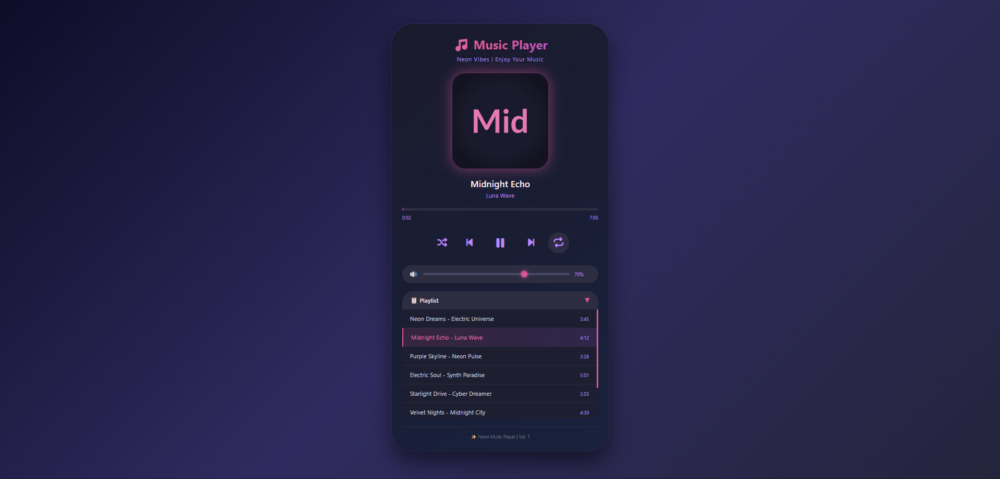

# 🎵 Pemutar Musik

<div align="center">

**Pemutar musik modern dengan efek neon, playlist lengkap, kontrol shuffle/repeat, volume slider, dan dukungan keyboard shortcut**

</div>

## 📋 Deskripsi Proyek

**Pemutar Musik** adalah aplikasi web pemutar musik dengan antarmuka bergaya neon futuristik. Aplikasi ini memungkinkan pengguna untuk memutar musik dari playlist yang telah disediakan, dengan fitur lengkap seperti kontrol putar/jeda, lagu sebelumnya/berikutnya, shuffle (acak), repeat (pengulangan), pengaturan volume, progress bar interaktif, serta playlist yang dapat disembunyikan. Dirancang dengan tema gelap dan aksen warna pink-ungu yang menyala.

Aplikasi ini sangat cocok untuk mendengarkan musik santai, belajar, atau bekerja dengan suasana yang estetik. Dilengkapi dengan 8 lagu demo elektronik dan berbagai fitur modern, aplikasi ini memberikan pengalaman mendengarkan musik yang menyenangkan.

Fitur utama aplikasi ini:
- **Kontrol Pemutaran Lengkap**: Play, Pause, Next, Previous, Shuffle, Repeat
- **Progress Bar Interaktif**: Klik pada progress bar untuk melompat ke bagian lagu tertentu
- **Volume Control**: Slider volume dengan ikon dinamis (🔊/🔉/🔇)
- **Playlist 8 Lagu**: Daftar lagu lengkap dengan durasi dan highlight lagu aktif
- **Keyboard Shortcuts**: Space (Play/Pause), Arrow Keys (Next/Prev/Volume)
- **Tampilan Neon Efek**: Efek glow, gradien, dan animasi pada elemen

## 📑 Daftar Isi

- [Deskripsi Proyek](#-deskripsi-proyek)
- [Tampilan Aplikasi](#-tampilan-aplikasi)
- [Latar Belakang](#-latar-belakang)
- [Fitur Utama](#-fitur-utama)
- [Teknologi yang Digunakan](#-teknologi-yang-digunakan)
- [Cara Penggunaan](#-cara-penggunaan)
- [Peran Developer](#-peran-developer)
- [Pembelajaran dari Proyek](#-pembelajaran-dari-proyek-lessons-learned)
- [Ucapan Terima Kasih](#-ucapan-terima-kasih)

## 📸 Tampilan Aplikasi

### Tampilan Utama

 


## 🎯 Latar Belakang

Proyek ini dibuat sebagai proyek pribadi untuk mengembangkan keterampilan dalam:

- **Web Audio API**: Menggunakan objek Audio() untuk mengontrol pemutaran musik
- **Event Handling Audio**: Menangani timeupdate, loadedmetadata, ended event
- **State Management**: Mengelola state pemutaran (play/pause, shuffle, repeat)
- **DOM Manipulation Dinamis**: Render playlist dan update UI secara real-time
- **Keyboard Integration**: Menambahkan shortcut keyboard untuk pengalaman lebih baik

Kebutuhan yang melatarbelakangi proyek ini:
- **Kebutuhan pemutar musik** dengan antarmuka yang menarik secara visual
- **Keinginan memahami** Web Audio API dan event pada elemen audio
- **Eksplorasi efek neon** dan gradien pada CSS
- **Pembuatan playlist** yang interaktif dan responsif

## 🌟 Fitur Utama

### 🎮 **Kontrol Pemutaran**

| Tombol | Fungsi | Shortcut |
|--------|--------|----------|
| **⏮ (Previous)** | Lagu sebelumnya (atau kembali ke awal jika >3 detik) | ← (Panah Kiri) |
| **▶/⏸ (Play/Pause)** | Memulai atau menjeda pemutaran | Space |
| **⏭ (Next)** | Lagu berikutnya | → (Panah Kanan) |
| **🔀 (Shuffle)** | Mengacak urutan pemutaran (tanpa mengubah playlist) | Klik tombol |
| **🔁 (Repeat)** | Mengulang lagu yang sama saat selesai | Klik tombol |

### 🔊 **Volume Control**

| Komponen | Fungsi |
|----------|--------|
| **Slider Volume** | Geser untuk mengatur volume (0-100%) |
| **Ikon Volume** | Berubah sesuai level volume (🔊/🔉/🔇) |
| **Persentase** | Menampilkan nilai volume saat ini |
| **Shortcut** | ↑ (Panah Atas) naik 5%, ↓ (Panah Bawah) turun 5% |

### 📋 **Playlist**

| Fitur | Deskripsi |
|-------|-----------|
| **8 Lagu Demo** | Lagu dengan artis dan durasi masing-masing |
| **Lagu Aktif** | Highlight dengan gradien dan border pink |
| **Klik untuk Putar** | Klik lagu di playlist untuk langsung memutar |
| **Collapse/Expand** | Tombol ▼/▶ untuk menyembunyikan/menampilkan playlist |
| **Scroll Kustom** | Scrollbar berwarna pink untuk playlist panjang |

### 🎨 **Visual & Animasi**

| Elemen | Efek |
|--------|------|
| **Album Art** | Gradien berbeda setiap lagu, border glow neon |
| **Progress Fill** | Gradien pink-ungu yang mengisi sesuai progres lagu |
| **Tombol Aktif (Shuffle/Repeat)** | Background pink dengan efek glow |
| **Hover Effect** | Tombol membesar (scale 1.1) dengan efek glow |
| **Player Card** | Hover translateY dengan shadow neon |

### ⌨️ **Keyboard Shortcuts**

| Tombol | Fungsi |
|--------|--------|
| **Space** | Play / Pause |
| **→ (Panah Kanan)** | Lagu berikutnya |
| **← (Panah Kiri)** | Lagu sebelumnya |
| **↑ (Panah Atas)** | Volume naik 5% |
| **↓ (Panah Bawah)** | Volume turun 5% |

### 📀 **Daftar Lagu (Playlist)**

| # | Judul Lagu | Artis | Durasi |
|---|------------|-------|--------|
| 1 | Neon Dreams | Electric Universe | 3:45 |
| 2 | Midnight Echo | Luna Wave | 4:12 |
| 3 | Purple Skyline | Neon Pulse | 3:28 |
| 4 | Electric Soul | Synth Paradise | 5:01 |
| 5 | Starlight Drive | Cyber Dreamer | 3:55 |
| 6 | Velvet Nights | Midnight City | 4:30 |
| 7 | Digital Love | Neon Heart | 3:42 |
| 8 | Infinity Pulse | Galactic Echo | 4:18 |

## 🛠️ Teknologi yang digunakan

### Core Technologies

| Teknologi | Fungsi | Alasan Penggunaan |
|-----------|--------|-------------------|
| **HTML5** | Struktur halaman | Semantik, audio element (via JavaScript) |
| **CSS3** | Styling dan layout | Flexbox, gradient, animasi, glassmorphism |
| **JavaScript (ES6+)** | Logika dan interaktivitas | Web Audio API, event handling, DOM manipulation |
| **Font Awesome 6** | Ikon kontrol | Ikon modern untuk tombol play, pause, shuffle, dll |

### Web Audio API yang Digunakan

| API / Properti | Penggunaan |
|----------------|------------|
| `new Audio()` | Membuat objek audio untuk kontrol pemutaran |
| `audio.play()` / `audio.pause()` | Memulai/menjeda pemutaran |
| `audio.currentTime` | Mendapatkan/mengatur posisi pemutaran (detik) |
| `audio.duration` | Mendapatkan durasi total lagu |
| `audio.volume` | Mengatur volume (0.0 - 1.0) |
| `audio.src` | Mengatur sumber file audio |
| `audio.load()` | Memuat ulang audio setelah mengganti src |

### Event Audio yang Digunakan

| Event | Penggunaan |
|-------|------------|
| `timeupdate` | Update progress bar dan waktu setiap 250ms |
| `loadedmetadata` | Mendapatkan durasi lagu saat metadata tersedia |
| `ended` | Mendeteksi lagu selesai untuk next/repeat |

### CSS Modern yang Diterapkan

| Fitur | Penggunaan |
|-------|------------|
| **Linear Gradient** | Background body, tombol, progress fill, teks |
| **Flexbox** | Layout controls, volume container, playlist items |
| **Custom Scrollbar** | Styling scrollbar playlist dengan warna pink |
| **Box Shadow dengan Glow** | Efek neon pada album art dan tombol aktif |
| **Transform & Transition** | Hover scale, translateY |
| **Media Queries** | Responsif untuk layar di bawah 480px |
| **Webkit-appearance** | Custom styling untuk range slider |

### Penjelasan File

| File | Fungsi |
|------|--------|
| **index.html** | Struktur aplikasi music player. Berisi header, album art dengan efek vinyl, informasi lagu, progress bar, kontrol (play/prev/next/shuffle/repeat), volume slider, playlist section dengan tombol toggle, dan daftar playlist. |
| **style.css** | Styling lengkap dengan tema gelap (dark theme), efek neon pink-ungu, desain card membulat, custom scrollbar, animasi hover, layout responsif, dan styling untuk range slider. |
| **script.js** | Logika inti aplikasi. Berisi database 8 lagu, fungsi load/play/pause/next/prev, implementasi shuffle dan repeat, volume control, progress bar interaktif, render playlist dinamis, penanganan event audio (timeupdate, loadedmetadata, ended), serta keyboard shortcuts. |

## 🎮 Cara Penggunaan

### Panduan Penggunaan Lengkap

#### 1. **Memutar Musik**

| Metode | Cara |
|--------|------|
| **Tombol Play** | Klik tombol ▶ (play) di tengah kontrol |
| **Playlist** | Klik salah satu lagu di daftar playlist |
| **Keyboard** | Tekan **Space** untuk play/pause |
| **Auto-start** | Lagu pertama akan dimuat, tetapi perlu klik Play untuk mulai |

#### 2. **Kontrol Pemutaran**

| Tombol | Fungsi | Kapan Digunakan |
|--------|--------|-----------------|
| **⏮** | Lagu sebelumnya | Ingin kembali ke lagu sebelumnya |
| **⏭** | Lagu berikutnya | Ingin melewati lagu saat ini |
| **🔀 (Shuffle)** | Mode acak | Ingin mendengarkan lagu secara random |
| **🔁 (Repeat)** | Mode ulang | Ingin satu lagu diputar berulang |

> **Catatan**: Tombol Shuffle dan Repeat akan menyala (background pink + glow) saat aktif

#### 3. **Mengatur Volume**

| Metode | Cara |
|--------|------|
| **Slider** | Geser slider volume ke kiri (kecil) atau kanan (besar) |
| **Keyboard** | ↑ (Panah Atas) = naik 5%, ↓ (Panah Bawah) = turun 5% |
| **Ikon** | Berubah otomatis: 🔊 (≥50%), 🔉 (1-49%), 🔇 (0%) |

#### 4. **Melompat ke Bagian Lagu**

- **Klik** pada progress bar di posisi mana pun
- Progress akan melompat ke posisi tersebut
- Progress fill dan waktu akan terupdate otomatis

#### 5. **Mengelola Playlist**

| Aksi | Cara |
|------|------|
| **Putar lagu dari playlist** | Klik nama lagu di daftar playlist |
| **Sembunyikan playlist** | Klik tombol **▼** (ubah menjadi ▶) |
| **Tampilkan playlist** | Klik tombol **▶** (ubah menjadi ▼) |
| **Lihat lagu aktif** | Lagu yang sedang diputar memiliki highlight pink |

### Contoh Skenario Penggunaan

#### Skenario 1: Mendengarkan Semua Lagu Berurutan

1. Buka aplikasi
2. Klik tombol **Play** (▶)
3. Nikmati lagu dari #1 hingga #8 secara berurutan
4. Saat lagu selesai, otomatis lanjut ke lagu berikutnya

#### Skenario 2: Mode Shuffle (Acak)

1. Klik tombol **🔀 (Shuffle)** hingga menyala pink
2. Klik **Play**
3. Lagu akan dimainkan secara acak (tidak berurutan)
4. Tidak akan mengulang lagu yang sama sampai semua lagu diputar (jika memungkinkan)

#### Skenario 3: Mengulang Satu Lagu (Repeat)

1. Klik tombol **🔁 (Repeat)** hingga menyala pink
2. Pilih lagu yang ingin diulang
3. Klik **Play**
4. Saat lagu selesai, akan diputar ulang dari awal terus-menerus

#### Skenario 4: Menggunakan Keyboard Shortcut

| Aktivitas | Shortcut |
|-----------|----------|
| Mulai/jeda lagu | Spasi |
| Ganti lagu berikutnya | → (Panah Kanan) |
| Kembali ke lagu sebelumnya | ← (Panah Kiri) |
| Volume lebih keras | ↑ (Panah Atas) |
| Volume lebih pelan | ↓ (Panah Bawah) |

### Tips Penggunaan

1. **Gunakan keyboard shortcut** untuk kontrol yang lebih cepat tanpa mouse
2. **Mode Shuffle** cocok untuk playlist panjang agar tidak bosan dengan urutan
3. **Mode Repeat** cocok untuk lagu favorit yang ingin didengarkan berulang
4. **Klik progress bar** untuk skip ke bagian favorit dalam lagu
5. **Sembunyikan playlist** jika ingin fokus pada album art dan kontrol utama

### Validasi & Penanganan Error

| Skenario | Penanganan |
|----------|------------|
| Gagal memuat lagu | Album art fallback ke placeholder |
| Durasi belum tersedia | Progress bar tidak bergerak, waktu masih 0:00 |
| Lagu selesai (repeat off) | Otomatis next song (atau shuffle jika aktif) |
| Lagu selesai (repeat on) | Memutar ulang lagu yang sama |

## 👨‍💻 Peran Developer

Sebagai developer proyek pribadi ini, saya bertanggung jawab atas:

### Peran dalam Proyek

| Area | Kontribusi |
|------|------------|
| **Perencanaan** | Merancang fitur music player dengan kontrol lengkap |
| **UI/UX Design** | Mendesain tema neon gelap dengan aksen pink-ungu |
| **Frontend Development** | Membangun struktur HTML dan styling CSS modern |
| **Web Audio Integration** | Implementasi kontrol audio dengan JavaScript |
| **Playlist Management** | Membuat sistem playlist yang interaktif |
| **Keyboard Shortcuts** | Menambahkan dukungan keyboard untuk power user |

### Fokus Pengembangan

1. **Fungsionalitas Inti Audio**
   - Implementasi objek Audio() dengan event handling
   - Progress bar real-time dengan event timeupdate
   - Volume control dengan slider dan keyboard

2. **State Management**
   - isPlaying, isShuffle, isRepeat state
   - Update UI sesuai state (ikon, warna tombol)
   - Sinkronisasi playlist highlight dengan lagu aktif

3. **Pengalaman Pengguna**
   - Efek visual neon (glow, gradien)
   - Animasi hover dan transisi
   - Playlist collapsible untuk efisiensi ruang

## 📚 Pembelajaran dari Proyek (Lessons Learned)

### Keterampilan Teknis yang Diperoleh

1. **Web Audio API dengan Objek Audio()**
   ```javascript
   const audio = new Audio();
   audio.src = song.url;
   audio.play();
   audio.pause();
   audio.currentTime = 0;
   audio.volume = 0.7;
   ```

2. **Event Handling untuk Audio**
   ```javascript
   audio.addEventListener('timeupdate', updateProgress);
   audio.addEventListener('loadedmetadata', setDuration);
   audio.addEventListener('ended', onSongEnd);
   ```

3. **Logika Shuffle Tanpa Mengubah Array**
   ```javascript
   let newIndex;
   do {
       newIndex = Math.floor(Math.random() * playlist.length);
   } while (playlist.length > 1 && newIndex === currentSongIndex);
   currentSongIndex = newIndex;
   ```

4. **Progress Bar Interaktif**
   ```javascript
   function seek(e) {
       const rect = progressBar.getBoundingClientRect();
       const percent = (e.clientX - rect.left) / rect.width;
       audio.currentTime = percent * audio.duration;
   }
   ```

5. **Keyboard Shortcut Handling**
   ```javascript
   document.addEventListener('keydown', (e) => {
       if (e.code === 'Space') {
           e.preventDefault(); // Mencegah scroll
           togglePlayPause();
       } else if (e.code === 'ArrowRight') {
           nextSong();
       }
   });
   ```

### Soft Skills yang Dikembangkan

#### 1. **Pemahaman Media Web**
- Memahami cara kerja pemutaran audio di browser
- Mengetahui keterbatasan dan kemampuan Web Audio API

#### 2. **Desain Visual Kreatif**
- Menerapkan tema neon yang futuristik
- Memilih kombinasi warna pink-ungu yang harmonis

#### 3. **Pengalaman Pengguna**
- Menyediakan multiple control methods (tombol, slider, keyboard)
- Memberikan feedback visual pada setiap aksi pengguna

## 🙏 Ucapan Terima Kasih

### Sumber Daya dan Referensi

#### Sumber Audio (Demo)
- **SoundHelix** - Penyedia file audio demo untuk testing (www.soundhelix.com)

#### Dokumentasi Resmi
- [MDN Web Docs - HTMLAudioElement](https://developer.mozilla.org/en-US/docs/Web/API/HTMLAudioElement) - Dokumentasi objek Audio
- [MDN Web Docs - KeyboardEvent](https://developer.mozilla.org/en-US/docs/Web/API/KeyboardEvent) - Panduan event keyboard
- [Font Awesome 6](https://fontawesome.com/) - Library ikon

#### Inspirasi Desain
- **Spotify** - Inspirasi layout music player modern
- **Dribbble** - Referensi desain neon dan gelap
- **Synthwave/Retrowave aesthetic** - Inspirasi tema neon pink-ungu

#### Tools yang Membantu
- **GitHub** - Hosting repository dan version control
- **VS Code** - Editor kode dengan Live Server

---

<div align="center">

**⭐ Jika proyek ini menghibur Anda dengan musik dan visual neon, berikan bintang! ⭐**

**"Nikmati musik favorit Anda dengan gaya neon yang bersinar. Dengarkan, rileks, dan biarkan musik mengalir!"**

</div>