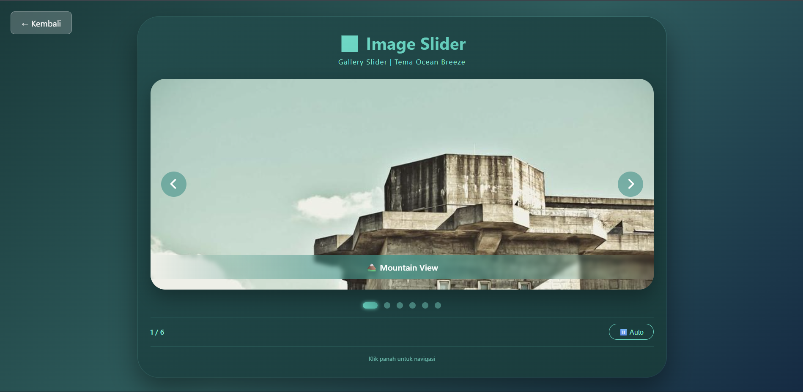

# 🖼️ Penggeser Gambar
<div align="center">

**Gallery slider modern dengan auto-slide, navigasi tombol, dot indicator, kontrol keyboard, touch support untuk mobile, dan tema ocean breeze yang menenangkan**

</div>

## 📋 Deskripsi Proyek

**Penggeser Gambar** adalah aplikasi web galeri gambar berbasis slider (carousel) yang menampilkan koleksi pemandangan alam dengan transisi yang halus. Aplikasi ini mendukung navigasi manual melalui tombol panah kiri/kanan, dot indicator, keyboard (panah kiri/kanan), serta kontrol sentuh untuk perangkat mobile. Dilengkapi dengan fitur auto-slide yang dapat diaktifkan/dinonaktifkan, slider ini memberikan pengalaman menjelajahi gambar yang interaktif dan menyenangkan.

Aplikasi ini sangat cocok digunakan untuk portofolio foto, galeri produk, tampilan hero section website, atau sekadar pajangan gambar yang estetik. Dengan tema warna ocean breeze (biru kehijauan), slider ini memberikan kesan segar dan menenangkan.

Fitur utama aplikasi ini:
- **Slider Mulus**: Transisi geser (slide) antar gambar dengan animasi smooth
- **Auto-slide**: Gambar berganti otomatis setiap 3 detik (bisa toggle)
- **Navigasi Lengkap**: Tombol prev/next, dot indicator, keyboard arrow keys
- **Touch Support**: Geser (swipe) pada layar sentuh untuk ganti gambar
- **Hover Pause**: Auto-slide berhenti sementara saat mouse di atas slider
- **6 Gambar Pemandangan**: Koleksi gambar berkualitas dari Lorem Picsum

## 📑 Daftar Isi

- [Deskripsi Proyek](#-deskripsi-proyek)
- [Tampilan Aplikasi](#-tampilan-aplikasi)
- [Latar Belakang](#-latar-belakang)
- [Fitur Utama](#-fitur-utama)
- [Teknologi yang Digunakan](#-teknologi-yang-digunakan)
- [Cara Penggunaan](#-cara-penggunaan)
- [Peran Developer](#-peran-developer)
- [Pembelajaran dari Proyek](#-pembelajaran-dari-proyek-lessons-learned)
- [Ucapan Terima Kasih](#-ucapan-terima-kasih)

## 📸 Tampilan Aplikasi

### Tampilan Utama Slider




## 🎯 Latar Belakang

Proyek ini dibuat sebagai proyek pribadi untuk mengembangkan keterampilan dalam:

- **CSS Transform & Transition**: Mengimplementasikan slider horizontal dengan `transform: translateX()`
- **JavaScript Timer (setInterval)**: Membuat auto-slide dengan interval yang dapat diatur
- **Event Handling untuk Mobile**: Mendeteksi touch start dan end untuk swipe gesture
- **Keyboard Accessibility**: Menambahkan navigasi keyboard untuk aksesibilitas
- **Dynamic DOM Manipulation**: Membuat dot indicator secara dinamis berdasarkan jumlah slide

Kebutuhan yang melatarbelakangi proyek ini:
- **Kebutuhan komponen carousel** yang sering digunakan dalam pengembangan web
- **Keinginan memahami** mekanisme slider murni JavaScript tanpa library
- **Eksplorasi touch event** untuk mendukung perangkat mobile
- **Pembuatan komponen reusable** dengan berbagai fitur kontrol

## 🌟 Fitur Utama

### 🎠 **Mekanisme Slider**

| Komponen | Deskripsi | Implementasi |
|----------|-----------|--------------|
| **Slider Container** | Wadah dengan overflow hidden | `overflow: hidden` |
| **Slider Track** | Baris horizontal berisi semua slide | `display: flex`, `transform: translateX()` |
| **Slide** | Setiap item gambar | `min-width: 100%` |
| **Transisi** | Animasi perpindahan slide | `transition: transform 0.5s ease-in-out` |

### 🎮 **Navigasi & Kontrol**

| Kontrol | Fungsi | Input Method |
|---------|--------|--------------|
| **◀ (Prev)** | Slide ke gambar sebelumnya | Klik tombol |
| **▶ (Next)** | Slide ke gambar berikutnya | Klik tombol |
| **Dot Indicator** | Langsung ke slide tertentu | Klik pada dot |
| **Panah Kiri (←)** | Slide sebelumnya | Keyboard |
| **Panah Kanan (→)** | Slide berikutnya | Keyboard |
| **Swipe Kiri/Kanan** | Ganti slide | Sentuh & geser |

### ⏯️ **Auto-slide System**

| Fitur | Deskripsi |
|-------|-----------|
| **Auto-start** | Slider dimulai secara otomatis saat halaman dimuat |
| **Interval** | 3 detik perpindahan antar slide |
| **Toggle Button** | Tombol ⏸️ Auto / ▶️ Auto untuk mengaktifkan/menonaktifkan |
| **Hover Pause** | Auto-slide berhenti sementara saat mouse di atas slider |
| **Reset on Navigation** | Timer auto-slide direset saat pengguna navigasi manual |

### 📱 **Touch Support (Mobile)**

| Gesture | Aksi |
|---------|------|
| **Swipe ke Kiri** | Slide berikutnya (next) |
| **Swipe ke Kanan** | Slide sebelumnya (prev) |
| **Threshold** | Minimal 50px pergerakan untuk mendeteksi swipe |

### 🎨 **Visual & Animasi**

| Elemen | Efek |
|--------|------|
| **Slide Images** | Tinggi 400px (desktop) / 280px (tablet) / 220px (mobile), object-fit cover |
| **Slide Caption** | Teks keterangan di bagian bawah gambar dengan blur background |
| **Dot Indicator** | Lingkaran kecil, dot aktif membesar (28px) dengan gradien |
| **Tombol Navigasi** | Lingkaran transparan dengan blur, hover berubah warna dan membesar |
| **Fade Animasi** | Setiap slide memiliki animasi fadeSlide saat muncul |

### 🖼️ **Daftar Gambar**

| # | Deskripsi | Caption |
|---|-----------|---------|
| 1 | Pemandangan gunung | 🏔️ Mountain View |
| 2 | Danau yang indah | 🏞️ Beautiful Lake |
| 3 | Ladang bunga | 🌸 Flower Field |
| 4 | Jalur hutan | 🍃 Forest Path |
| 5 | Puncak megah | ⛰️ Majestic Peak |
| 6 | Matahari terbenam | 🌅 Sunset Horizon |

## 🛠️ Teknologi yang Digunakan

### Core Technologies

| Teknologi | Fungsi | Alasan Penggunaan |
|-----------|--------|-------------------|
| **HTML5** | Struktur halaman | Semantik, layout slider |
| **CSS3** | Styling dan layout | Flexbox, transform, transition, gradient |
| **JavaScript (ES6+)** | Logika dan interaktivitas | Timer, touch events, keyboard events, DOM manipulation |
| **Font Awesome 6** | Ikon navigasi | Ikon panah kiri/kanan |

### Fitur JavaScript yang Digunakan

| Fitur | Penggunaan |
|-------|------------|
| **setInterval / clearInterval** | Mekanisme auto-slide setiap 3 detik |
| **Touch Events** | `touchstart`, `touchend` untuk deteksi swipe |
| **Keyboard Events** | `keydown` untuk navigasi panah kiri/kanan |
| **Mouse Events** | `mouseenter`, `mouseleave` untuk hover pause |
| **transform & transition** | Animasi perpindahan slide via CSS |
| **Array & DOM Traversal** | `querySelectorAll`, `classList` untuk manipulasi dot |

### CSS Modern yang Diterapkan

| Fitur | Penggunaan |
|-------|------------|
| **CSS Transform** | `translateX()` untuk pergerakan slider |
| **Transition** | Animasi halus 0.5s ease-in-out |
| **Linear Gradient** | Background tema ocean breeze, caption, dot aktif |
| **Backdrop-filter** | Efek blur pada caption dan tombol navigasi |
| **Flexbox** | Layout container, dots container |
| **Object-fit** | `object-fit: cover` untuk rasio gambar konsisten |
| **Keyframes Animation** | Animasi fadeSlide pada slide |
| **Media Queries** | Responsif untuk tablet dan mobile |

### Sumber Gambar

| Sumber | Deskripsi |
|--------|-----------|
| **Lorem Picsum** | placeholder images gratis (picsum.photos) |
| **Image IDs** | 101, 104, 106, 15, 96, 169 - berbagai pemandangan |

### Penjelasan File

| File | Fungsi |
|------|--------|
| **index.html** | Struktur image slider. Berisi header, slider container dengan track dan 6 slide gambar, tombol navigasi prev/next, dots container untuk indikator, info slide counter, tombol toggle auto-slide, dan footer note. |
| **style.css** | Styling lengkap dengan tema ocean breeze (gradien hijau kebiruan), desain slider card, styling slide caption dengan blur, tombul navigasi bulat dengan efek hover, dots indicator dengan animasi, dan layout responsif. |
| **script.js** | Logika inti aplikasi. Mengatur state currentIndex, fungsi goToSlide dengan transform translateX, pembuatan dots dinamis, update counter dan active dot, navigasi prev/next, sistem auto-slide dengan setInterval, touch events untuk swipe, keyboard support, dan hover pause. |

## 🎮 Cara Penggunaan

### Panduan Penggunaan Lengkap

#### 1. **Navigasi Manual**

| Metode | Cara |
|--------|------|
| **Tombol ◀** | Klik tombol panah kiri untuk melihat gambar sebelumnya |
| **Tombol ▶** | Klik tombol panah kanan untuk melihat gambar berikutnya |
| **Dot Indicator** | Klik pada lingkaran dot untuk langsung menuju slide tertentu |
| **Keyboard ←** | Tekan panah kiri pada keyboard untuk slide sebelumnya |
| **Keyboard →** | Tekan panah kanan pada keyboard untuk slide berikutnya |
| **Swipe (Mobile)** | Geser layar ke kiri/kanan pada area slider |

#### 2. **Auto-slide**

| Status | Tombol | Kondisi |
|--------|--------|---------|
| **Aktif (default)** | ⏸️ Auto | Gambar berganti otomatis setiap 3 detik |
| **Nonaktif** | ▶️ Auto | Slider hanya bergerak saat dinavigasi manual |

**Perilaku tambahan:**
- **Hover pause**: Arahkan mouse ke slider → auto-slide berhenti sementara
- **Hover resume**: Lepaskan mouse dari slider → auto-slide lanjut (jika status aktif)
- **Reset timer**: Navigasi manual akan mereset timer auto-slide

#### 3. **Membaca Informasi**

| Informasi | Lokasi | Contoh |
|-----------|--------|--------|
| **Slide Counter** | Di sebelah kiri bawah | `3 / 6` (sedang di slide ke-3 dari 6) |
| **Caption Gambar** | Di bagian bawah setiap gambar | 🏔️ Mountain View |
| **Dot Aktif** | Dot yang membesar dan bercahaya | Menunjukkan slide sedang aktif |

### Contoh Skenario Penggunaan

#### Skenario 1: Presentasi Portofolio

1. Biarkan auto-slide berjalan (default)
2. Gambar berganti otomatis setiap 3 detik
3. Pengunjung dapat melihat semua karya tanpa interaksi

#### Skenario 2: Eksplorasi Manual

1. Matikan auto-slide dengan klik **▶️ Auto**
2. Gunakan tombol ◀/▶ atau dot untuk menjelajahi gambar
3. Cocok untuk pengguna yang ingin mengamati setiap detail

#### Skenario 3: Presentasi dengan Pointer

1. Arahkan mouse ke slider untuk pause auto-slide (hover pause)
2. Tunjuk dan jelaskan gambar saat ini
3. Geser mouse keluar untuk melanjutkan auto-slide

#### Skenario 4: Penggunaan Mobile

1. Buka di smartphone
2. Geser (swipe) layar ke kiri untuk gambar berikutnya
3. Geser ke kanan untuk gambar sebelumnya
4. Sentuh dot untuk lompat ke slide tertentu

### Tips Penggunaan

1. **Gunakan keyboard** untuk navigasi cepat saat presentasi di desktop
2. **Toggle auto-slide** saat ingin fokus pada gambar tertentu
3. **Hover pause** berguna saat menjelaskan konten gambar
4. **Dot indicator** memberikan gambaran posisi Anda dalam galeri
5. **Slider responsif** akan menyesuaikan tinggi gambar di perangkat berbeda

### Validasi & Kasus Khusus

| Skenario | Penanganan |
|----------|------------|
| Slide pertama, klik prev | Kembali ke slide terakhir (loop) |
| Slide terakhir, klik next | Kembali ke slide pertama (loop) |
| Auto-slide aktif & hover | Auto-slide berhenti, lanjut setelah mouse leave |
| Touch swipe kurang dari 50px | Tidak dianggap sebagai gesture swipe |
| Tombol Space saat auto-slide toggle | Mencegah scroll halaman (preventDefault) |

## 👨‍💻 Peran Developer

Sebagai developer proyek pribadi ini, saya bertanggung jawab atas:

### Peran dalam Proyek

| Area | Kontribusi |
|------|------------|
| **Perencanaan** | Merancang slider dengan fitur auto-slide dan navigasi lengkap |
| **UI/UX Design** | Mendesain tema ocean breeze yang menenangkan |
| **Frontend Development** | Membangun struktur HTML dan styling CSS modern |
| **JavaScript Logic** | Implementasi slider transform, timer, touch events |
| **Mobile Optimization** | Menambahkan touch support dan responsive design |
| **Accessibility** | Menambahkan keyboard navigation untuk aksesibilitas |

### Fokus Pengembangan

1. **Fungsionalitas Inti Slider**
   - Implementasi `transform: translateX()` dengan CSS transition
   - Perhitungan indeks dengan wrap-around (loop)
   - Sinkronisasi slider position dengan state

2. **Auto-slide System**
   - Timer dengan setInterval dan clearInterval
   - Toggle on/off dengan feedback visual
   - Hover pause untuk meningkatkan UX

3. **Multi-input Support**
   - Tombol navigasi
   - Dot indicator dinamis
   - Keyboard events (panah kiri/kanan)
   - Touch events (swipe untuk mobile)

## 📚 Pembelajaran dari Proyek (Lessons Learned)

### Keterampilan Teknis yang Diperoleh

1. **CSS Transform untuk Slider**
   ```css
   .slider {
       display: flex;
       transition: transform 0.5s ease-in-out;
   }
   ```
   ```javascript
   slider.style.transform = `translateX(-${currentIndex * 100}%)`;
   ```

2. **Timer Management**
   ```javascript
   // Start
   autoPlayInterval = setInterval(() => nextSlide(), 3000);
   
   // Stop & cleanup
   clearInterval(autoPlayInterval);
   autoPlayInterval = null;
   ```

3. **Touch Swipe Detection**
   ```javascript
   function handleTouchStart(e) {
       touchStartX = e.changedTouches[0].screenX;
   }
   
   function handleTouchEnd(e) {
       const diff = e.changedTouches[0].screenX - touchStartX;
       if (Math.abs(diff) > 50) {
           diff > 0 ? prevSlide() : nextSlide();
       }
   }
   ```

4. **Dynamic Dot Generation**
   ```javascript
   function createDots() {
       for (let i = 0; i < totalSlides; i++) {
           const dot = document.createElement('div');
           dot.classList.add('dot');
           dot.addEventListener('click', () => goToSlide(i));
           dotsContainer.appendChild(dot);
       }
   }
   ```

5. **Keyboard Event dengan Prevent Default**
   ```javascript
   if (e.key === 'ArrowLeft') {
       prevSlide();
   } else if (e.key === ' ' || e.key === 'Space') {
       e.preventDefault(); // Mencegah scroll
       toggleAutoPlay();
   }
   ```

### Soft Skills yang Dikembangkan

#### 1. **Pemahaman UX untuk Slider**
- Memberikan multiple control methods (klik, keyboard, sentuh)
- Feedback visual untuk setiap interaksi
- Loop navigation yang intuitif

#### 2. **Perhatian terhadap Detail**
- Threshold untuk swipe detection (50px)
- Timer reset pada navigasi manual
- Hover pause tanpa mengubah status auto-slide

#### 3. **Desain Responsif**
- Tinggi gambar berbeda di desktop/tablet/mobile
- Tombol navigasi tetap terjangkau di layar kecil
- Caption tetap terbaca di semua ukuran

## 🙏 Ucapan Terima Kasih

### Sumber Daya dan Referensi

#### Sumber Gambar
- **Lorem Picsum** (picsum.photos) - Placeholder images gratis berkualitas

#### Dokumentasi Resmi
- [MDN Web Docs - Touch Events](https://developer.mozilla.org/en-US/docs/Web/API/Touch_events) - Panduan event sentuh
- [MDN Web Docs - CSS Transform](https://developer.mozilla.org/en-US/docs/Web/CSS/transform) - Dokumentasi transform
- [MDN Web Docs - setInterval](https://developer.mozilla.org/en-US/docs/Web/API/setInterval) - Panduan timer

#### Inspirasi Desain
- **Ocean Breeze Theme** - Inspirasi warna gradien biru kehijauan
- **Dribbble** - Referensi desain slider modern
- **Instagram Carousel** - Inspirasi dot indicator

#### Tools yang Membantu
- **GitHub** - Hosting repository dan version control
- **VS Code** - Editor kode dengan Live Server

---

<div align="center">

**⭐ Jika proyek ini membantu Anda menampilkan galeri gambar dengan elegan, berikan bintang! ⭐**

**"Setiap gambar memiliki cerita. Biarkan slider ini membawamu menjelajahi keindahan dunia."**

</div>