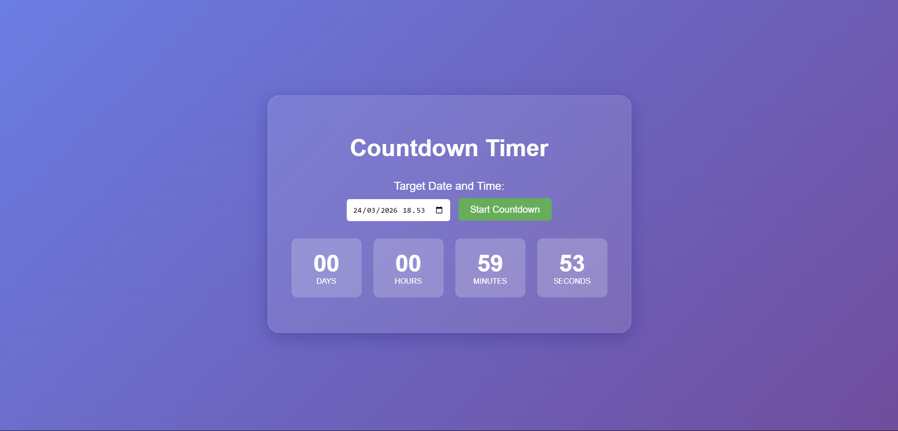

# ⏰ Penghitung Waktu Mundur

**Aplikasi Penghitung Waktu Mundur yang dapat menghitung mundur waktu menuju tanggal dan jam yang ditentukan pengguna**

## 📋 Deskripsi Proyek

**Penghitung Waktu Mundur** adalah aplikasi web sederhana yang memungkinkan pengguna untuk menghitung mundur waktu menuju tanggal dan waktu yang ditentukan. Aplikasi ini menampilkan sisa waktu dalam format hari, jam, menit, dan detik, dengan antarmuka yang modern dan elegan. Cocok digunakan untuk menghitung mundur menuju acara spesial, tenggat waktu, atau momen penting lainnya.

Aplikasi ini sangat berguna bagi siapa saja yang ingin memantau waktu tersisa menuju suatu peristiwa, baik untuk keperluan pribadi, profesional, maupun edukasi. Dengan desain yang bersih dan fitur validasi input, pengguna dapat dengan mudah mengatur target waktu dan melihat hitungan mundur secara real-time.

Fitur utama aplikasi ini:
- Pemilihan Target Waktu: Input datetime-local untuk menentukan tanggal dan jam target
- Hitungan Mundur Real-time: Menampilkan hari, jam, menit, dan detik yang tersisa
- Validasi Input: Memastikan target waktu valid dan berada di masa depan
- Tampilan Modern: Desain dengan efek glassmorphism dan gradient background
- Responsif: Tampilan optimal di berbagai ukuran layar

## 📑 Daftar Isi

- [Deskripsi Proyek](#-deskripsi-proyek)
- [Tampilan Aplikasi](#-tampilan-aplikasi)
- [Latar Belakang](#-latar-belakang)
- [Fitur Utama](#-fitur-utama)
- [Teknologi yang Digunakan](#-teknologi-yang-digunakan)
- [Cara Penggunaan](#-cara-penggunaan)
- [Peran Developer](#-peran-developer)
- [Pembelajaran dari Proyek](#-pembelajaran-dari-proyek-lessons-learned)
- [Ucapan Terima Kasih](#-ucapan-terima-kasih)

## 📸 Tampilan Aplikasi

### Tampilan Utama

## 🎯 Latar Belakang

Proyek ini dibuat sebagai proyek pribadi untuk mengembangkan keterampilan dalam:

- **Manipulasi Waktu dengan JavaScript**: Menggunakan Date API untuk menghitung selisih waktu
- **Interval dan Timer**: Mengimplementasikan setInterval untuk update real-time
- **Validasi Input**: Memastikan input pengguna valid dan sesuai
- **Manipulasi DOM**: Memperbarui tampilan countdown secara dinamis
- **CSS Modern**: Membuat efek glassmorphism dan gradient background

Kebutuhan yang melatarbelakangi proyek ini:
- **Kebutuhan alat hitung mundur** yang mudah digunakan
- **Keinginan untuk memahami** manipulasi waktu di JavaScript
- **Kebutuhan visualisasi waktu** yang menarik dan informatif

## 🌟 Fitur Utama

### ⏱️ **Hitungan Mundur**

| Unit | Deskripsi | Perhitungan |
|------|-----------|-------------|
| **Days** | Jumlah hari tersisa | `distance / (1000 * 60 * 60 * 24)` |
| **Hours** | Jumlah jam tersisa | `(distance % (1000 * 60 * 60 * 24)) / (1000 * 60 * 60)` |
| **Minutes** | Jumlah menit tersisa | `(distance % (1000 * 60 * 60)) / (1000 * 60)` |
| **Seconds** | Jumlah detik tersisa | `(distance % (1000 * 60)) / 1000` |

### ✅ **Validasi Input**

| Validasi | Pesan Error |
|----------|-------------|
| Tanggal tidak valid | "Please select a valid date and time." |
| Tanggal sudah lewat | "Please select a future date and time." |

### 🎨 **Desain Antarmuka**

| Komponen | Deskripsi |
|----------|-----------|
| **Background Gradient** | Linear gradient dari ungu (#667eea) ke ungu tua (#764ba2) |
| **Glassmorphism Card** | Latar belakang transparan dengan blur dan border semi-transparan |
| **Time Box** | Kotak dengan background semi-transparan untuk setiap unit waktu |
| **Hover Effect** | Tombol dengan efek perubahan warna |
| **Responsif** | Layout menyesuaikan dengan lebar layar |

## 🛠️ Teknologi yang Digunakan

### Core Technologies

| Teknologi | Fungsi | Alasan Penggunaan |
|-----------|--------|-------------------|
| **HTML5** | Struktur halaman | Standar web, semantik |
| **CSS3** | Styling dan layout | Flexbox, gradient, glassmorphism |
| **JavaScript (ES6+)** | Logika dan interaktivitas | Date API, setInterval, DOM manipulation |

### Fitur yang Digunakan

| Fitur | Penggunaan |
|-------|------------|
| **Date API** | Membaca input datetime-local dan menghitung selisih waktu |
| **setInterval** | Update countdown setiap detik |
| **clearInterval** | Menghentikan interval saat countdown selesai |
| **padStart** | Format angka dengan leading zero (00, 01, 02) |
| **Flexbox** | Tata letak time boxes |
| **CSS Gradient** | Background linear-gradient |
| **Glassmorphism** | Efek backdrop-filter blur |
| **Event Listener** | Menangani klik tombol start |

### Penjelasan File

| File | Fungsi |
|------|--------|
| **index.html** | Struktur dasar aplikasi countdown. Berisi container, input datetime-local, tombol start, area countdown dengan 4 box (days, hours, minutes, seconds), dan area pesan. |
| **style.css** | Styling aplikasi. Mengatur gradient background, efek glassmorphism, tata letak flexbox untuk time boxes, dan responsif. |
| **script.js** | Logika aplikasi. Mengambil input target waktu, validasi, dan memperbarui tampilan countdown setiap detik menggunakan setInterval. |

## 🎮 Cara Penggunaan

### Panduan Penggunaan Lengkap

#### 1. **Mengatur Target Waktu**

1. Klik pada input **"Target Date and Time"**
2. Pilih tanggal dari kalender yang muncul
3. Pilih jam dan menit yang diinginkan

#### 2. **Memulai Countdown**

1. Setelah memilih target waktu, klik tombol **"Start Countdown"**
2. Hitungan mundur akan muncul dalam format:
   - **Days**: Jumlah hari tersisa
   - **Hours**: Jumlah jam tersisa
   - **Minutes**: Jumlah menit tersisa
   - **Seconds**: Jumlah detik tersisa

#### 3. **Contoh Penggunaan**

| Target | Tampilan |
|--------|----------|
| Besok pukul 12:00 | Days: 00, Hours: 12, Minutes: 00, Seconds: 00 |
| 7 hari lagi | Days: 07, Hours: 00, Minutes: 00, Seconds: 00 |
| 2 jam 30 menit lagi | Days: 00, Hours: 02, Minutes: 30, Seconds: 00 |

#### 4. **Ketika Countdown Selesai**

- Hitungan mundur akan berhenti
- Pesan **"Countdown finished!"** akan muncul
- Display countdown akan disembunyikan

#### 5. **Memulai Countdown Baru**

- Pilih tanggal baru pada input
- Klik **"Start Countdown"** lagi

### Validasi Input

| Skenario | Pesan yang Ditampilkan |
|----------|------------------------|
| Input kosong | "Please select a valid date and time." |
| Tanggal yang sudah lewat | "Please select a future date and time." |

### Tips Penggunaan

1. **Gunakan format yang benar** saat memilih tanggal dan waktu
2. **Pastikan target waktu** berada di masa depan
3. **Countdown berjalan real-time** dan diperbarui setiap detik
4. **Untuk countdown baru**, cukup pilih tanggal baru dan klik Start lagi

## 👨‍💻 Peran Developer

Sebagai developer proyek pribadi ini, saya bertanggung jawab atas:

### Peran dalam Proyek

| Area | Kontribusi |
|------|------------|
| **Perencanaan** | Merancang fitur-fitur countdown timer |
| **UI/UX Design** | Mendesain antarmuka dengan efek glassmorphism modern |
| **Frontend Development** | Membangun struktur HTML dan styling CSS |
| **JavaScript Logic** | Implementasi perhitungan waktu dan interval |
| **Validasi Input** | Memastikan target waktu valid dan di masa depan |
| **Responsive Design** | Tampilan optimal di berbagai ukuran layar |

### Fokus Pengembangan

1. **Fungsionalitas Inti**
   - Perhitungan selisih waktu dengan Date API
   - Update real-time dengan setInterval
   - Format tampilan dengan leading zero

2. **User Experience**
   - Input datetime-local yang mudah digunakan
   - Pesan error yang informatif
   - Tampilan countdown yang jelas

3. **Desain Visual**
   - Efek glassmorphism modern
   - Gradient background yang menarik
   - Animasi hover pada tombol

## 📚 Pembelajaran dari Proyek (Lessons Learned)

### Keterampilan Teknis yang Diperoleh
1. Perhitungan Selisih Waktu dengan Date API
2. Interval Timer dengan setInterval dan clearInterval
3. Format Angka dengan Leading Zero
4. Validasi Input Datetime
5. Efek Glassmorphism dengan CSS
6. CSS Gradient Background

### Soft Skills yang Dikembangkan

#### 1. **Manipulasi Waktu**
- Memahami konsep timestamp dan milidetik
- Menghitung selisih waktu dalam berbagai unit
- Mengonversi milidetik ke hari, jam, menit, detik

#### 2. **Timer dan Interval**
- Mengelola interval dengan setInterval
- Membersihkan interval dengan clearInterval
- Menghindari multiple interval yang berjalan bersamaan

#### 3. **Validasi Input**
- Memeriksa validitas tanggal
- Memastikan input berada di masa depan
- Memberikan pesan error yang jelas

## 🙏 Ucapan Terima Kasih

### Sumber Daya dan Referensi

#### Dokumentasi Resmi
- [MDN Web Docs](https://developer.mozilla.org/) - Dokumentasi HTML, CSS, JavaScript
- [Date API Documentation](https://developer.mozilla.org/en-US/docs/Web/JavaScript/Reference/Global_Objects/Date) - Panduan Date API
- [setInterval Documentation](https://developer.mozilla.org/en-US/docs/Web/API/setInterval) - Panduan timer

#### Tools yang Membantu
- **GitHub** - Hosting repository dan version control
- **VS Code** - Editor kode

---

**⭐ Jika proyek ini membantu Anda menghitung mundur menuju momen penting, berikan bintang! ⭐**

**"Setiap detik yang berharga layak dihitung. Gunakan waktu dengan bijak!"**

