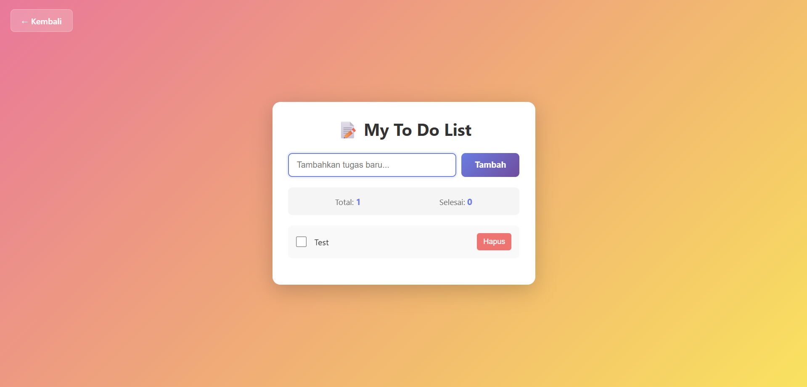

# 📝 To Do List

<div align="center">

**Aplikasi daftar tugas sederhana dengan penyimpanan local, statistik real-time, dan antarmuka yang bersih dan responsif**

</div>

## 📋 Deskripsi Proyek

**To Do List** adalah aplikasi web manajemen tugas yang memungkinkan pengguna untuk menambah, menandai selesai, dan menghapus tugas-tugas sehari-hari. Aplikasi ini menyimpan semua data secara lokal di browser menggunakan LocalStorage, sehingga tugas-tugas tetap tersimpan meskipun halaman ditutup. Dilengkapi dengan statistik real-time tentang total tugas dan tugas yang telah selesai, aplikasi ini membantu pengguna melacak produktivitas mereka.

Aplikasi ini sangat berguna untuk mengorganisir aktivitas harian, membuat daftar belanja, merencanakan proyek, atau sekadar mencatat ide-ide penting. Dengan antarmuka yang minimalis dan intuitif, siapa pun dapat langsung menggunakannya tanpa perlu belajar.

Fitur utama aplikasi ini:
- **Tambah Tugas**: Input teks dengan tombol tambah atau tekan Enter
- **Tandai Selesai**: Checklist untuk menandai tugas yang telah dikerjakan
- **Hapus Tugas**: Tombol hapus dengan konfirmasi untuk setiap tugas
- **Statistik Real-time**: Total tugas dan jumlah tugas selesai
- **Penyimpanan Lokal**: Data tersimpan otomatis di LocalStorage browser
- **Responsif**: Tampilan optimal di desktop maupun perangkat mobile

## 📑 Daftar Isi

- [Deskripsi Proyek](#-deskripsi-proyek)
- [Tampilan Aplikasi](#-tampilan-aplikasi)
- [Latar Belakang](#-latar-belakang)
- [Fitur Utama](#-fitur-utama)
- [Teknologi yang Digunakan](#-teknologi-yang-digunakan)
- [Cara Penggunaan](#-cara-penggunaan)
- [Peran Developer](#-peran-developer)
- [Pembelajaran dari Proyek](#-pembelajaran-dari-proyek-lessons-learned)
- [Ucapan Terima Kasih](#-ucapan-terima-kasih)

## 📸 Tampilan Aplikasi

### Tampilan Utama

 


## 🎯 Latar Belakang

Proyek ini dibuat sebagai proyek pribadi untuk mengembangkan keterampilan dalam:

- **Manipulasi DOM Dinamis**: Membuat, mengupdate, dan menghapus elemen secara dinamis
- **Penyimpanan Lokal (LocalStorage)**: Menyimpan dan memuat data dari LocalStorage
- **Event Handling**: Menangani berbagai event (click, keypress) untuk interaksi pengguna
- **Array Methods**: Menggunakan filter, find, forEach untuk manipulasi data
- **CRUD Operations**: Implementasi lengkap Create, Read, Update, Delete pada data

Kebutuhan yang melatarbelakangi proyek ini:
- **Kebutuhan alat manajemen tugas** yang sederhana dan cepat
- **Keinginan memahami** konsep CRUD pada JavaScript
- **Kebutuhan penyimpanan data** tanpa backend (menggunakan LocalStorage)
- **Pembelajaran tentang** state management sederhana di frontend

## 🌟 Fitur Utama

### ✅ **Operasi CRUD Lengkap**

| Operasi | Deskripsi | Metode |
|---------|-----------|--------|
| **Create** | Menambah tugas baru | Input teks + Tombol Tambah / Enter |
| **Read** | Menampilkan semua tugas | Render ulang setiap ada perubahan |
| **Update** | Mengubah status selesai/tidak | Klik checkbox |
| **Delete** | Menghapus tugas | Tombol Hapus (dengan konfirmasi) |

### 📊 **Struktur Data Tugas**

| Properti | Tipe Data | Deskripsi |
|----------|-----------|-----------|
| `id` | Number (timestamp) | Identifikasi unik setiap tugas |
| `text` | String | Isi tugas yang harus dikerjakan |
| `completed` | Boolean | Status selesai (true/false) |
| `createdAt` | String | Waktu pembuatan (format Indonesia) |

### 📈 **Statistik Real-time**

| Statistik | Perhitungan | Contoh |
|-----------|-------------|--------|
| **Total** | Jumlah semua tugas dalam daftar | 5 |
| **Selesai** | Jumlah tugas dengan completed = true | 3 |

### 💾 **Penyimpanan Lokal**

| Aksi | Fungsi | Waktu Eksekusi |
|------|--------|----------------|
| **Save** | `localStorage.setItem('todos', JSON.stringify(todos))` | Setiap ada perubahan (tambah, hapus, toggle) |
| **Load** | `localStorage.getItem('todos')` | Saat halaman dimuat (DOMContentLoaded) |

### 🎨 **Antarmuka & Visual**

| Komponen | Efek / Fungsi |
|----------|---------------|
| **Tugas Selesai** | Teks coret, opacity berkurang (0.6) |
| **Hover Item** | Background berubah, item bergeser ke kanan |
| **Animasi Masuk** | SlideIn untuk container, fadeIn untuk tugas baru |
| **Tombol Hapus** | Hover scale up, active scale down |
| **Empty State** | Pesan ramah saat belum ada tugas |
| **Focus Input** | Border berubah warna, box shadow muncul |

## 🛠️ Teknologi yang Digunakan

### Core Technologies

| Teknologi | Fungsi | Alasan Penggunaan |
|-----------|--------|-------------------|
| **HTML5** | Struktur halaman | Semantik, form elements |
| **CSS3** | Styling dan layout | Flexbox, gradient, animasi keyframes |
| **JavaScript (ES6+)** | Logika dan interaktivitas | Array methods, LocalStorage, DOM manipulation |

### Fitur JavaScript yang Digunakan

| Fitur | Penggunaan |
|-------|------------|
| **Array.filter()** | Menghapus tugas berdasarkan id |
| **Array.find()** | Mencari tugas untuk toggle status |
| **Array.forEach()** | Iterasi render semua tugas |
| **Array.unshift()** | Menambah tugas baru di awal daftar |
| **localStorage API** | Menyimpan dan memuat data |
| **JSON.parse() / JSON.stringify()** | Konversi object <-> string untuk storage |
| **Event Listeners** | `click`, `keypress`, `DOMContentLoaded` |
| **Date.now()** | Membuat unique id untuk setiap tugas |
| **escapeHtml()** | Mencegah XSS (Cross-site scripting) |

### CSS Modern yang Diterapkan

| Fitur | Penggunaan |
|-------|------------|
| **Linear Gradient** | Background body pink-kuning, tombol tambah |
| **Flexbox** | Layout input container, todo item, stats |
| **Keyframes Animation** | SlideIn (container), fadeIn (tugas baru) |
| **Transform & Transition** | Hover effect, translate, scale |
| **Box Shadow** | Efek kedalaman pada card dan hover |
| **Media Queries** | Responsif untuk layar di bawah 600px |
| **accent-color** | Warna checkbox yang konsisten |

### Penjelasan File

| File | Fungsi |
|------|--------|
| **index.html** | Struktur aplikasi to do list. Berisi input teks dengan tombol tambah, stats area (total & selesai), unordered list untuk menampilkan tugas, dan empty message yang muncul saat tidak ada tugas. |
| **styles.css** | Styling lengkap dengan background gradient pink-kuning, desain card putih dengan bayangan, animasi slideIn dan fadeIn, efek hover pada todo item dan tombol hapus, serta layout responsif. |
| **script.js** | Logika inti aplikasi. Mengelola array todos, fungsi add/delete/toggle, render dinamis ke DOM, penyimpanan ke localStorage, update statistik, validasi input, dan escape HTML untuk keamanan. |

## 🎮 Cara Penggunaan

### Panduan Penggunaan Lengkap

#### 1. **Menambah Tugas Baru**

| Metode | Cara |
|--------|------|
| **Tombol** | 1. Ketik tugas di kolom input <br> 2. Klik tombol **"Tambah"** |
| **Keyboard** | 1. Ketik tugas di kolom input <br> 2. Tekan **Enter** |

> **Validasi**: Tidak boleh menambah tugas kosong. Jika kosong, akan muncul alert "Silakan masukkan tugas!"

#### 2. **Menandai Tugas Selesai**

- Klik **checkbox** di sebelah kiri tugas
- Tugas yang selesai akan memiliki **teks coret** dan tampilan lebih **transparan**
- Klik kembali checkbox untuk membatalkan status selesai

#### 3. **Menghapus Tugas**

1. Arahkan kursor ke tugas yang akan dihapus
2. Klik tombol **"Hapus"** berwarna merah
3. Konfirmasi: "Yakin ingin menghapus tugas ini?"
4. Tugas akan dihapus dari daftar

#### 4. **Melihat Statistik**

| Area | Informasi |
|------|-----------|
| **Total** | Jumlah semua tugas dalam daftar |
| **Selesai** | Jumlah tugas yang telah dicentang |

#### 5. **Data Persistent**

- Semua tugas **tetap tersimpan** meskipun halaman ditutup atau browser di-refresh
- Data disimpan di **LocalStorage** browser Anda

### Contoh Skenario Penggunaan

#### Skenario 1: Daftar Belanja Harian

| Langkah | Tugas | Status |
|---------|-------|--------|
| 1 | Beli beras 5kg | ✅ Selesai |
| 2 | Beli sayuran | ✅ Selesai |
| 3 | Beli sabun mandi | ☐ Belum |
| 4 | Beli minyak goreng | ☐ Belum |

**Statistik:** Total 4, Selesai 2

#### Skenario 2: Tugas Pekerjaan

| Langkah | Tugas | Prioritas |
|---------|-------|-----------|
| 1 | Kirim laporan mingguan | ✅ Selesai |
| 2 | Meeting dengan client jam 14:00 | ☐ Belum |
| 3 | Review pull request | ✅ Selesai |
| 4 | Update dokumentasi | ☐ Belum |

**Statistik:** Total 4, Selesai 2

### Tips Penggunaan

1. **Gunakan Enter** untuk menambah tugas lebih cepat
2. **Tugas baru** akan muncul di bagian atas daftar (terbaru di atas)
3. **Hapus tugas** yang tidak relevan untuk menjaga daftar tetap rapi
4. **Gunakan checkbox** untuk melacak progres harian
5. **Data aman** karena tersimpan di LocalStorage browser Anda sendiri

### Validasi & Keamanan

| Aspek | Penanganan |
|-------|------------|
| **Input Kosong** | Alert peringatan, tidak menambah tugas |
| **HTML Injection** | Fungsi escapeHtml() mencegah XSS |
| **JSON Parsing Error** | Try-catch, fallback ke array kosong |
| **Konfirmasi Hapus** | Confirm dialog sebelum menghapus |

## 👨‍💻 Peran Developer

Sebagai developer proyek pribadi ini, saya bertanggung jawab atas:

### Peran dalam Proyek

| Area | Kontribusi |
|------|------------|
| **Perencanaan** | Merancang struktur data dan fitur CRUD |
| **UI/UX Design** | Mendesain antarmuka minimalis dengan gradien ceria |
| **Frontend Development** | Membangun struktur HTML dan styling CSS |
| **JavaScript Logic** | Implementasi CRUD, LocalStorage, dan render dinamis |
| **Keamanan** | Menambahkan escapeHtml untuk mencegah XSS |
| **Responsive Design** | Memastikan tampilan optimal di mobile |

### Fokus Pengembangan

1. **Fungsionalitas Inti CRUD**
   - Create: menambah tugas dengan validasi
   - Read: menampilkan semua tugas dengan render dinamis
   - Update: toggle status completed
   - Delete: hapus tugas dengan konfirmasi

2. **Pengalaman Pengguna**
   - Animasi masuk yang halus
   - Feedback visual pada hover dan click
   - Empty state yang informatif
   - Dukungan keyboard (Enter)

3. **Persistensi Data**
   - Auto-save ke LocalStorage
   - Load data saat halaman dimuat
   - Error handling untuk data corrupt

## 📚 Pembelajaran dari Proyek (Lessons Learned)

### Keterampilan Teknis yang Diperoleh

1. **CRUD Operations dengan Array**
   ```javascript
   // Create - unshift untuk menambah di awal
   todos.unshift(todo);
   
   // Update - find untuk mencari dan mengubah
   const todo = todos.find(t => t.id === id);
   todo.completed = !todo.completed;
   
   // Delete - filter untuk menghapus
   todos = todos.filter(todo => todo.id !== id);
   ```

2. **LocalStorage Pattern**
   ```javascript
   // Save
   localStorage.setItem('todos', JSON.stringify(todos));
   
   // Load
   const saved = localStorage.getItem('todos');
   if (saved) todos = JSON.parse(saved);
   ```

3. **Dynamic DOM Rendering**
   - Membangun HTML string atau elemen secara dinamis
   - Menggunakan innerHTML atau createElement
   - Event binding pada elemen dinamis

4. **XSS Prevention**
   ```javascript
   function escapeHtml(text) {
       return text.replace(/[&<>"']/g, function(m) {
           if (m === '&') return '&amp;';
           if (m === '<') return '&lt;';
           if (m === '>') return '&gt;';
           if (m === '"') return '&quot;';
           return '&#039;';
       });
   }
   ```

5. **State & UI Synchronization**
   - Setiap perubahan data → render ulang UI
   - Update statistik setelah render
   - Tampilkan/hide empty state berdasarkan data

### Soft Skills yang Dikembangkan

#### 1. **Pemahaman CRUD**
- Memahami siklus hidup data dalam aplikasi
- Menjaga konsistensi antara data dan UI

#### 2. **Perhatian terhadap Detail**
- Validasi input yang baik
- Konfirmasi sebelum aksi destruktif (hapus)
- Menampilkan pesan yang ramah untuk empty state

#### 3. **Keamanan Dasar Frontend**
- Menyadari risiko XSS
- Menerapkan escape HTML pada input pengguna

## 🙏 Ucapan Terima Kasih

### Sumber Daya dan Referensi

#### Dokumentasi Resmi
- [MDN Web Docs - LocalStorage](https://developer.mozilla.org/en-US/docs/Web/API/Window/localStorage) - Panduan penyimpanan lokal
- [MDN Web Docs - Array Methods](https://developer.mozilla.org/en-US/docs/Web/JavaScript/Reference/Global_Objects/Array) - Referensi array filter, find, forEach
- [MDN Web Docs - Event Reference](https://developer.mozilla.org/en-US/docs/Web/Events) - Panduan event handling

#### Inspirasi Desain
- **Todoist** - Inspirasi aplikasi to do list profesional
- **Dribbble** - Referensi desain minimalis modern

#### Tools yang Membantu
- **GitHub** - Hosting repository dan version control
- **VS Code** - Editor kode dengan Live Server

---

<div align="center">

**⭐ Jika proyek ini membantu Anda mengorganisir tugas sehari-hari, berikan bintang! ⭐**

**"Selesaikan satu tugas dalam satu waktu. Produktivitas dimulai dari daftar yang teratur!"**

</div>