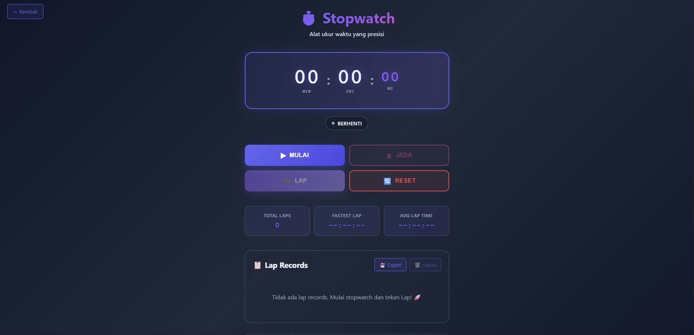

# ⏱️ Stopwatch

<div align="center">

**Stopwatch digital dengan fitur lap records, statistik performa, export data, dan kontrol keyboard yang presisi hingga level milidetik**

</div>

## 📋 Deskripsi Proyek

**Stopwatch** adalah aplikasi web pengukur waktu digital dengan akurasi hingga level sentisecond (1/100 detik). Aplikasi ini dilengkapi fitur lap records untuk mencatat waktu setiap putaran, statistik performa (lap tercepat, rata-rata waktu lap), kemampuan export data ke CSV, serta kontrol keyboard yang lengkap. Dirancang dengan antarmuka modern dark theme dan animasi yang halus.

Aplikasi ini sangat berguna untuk berbagai keperluan seperti olahraga (lari, renang, bersepeda), latihan interval, kompetisi, atau sekadar mengukur durasi aktivitas sehari-hari. Dengan fitur lap records yang lengkap, pengguna dapat menganalisis performa dari waktu ke waktu.

Fitur utama aplikasi ini:
- **Timer Presisi**: Pengukuran waktu hingga sentisecond (00:00.00 format)
- **Lap Records**: Catat waktu setiap putaran dengan delta time antar lap
- **Statistik Lengkap**: Total lap, lap tercepat, dan rata-rata waktu lap
- **Export Data**: Simpan lap records ke file CSV
- **Kontrol Keyboard**: Space/Enter (Start/Pause), L (Lap), R (Reset)
- **Visual Feedback**: Status badge dengan animasi, highlight lap tercepat/terlambat

## 📑 Daftar Isi

- [Deskripsi Proyek](#-deskripsi-proyek)
- [Tampilan Aplikasi](#-tampilan-aplikasi)
- [Latar Belakang](#-latar-belakang)
- [Fitur Utama](#-fitur-utama)
- [Teknologi yang Digunakan](#-teknologi-yang-digunakan)
- [Cara Penggunaan](#-cara-penggunaan)
- [Peran Developer](#-peran-developer)
- [Pembelajaran dari Proyek](#-pembelajaran-dari-proyek-lessons-learned)
- [Ucapan Terima Kasih](#-ucapan-terima-kasih)

## 📸 Tampilan Aplikasi

### Tampilan Utama

 


## 🎯 Latar Belakang

Proyek ini dibuat sebagai proyek pribadi untuk mengembangkan keterampilan dalam:

- **Timer & Interval Management**: Mengelola setInterval dengan akurasi 10ms untuk update display
- **Object-Oriented Programming (OOP)**: Implementasi kelas StopwatchApp untuk state management
- **Data Structure & Algorithms**: Perhitungan delta time, fastest lap, average lap time
- **File Export (CSV)**: Membuat dan mengunduh file CSV dari data JavaScript
- **Keyboard Event Handling**: Menangani berbagai shortcut keyboard dengan state-aware logic

Kebutuhan yang melatarbelakangi proyek ini:
- **Kebutuhan alat pengukur waktu** yang presisi untuk berbagai aktivitas
- **Keinginan memahami** manajemen interval dan timestamp dalam JavaScript
- **Kebutuhan analisis performa** melalui fitur lap records dan statistik
- **Eksplorasi export data** untuk menyimpan riwayat pengukuran

## 🌟 Fitur Utama

### ⏱️ **Fungsi Timer**

| Fungsi | Deskripsi | Presisi |
|--------|-----------|---------|
| **Mulai** | Memulai penghitungan waktu | Update setiap 10ms |
| **Jeda** | Menghentikan sementara penghitungan | Mempertahankan nilai waktu |
| **Lap** | Mencatat waktu putaran saat ini | Delta dari lap sebelumnya |
| **Reset** | Mengembalikan timer ke 0:00.00 dan reset stats | Menghapus semua lap |

### 📊 **Format Tampilan Waktu**

| Satuan | Rentang | Format |
|--------|---------|--------|
| **Menit** | 00 - 99 | 2 digit |
| **Detik** | 00 - 59 | 2 digit |
| **Sentisecond** | 00 - 99 | 2 digit (1/100 detik) |

Contoh: `05:23.45` = 5 menit, 23 detik, 45 sentisecond

### 🏁 **Sistem Lap Records**

| Informasi | Deskripsi |
|-----------|-----------|
| **Lap Number** | Nomor urut lap (1, 2, 3, ...) |
| **Lap Time** | Waktu yang dibutuhkan untuk lap tersebut |
| **Delta Time** | Selisih waktu dari lap sebelumnya |
| **Timestamp** | Waktu saat lap direkam |

### 📈 **Statistik Performa**

| Statistik | Perhitungan | Contoh |
|-----------|-------------|--------|
| **Total Laps** | Jumlah lap yang tercatat | 5 lap |
| **Fastest Lap** | Nilai minimum dari semua lap times | 00:45.23 |
| **Avg Lap Time** | Rata-rata = total waktu lap / jumlah lap | 00:52.10 |

### 🎨 **Visual Highlight**

| Status | Highlight |
|--------|-----------|
| **Lap Tercepat** | Latar belakang hijau transparan, border kiri hijau |
| **Lap Terlambat** | Latar belakang merah transparan, border kiri merah |
| **Delta Lebih Cepat** | Indikator ⬆️ dengan warna hijau |
| **Delta Lebih Lambat** | Indikator ⬇️ dengan warna merah |

### ⌨️ **Shortcut Keyboard**

| Tombol | Fungsi | Kondisi |
|--------|--------|---------|
| **Space** atau **Enter** | Start / Pause | Toggle berdasarkan status |
| **L** | Record Lap | Hanya saat stopwatch berjalan |
| **R** | Reset | Kapan saja |

## 🛠️ Teknologi yang Digunakan

### Core Technologies

| Teknologi | Fungsi | Alasan Penggunaan |
|-----------|--------|-------------------|
| **HTML5** | Struktur halaman | Semantik, layout modern |
| **CSS3** | Styling dan layout | CSS Grid, Flexbox, gradient, keyframes |
| **JavaScript (ES6+)** | Logika dan interaktivitas | Class OOP, setInterval, Date API, Blob API |

### Fitur JavaScript yang Digunakan

| Fitur | Penggunaan |
|-------|------------|
| **Class (OOP)** | Mengorganisir kode ke dalam StopwatchApp class |
| **setInterval / clearInterval** | Mekanisme utama timer (update setiap 10ms) |
| **Date.now()** | Mendapatkan timestamp presisi untuk perhitungan waktu |
| **Spread Operator (...)** | Menduplikasi array untuk perhitungan statistik |
| **Array.reduce()** | Menghitung total waktu untuk average lap |
| **Blob API & URL.createObjectURL** | Membuat file CSV untuk export data |
| **Event Listeners** | `click`, `keydown` untuk interaksi |
| **DOM Manipulation** | Update display, lap list, statistik |

### CSS Modern yang Diterapkan

| Fitur | Penggunaan |
|-------|------------|
| **CSS Grid** | Layout controls, stats section (3 kolom responsif) |
| **CSS Variables** | Sistem tema dark dengan variable warna |
| **Linear Gradient** | Background body, tombol, teks judul |
| **Keyframes Animation** | SlideDown, fadeIn, slideIn, pulse |
| **Custom Scrollbar** | Styling scrollbar pada lap list |
| **Media Queries** | Responsif untuk layar di bawah 600px |
| **::before Pseudo-element** | Efek radial gradient overlay pada timer |

### Penjelasan File

| File | Fungsi |
|------|--------|
| **index.html** | Struktur aplikasi stopwatch. Berisi timer display dengan format MIN:SEC:MS, status badge, 4 tombol kontrol (Mulai, Jeda, Lap, Reset), statistik card (Total Laps, Fastest Lap, Avg Lap Time), lap records section dengan tombol export dan hapus, serta info keyboard shortcuts. |
| **styles.css** | Styling lengkap dengan tema gelap (dark theme), desain modern dengan gradient, efek glassmorphism pada timer display, styling khusus untuk lap tercepat/terlambat, custom scrollbar, dan animasi untuk berbagai interaksi. |
| **script.js** | Logika inti aplikasi menggunakan class OOP. Mengelola state (isRunning, totalTime, laps array), implementasi timer dengan setInterval, perhitungan delta time antar lap, pembangkitan statistik (fastest lap, average), export ke CSV dengan Blob API, penanganan keyboard shortcuts, dan visual feedback animasi. |

## 🎮 Cara Penggunaan

### Panduan Penggunaan Lengkap

#### 1. **Mengontrol Stopwatch**

| Tombol | Fungsi |
|--------|--------|
| **▶ Mulai** | Memulai penghitungan waktu |
| **⏸ Jeda** | Menghentikan sementara penghitungan |
| **🏁 Lap** | Mencatat waktu putaran saat ini |
| **🔄 Reset** | Mengembalikan timer ke 0:00.00 dan reset semua lap |

#### 2. **Menggunakan Lap Records**

**Kapan menggunakan Lap:**
- Saat olahraga (setiap putaran lintasan)
- Latihan interval (setiap sesi latihan)
- Memecah aktivitas panjang menjadi segmen-segmen

**Contoh penggunaan:**
1. Klik **Mulai** untuk memulai timer
2. Setiap kali menyelesaikan satu putaran, klik **Lap**
3. Stopwatch terus berjalan, lap baru tercatat
4. Lihat perbandingan delta antar lap (⬆️ lebih cepat, ⬇️ lebih lambat)

#### 3. **Membaca Statistik**

| Statistik | Informasi yang Diberikan |
|-----------|--------------------------|
| **Total Laps** | Berapa banyak lap yang telah direkam |
| **Fastest Lap** | Waktu lap terbaik yang pernah dicapai |
| **Avg Lap Time** | Rata-rata waktu semua lap (bisa untuk evaluasi konsistensi) |

#### 4. **Mengelola Lap Records**

| Aksi | Cara |
|------|------|
| **Hapus satu lap** | Klik tombol "Hapus" pada lap item |
| **Hapus semua lap** | Klik tombol "🗑️ Hapus" di header lap section |
| **Export semua lap** | Klik tombol "💾 Export" → file CSV akan diunduh |

#### 5. **Menggunakan Shortcut Keyboard**

| Tombol | Aksi | Tips |
|--------|------|------|
| **Space** | Start / Pause | Cara tercepat untuk mengontrol timer |
| **L** | Record Lap | Tidak perlu menggeser kursor ke tombol |
| **R** | Reset | Reset cepat kapan saja |

> **Catatan**: Shortcut keyboard bekerja di mana pun fokus berada, kecuali saat mengetik di input (tidak ada input di aplikasi ini, jadi selalu aktif)

### Contoh Skenario Penggunaan

#### Skenario 1: Latihan Lari 5 Putaran

| Waktu | Aksi | Hasil |
|-------|------|-------|
| 00:00.00 | Start | Timer berjalan |
| 01:30.15 | Lap #1 | Lap time: 01:30.15 |
| 01:28.45 | Lap #2 | Lap time: 01:28.45 (⬆️ lebih cepat) |
| 01:32.30 | Lap #3 | Lap time: 01:32.30 (⬇️ lebih lambat) |
| 01:29.90 | Lap #4 | Lap time: 01:29.90 (⬆️ lebih cepat) |
| 01:31.20 | Lap #5 | Lap time: 01:31.20 (⬇️ lebih lambat) |

**Statistik yang ditampilkan:**
- Total Laps: 5
- Fastest Lap: 01:28.45 (Lap #2)
- Avg Lap Time: 01:30.40

#### Skenario 2: Memasak dengan Interval

| Aksi | Fungsi |
|------|--------|
| Start | Mulai memasak |
| Lap #1 | Selesai menyiapkan bahan (07:30.00) |
| Lap #2 | Selesai memasak utama (25:00.00) |
| Lap #3 | Selesai plating (08:15.00) |
| Export CSV | Simpan waktu memasak untuk resep |

### Validasi & Kasus Khusus

| Skenario | Penanganan |
|----------|------------|
| Lap tanpa start | Tombol Lap disabled |
| Reset saat berjalan | Timer berhenti, semua lap terhapus |
| Hapus semua lap | Konfirmasi dialog sebelum menghapus |
| Export tanpa lap | Alert memberitahu tidak ada data |
| Minimum lap untuk statistik | Avg lap hanya jika minimal 1 lap |

## 👨‍💻 Peran Developer

Sebagai developer proyek pribadi ini, saya bertanggung jawab atas:

### Peran dalam Proyek

| Area | Kontribusi |
|------|------------|
| **Perencanaan** | Merancang arsitektur class dan state management |
| **UI/UX Design** | Mendesain dark theme modern dengan gradient |
| **Frontend Development** | Membangun struktur HTML dan styling CSS lengkap |
| **JavaScript Logic** | Implementasi timer presisi, lap system, statistik |
| **Data Management** | Export CSV, perhitungan delta time |
| **Keyboard Integration** | Menambahkan shortcut keyboard yang lengkap |

### Fokus Pengembangan

1. **Fungsionalitas Inti Timer**
   - Akurasi hingga sentisecond (10ms update interval)
   - Manajemen state (running, paused, stopped)
   - Perhitungan waktu dengan Date.now() timestamps

2. **Fitur Lap Records**
   - Pencatatan delta time antar lap
   - Highlight lap tercepat dan terlambat
   - Indikator arah perubahan (⬆️/⬇️)

3. **Statistik & Analisis**
   - Fastest lap (minimum)
   - Average lap time (mean)
   - Update real-time saat lap bertambah

4. **Export & Data Portability**
   - Format CSV standar
   - Download file dengan nama berisi tanggal
   - Menyertakan timestamp untuk setiap lap

## 📚 Pembelajaran dari Proyek (Lessons Learned)

### Keterampilan Teknis yang Diperoleh

1. **Timer Akurat dengan setInterval**
   ```javascript
   // Update setiap 10ms untuk akurasi sentisecond
   this.intervalId = setInterval(() => this.updateDisplay(), 10);
   
   // Menghitung elapsed time dengan timestamp
   this.totalTime = Date.now() - this.startTime;
   ```

2. **Perhitungan Delta Time Antar Lap**
   ```javascript
   if (this.laps.length > 0) {
       const prevLapTime = this.laps[this.laps.length - 1].time;
       lap.delta = lapTime - prevLapTime;
   }
   ```

3. **Statistik dengan Array Methods**
   ```javascript
   // Fastest lap
   const fastestTime = Math.min(...lapTimes);
   
   // Average lap time
   const avgTime = lapTimes.reduce((a, b) => a + b, 0) / lapTimes.length;
   ```

4. **Export CSV dengan Blob API**
   ```javascript
   const blob = new Blob([csvContent], { type: 'text/csv' });
   const url = window.URL.createObjectURL(blob);
   const link = document.createElement('a');
   link.download = `stopwatch-laps-${date}.csv`;
   ```

5. **Keyboard Event Handling**
   ```javascript
   document.addEventListener('keydown', (e) => {
       if (e.key === ' ' || e.key === 'Enter') {
           e.preventDefault(); // Mencegah scroll/spasi default
           if (this.isRunning) this.pause();
           else this.start();
       }
   });
   ```

### Soft Skills yang Dikembangkan

#### 1. **Object-Oriented Thinking**
- Memisahkan tanggung jawab ke dalam class
- Mengelola state secara terpusat
- Metode yang modular dan reusable

#### 2. **Perhatian terhadap Presisi**
- Memilih interval 10ms untuk akurasi sentisecond
- Menangani edge cases pada timer
- Validasi input dan kondisi

#### 3. **Pengalaman Pengguna**
- Feedback visual (status badge, animasi)
- Shortcut keyboard untuk power user
- Konfirmasi sebelum aksi destruktif (clear laps)

## 🙏 Ucapan Terima Kasih

### Sumber Daya dan Referensi

#### Dokumentasi Resmi
- [MDN Web Docs - setInterval](https://developer.mozilla.org/en-US/docs/Web/API/setInterval) - Panduan timer JavaScript
- [MDN Web Docs - Blob API](https://developer.mozilla.org/en-US/docs/Web/API/Blob) - Panduan export file
- [MDN Web Docs - KeyboardEvent](https://developer.mozilla.org/en-US/docs/Web/API/KeyboardEvent) - Panduan event keyboard

#### Inspirasi Desain
- **Stopwatch digital profesional** - Referensi fitur lap dan statistik
- **Dribbble** - Inspirasi dark theme modern

#### Tools yang Membantu
- **GitHub** - Hosting repository dan version control
- **VS Code** - Editor kode dengan Live Server

---

<div align="center">

**⭐ Jika proyek ini membantu Anda mengukur waktu dengan presisi, berikan bintang! ⭐**

**"Setiap detik berharga. Ukur waktu Anda, maksimalkan produktivitas Anda!"**

</div>